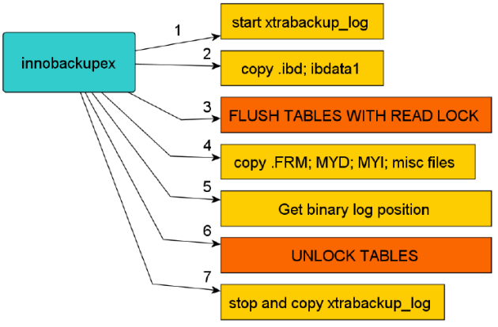

# Innobackupex(xtrabackup)完全备份Mysql过程

<!--more-->
&nbsp;

&nbsp;

&nbsp;

1 首先会启动一个xtrabackup_log后台检测的进程，实时检测mysql 事务日志redo的变化，一旦发现redo有新的日志写入，立刻将日志写入到日志文件xtrabackup_logfile中

2 复制innodb的数据文件和系统表空间文件idbdata1到对应的以默认时间戳为备份目录的地方。

3 复制结束后，执行flush table with read lock锁表操作。（MyISAM引擎由于不支持事务日志，所以会进行锁表。）

4 复制.frm，MYI，MYD文件。

5 并且在这一时刻获得binary log 的位置。

6 将表进行解锁unlock tables。

7 停止xtrabackup_log进程。

---

> 作者: [SoulChild](https://www.soulchild.cn)  
> URL: https://www.soulchild.cn/1067/  

