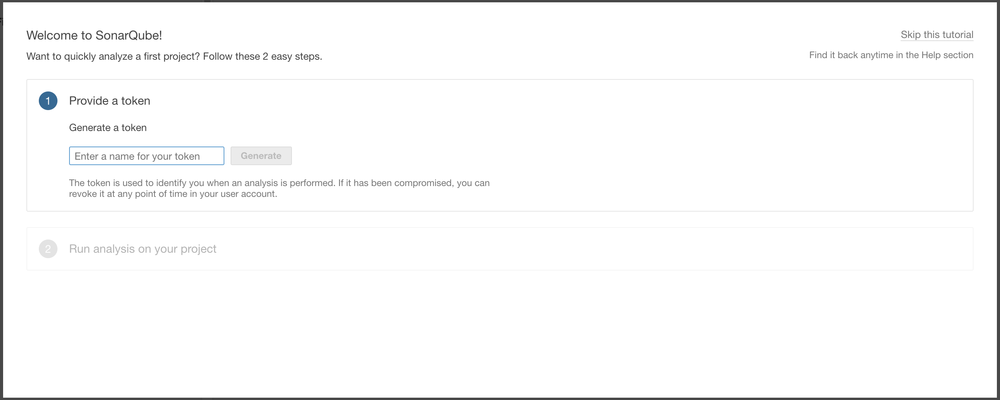

# sonarqube记录

<!--more-->
1.安装mysql5.7

&nbsp;

2.启动数据库，配置密码，并创建一个sonar库
<pre class="line-numbers" data-start="1"><code class="language-bash">vim /etc/my.cnf
max_allowed_packet = 64M

systemctl start mysqld
mysqladmin password 123456
mysql -uroot -p123456 -e "CREATE DATABASE sonar DEFAULT CHARACTER SET utf8;"
mysql -uroot -p123456 -e "show databases;"</code></pre>
&nbsp;

3.安装sonarqube
<pre class="line-numbers" data-start="1"><code class="language-bash">wget https://binaries.sonarsource.com/Distribution/sonarqube/sonarqube-7.0.zip
unzip sonarqube-7.0.zip  -d /usr/local/
useradd sonar -M -s /sbin/nologin
chown -R sonar.sonar /usr/local/sonarqube-7.0/
ln -s /usr/local/sonarqube-7.0/ /usr/local/sonarqube</code></pre>
&nbsp;

4.修改sonar配置文件
<pre class="line-numbers" data-start="1"><code class="language-bash">vim /usr/local/sonarqube/conf/sonar.properties
sonar.jdbc.username=root
sonar.jdbc.password=123456
sonar.jdbc.url=jdbc:mysql://localhost:3306/sonar?useUnicode=true&amp;characterEncoding=utf8&amp;rewriteBatchedStatements=true&amp;useConfigs=maxPerformance&amp;useSSL=false</code></pre>
&nbsp;

5.启动sonar
<pre class="line-numbers" data-start="1"><code class="language-bash">su -s /bin/bash - sonar -c /usr/local/sonarqube/bin/linux-x86-64/sonar.sh start</code></pre>
&nbsp;

6.访问

http://IP:9000/

用户名密码：admin

&nbsp;

7.生成token令牌

&nbsp;

gitlab: <strong class="spacer-right text-middle">c8f7808f87bf63f857707fba1b571cf53debe8e7</strong>

&nbsp;

8.手动检测，<code class="null">-Dsonar.projectKey=html</code>指定关键字
<pre class="line-numbers" data-start="1"><code class="language-bash">#maven
mvn sonar:sonar \
  -Dsonar.host.url=http://10.0.0.51:9000 \
  -Dsonar.login=c8f7808f87bf63f857707fba1b571cf53debe8e7

#html
sonar-scanner \
 -Dsonar.projectKey=html \
 -Dsonar.sources=. \
 -Dsonar.host.url=http://10.0.0.51:9000 \
 -Dsonar.login=c8f7808f87bf63f857707fba1b571cf53debe8e7

#js
sonar-scanner \
 -Dsonar.projectKey=js \
 -Dsonar.projectName=js项目 \
 -Dsonar.sources=. \
 -Dsonar.host.url=http://10.0.0.51:9000 \
 -Dsonar.login=c8f7808f87bf63f857707fba1b571cf53debe8e7</code></pre>
&nbsp;

&nbsp;

&nbsp;

&nbsp;

&nbsp;

&nbsp;

&nbsp;

---

> 作者: [SoulChild](https://www.soulchild.cn)  
> URL: https://www.soulchild.cn/1331/  

