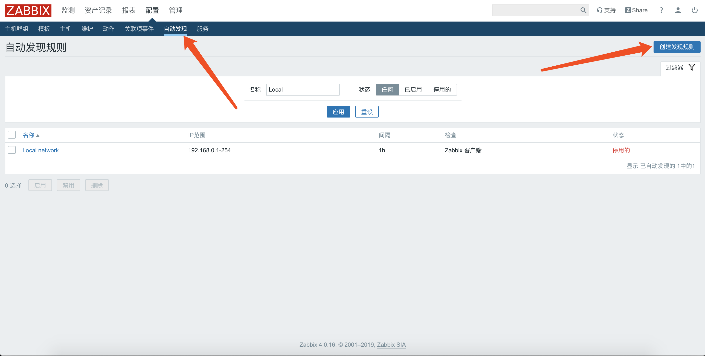

# zabbix通过自动发现创建主机

<!--more-->
安装zabbix-agent

rpm -ivh https://mirrors.tuna.tsinghua.edu.cn/zabbix/zabbix/4.0/rhel/7/x86_64/zabbix-agent-4.0.16-1.el7.x86_64.rpm

&nbsp;

sed -i s#^Server=.*#Server=zabbix-server地址# /etc/zabbix/zabbix_agentd.conf

systemctl restart zabbix-agent

&nbsp;

配置zabbix

1.创建自动发现规则

修改IP范围和检查条件

&nbsp;

2.创建自动发现动作

添加执行动作条件

配置执行动作

&nbsp;

&nbsp;

---

> 作者: [SoulChild](https://www.soulchild.cn)  
> URL: https://www.soulchild.cn/1405/  

