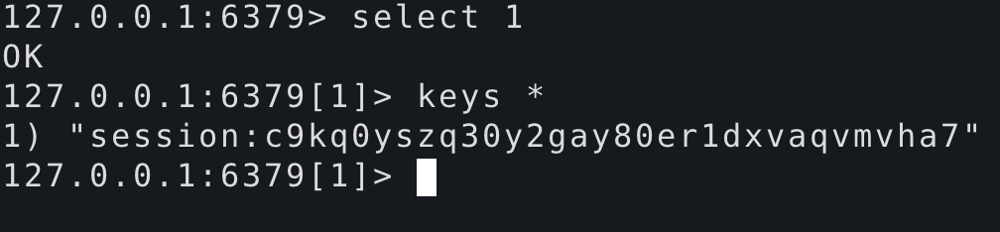

# django中使用redis存储session

<!--more-->
1.安装django-redis-sessions模块

&nbsp;

2.django中settings.py配置
<pre class="line-numbers" data-line="1" data-start="1"><code class="language-python">SESSION_ENGINE = 'redis_sessions.session'
SESSION_REDIS = {
    'host': '10.0.0.200',
    'port': 6379,
    'db': 1,
    'password': '',
    'prefix': 'session',
    'socket_timeout': 1
}</code></pre>
3.编写视图函数views.py
<pre class="line-numbers" data-line="1" data-start="1"><code class="language-python">def set_session(request):
    request.session['username'] = 'soulchild'
    return HttpResponse('设置session')

def get_session(request):
    res = request.session.get('username')
    return HttpResponse(res)</code></pre>
4.配置路由urls.py
<pre class="line-numbers" data-line="1" data-start="1"><code class="language-python">    url(r'^set_session$', views.set_session, name='set_session'),
    url(r'^get_session$', views.get_session, name='get_session'),</code></pre>
&nbsp;

5.验证

启动django

python manage.py runserver

打开：http://127.0.0.1:8000/set_session

查看redis

&nbsp;

打开：http://127.0.0.1:8000/get_session

结果正常显示

&nbsp;

# 关于哨兵模式和集群可参考：
<blockquote>https://pypi.org/project/django-redis-sessions/</blockquote>

---

> 作者: [SoulChild](https://www.soulchild.cn)  
> URL: https://www.soulchild.cn/1471/  

