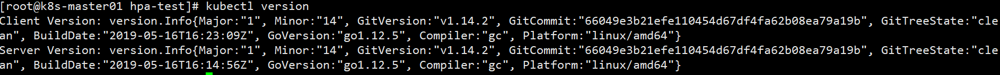

# k8s使用metrics-server实现hpa弹性伸缩

<!--more-->
集群版本：

1.下载metrics-server
<pre class="pure-highlightjs"><code class="bash">直接下载yaml文件：
wget https://github.com/kubernetes-sigs/metrics-server/releases/download/v0.3.6/components.yaml

或者下载源代码进入到deploy目录
metrics-server-xxx/deploy/</code></pre>
&nbsp;

2.修改镜像地址
<pre class="pure-highlightjs"><code class="bash">sed -i 's#k8s.gcr.io#registry.aliyuncs.com/google_containers#' components.yaml</code></pre>
&nbsp;

3.安装
<pre class="pure-highlightjs"><code class="bash">kubectl apply -f components.yaml</code></pre>
报错1：

默认通过dns解析主机名，解析失败，可以通过修改coredns配置解决

或者修改启动参数，手动指定ip类型

--kubelet-preferred-address-types=InternalIP

安装：
<pre class="pure-highlightjs"><code class="bash">kubectl apply -f components.yaml</code></pre>
&nbsp;

报错2：

证书问题，添加跳过认证的参数--kubelet-insecure-tls

&nbsp;

4.验证
<pre class="pure-highlightjs"><code class="bash">kubectl top ndoe</code></pre>

&nbsp;

5.配置deplotment
<pre class="pure-highlightjs"><code class="null">apiVersion: extensions/v1beta1
kind: Deployment
metadata:
  name: hpa-test
  labels:
    app: hpa
spec:
  template:
    metadata:
      labels:
        app: nginx
    spec:
      containers:
      - name: nginx-c
        image: nginx:1.14.2
        ports:
        - containerPort: 80
        resources:
          requests:
            cpu: 0.005
            memory: 100Mi
          limits:
            cpu: 0.010
            memory: 100MGi</code></pre>
&nbsp;

6.创建hpa资源
<pre class="pure-highlightjs"><code class="bash">kubectl autoscale --max=10 --min=1 --cpu-percent=5 deployment hpa-test</code></pre>

&nbsp;

7.压测

开始测试：
<pre class="pure-highlightjs"><code class="bash">while true;do curl -I 10.244.1.90;done</code></pre>
可以看到配置已经生效

&nbsp;

&nbsp;

&nbsp;

&nbsp;

&nbsp;

---

> 作者: [SoulChild](https://www.soulchild.cn)  
> URL: https://www.soulchild.cn/1567/  

