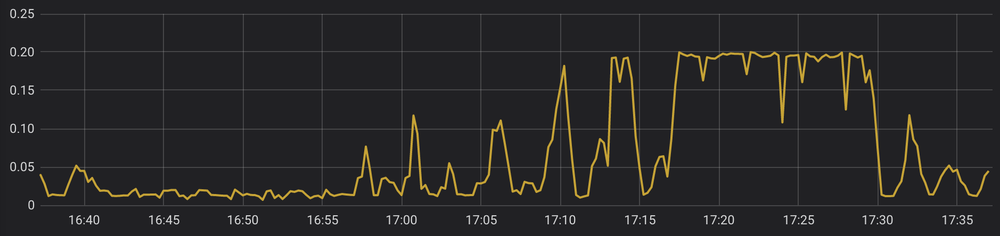

# 如何理解k8s中limit限制cpu单位

<!--more-->
官方对单位的解释：

https://v1-14.docs.kubernetes.io/zh/docs/tasks/configure-pod-container/assign-cpu-resource/#cpu-%E5%8D%95%E4%BD%8D


- requests：代表容器启动请求的资源限制，分配的资源必须要达到此要求

- limits：代表最多可以请求多少资源

单位m：CPU的计量单位叫毫核(m)。一个节点的CPU核心数量乘以1000，得到的就是节点总的CPU总数量。如，一个节点有两个核，那么该节点的CPU总量为2000m。

下面拿双核举例：
```yaml
        resources:
          requests:
            cpu: 50m     #等同于0.05
            memory: 512Mi
          limits:
            cpu: 100m    #等同于0.1
            memory: 1Gi
```
含义：该容器启动时请求50/2000的核心（2.5％）并且允许最多使用100/2000核心（5％）。

0.05个核除总核数量2就是2.5%了，0.1个核除总核数就2是5%了

&nbsp;
```yaml
        resources:
          requests:
            cpu: 100m    #等同于0.1
            memory: 512Mi
          limits:
            cpu: 200m    #等同于0.2
            memory: 1Gi
```
cpu单位m的含义：该容器启动时请求100/2000的核心（5％）并且允许最多使用200/2000核心（10％）

0.1个核除总核数量2就是5%了，0.2个核除总核数2就是10%了

&nbsp;

可以看到下图是限制200m也就是0.2个核，最高可以跑到0.2




---

> 作者: [SoulChild](https://www.soulchild.cn)  
> URL: https://www.soulchild.cn/1591/  

