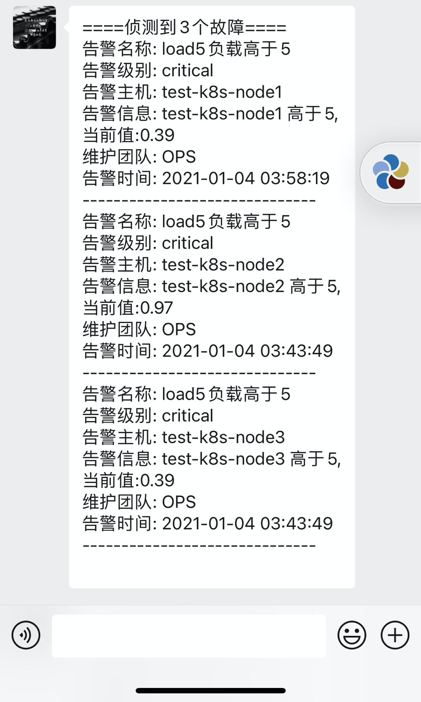

# alertmanager配置企业微信告警(六)

<!--more-->
## 一、promethues告警配置:
alerting和rules的配置(抓取指标需自行配置)：
```
global:
  scrape_interval:     15s
  evaluation_interval: 15s
  alerting:
    alertmanagers:
    - static_configs:
      - targets: ["alertmanager:9093"]
 rule_files:
 - "/etc/prometheus/rules.yml"
```

/etc/prometheus/rules.yml的配置：
```
groups:
  - name: linux_alert
    rules: 
      - alert: "load5负载高于5"
        for: 20s 
        expr: node_load5 > 5
        labels:
          severity: critical
          team: ops 
        annotations:
          description: "{{ $labels.instance }} 高于5,当前值:{{ $value }}"
          summary: "load5负载高于5"
```


## 二、alertmanager配置
```
templates:
- '/etc/alertmanager/*.tmpl'
global:
  resolve_timeout: 5m
route:
  group_by: ['alertname', 'cluster']
  group_wait: 15s
  group_interval: 1m
  repeat_interval: 30m
  receiver: default
  routes:
  - receiver: wechat
    match:
      severity: critical
receivers:
- name: 'wechat'
  wechat_configs:
  - send_resolved: true
    api_secret: 'xxxxxxxxxxxxxxxxxxxxxxxxxxxxxxxxxxxxxxxxxxxxxx'  # 在企业微信后台应用中查看
    corp_id: 'xxxxxxxxxxxxxx'  # 我的企业-企业信息-企业ID
    agent_id: '1000008' # 应用i,在企业微信后台应用中查看
    to_party: '7' # 发送给哪个部门,部门需要对应用有权限
    message: '{{ template "wechat.tmpl" . }}' # 发送的内容,这里调用的wechat.tmpl模板，后面会定义这个模板
```

### 告警模板
/etc/alertmanager/wechat.tmpl
```
{{ define "__alert_list" }}{{ range . -}}
告警名称: {{ index .Annotations "summary" }}
告警级别: {{ .Labels.severity }}
告警主机: {{ .Labels.instance }}
告警信息: {{ index .Annotations "description" }}
维护团队: {{ .Labels.team | toUpper }}
告警时间: {{ .StartsAt.Format "2006-01-02 15:04:05" }}
------------------------------
{{ end -}}{{ end }}

{{ define "__resolved_list" }}{{ range . -}}
告警名称: {{ index .Annotations "summary" }}
告警级别: {{ .Labels.severity }}
告警主机: {{ .Labels.instance }}
告警信息: {{ index .Annotations "description" }}
维护团队: {{ .Labels.team | toUpper }}
告警时间: {{ .StartsAt.Format "2006-01-02 15:04:05" }}
恢复时间: {{ .EndsAt.Format "2006-01-02 15:04:05" }}
------------------------------
{{ end -}}{{ end }}

{{ define "wechat.tmpl" }}
{{- if gt (len .Alerts.Firing) 0 -}}
====侦测到{{ .Alerts.Firing | len  }}个故障====
{{ template "__alert_list" .Alerts.Firing }}
{{ end -}}
{{- if gt (len .Alerts.Resolved) 0 -}}
====恢复{{ .Alerts.Resolved | len  }}个故障====
{{ template "__resolved_list" .Alerts.Resolved }}
{{- end -}}
{{ end }}
```

## 三、告警效果



---

> 作者: [SoulChild](https://www.soulchild.cn)  
> URL: https://www.soulchild.cn/1604/  

