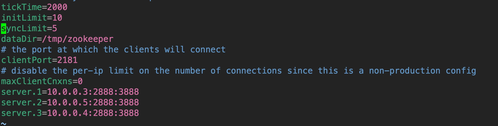

# kafka2.0.1集群部署

<!--more-->
1.下载安装：

&nbsp;
<pre class="pure-highlightjs"><code class="null">wget https://archive.apache.org/dist/kafka/2.0.1/kafka_2.12-2.0.1.tgz
tar xf kafka_2.12-2.0.1.tgz
mv kafka_2.12-2.0.1 /usr/local/kafka</code></pre>
&nbsp;

2.配置zookeeper：可参考https://soulchild.cn/1663.html

/usr/local/kafka/config/zookeeper.properties

3. 创建 /tmp/zookeeper/myid文件
<pre class="pure-highlightjs"><code class="null">echo 1 &gt; /tmp/zookeeper/myid</code></pre>
4. 启动zookeeper
<pre class="pure-highlightjs"><code class="null">cd /usr/local/kafka/bin
./zookeeper-server-start.sh -daemon ../config/zookeeper.properties</code></pre>
&nbsp;

5.配置kafka：

文件路径：/usr/local/kafka/config/server.properties

修改配置文件：
<pre class="pure-highlightjs"><code class="null">#kafka集群的唯一标识，在改变IP地址，不改变broker.id的话不会影响消费者。
#Kafka在启动时会在zookeeper中/brokers/ids路径下创建一个以broker的id为名称的虚节点，Kafka的健康状态检查就依赖于此节点。
#当broker下线时，该虚节点会自动删除，其他broker或者客户端通过判断/brokers/ids路径下是否有此broker的id来确定该broker的健康状态。
broker.id=0

#配置监听地址和端口，listener_name://host_name:port
listeners=PLAINTEXT://elk1:9092

#topic不存在时，是否自动创建topic
auto.create.topics.enable=true

#此项设置为true，删除topic时会真正删除，设置为flase只是标记删除
delete.topic.enable=true

#日志和持久化数据目录，指定多路径使用逗号分割
log.dirs=/tmp/kafka-logs

#partitions数量建议大于等于消费者数量
num.partitions=6

#保留kafka中消息的时间
log.retention.hours=168

#topic的partition是以一堆segment文件存储的，这个控制每个segment的大小，会被topic创建时的指定参数覆盖
log.segment.bytes=1073741824

#zookeeper集群连接地址和超时时间配置
zookeeper.connect=elk1:2181,elk2:2181,elk3:2181
zookeeper.connection.timeout.ms=6000

# broker处理消息的最大线程数，一般情况下不需要去修改
num.network.threads=3
# broker处理磁盘IO的线程数 ，数值应该大于你的硬盘数
num.io.threads=8

#topic副本数量，如果要部署单机kafka,将值改为1
offsets.topic.replication.factor=3</code></pre>
其他参数详细说明：https://www.cnblogs.com/alan319/p/8651434.html

&nbsp;

&nbsp;

启动kafka：
<pre class="pure-highlightjs"><code class="null">cd /usr/local/kafka/bin
./kafka-server-start.sh -daemon ../config/server.properties</code></pre>
&nbsp;

其他两台机器相同配置，只需要修改broker.id和listeners.

---

> 作者: [SoulChild](https://www.soulchild.cn)  
> URL: https://www.soulchild.cn/1670/  

