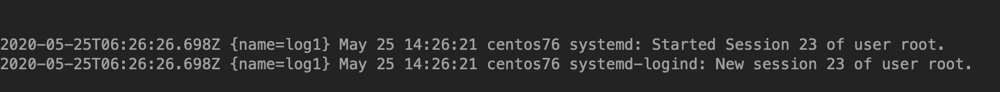

# logstash使用filebeat作为日志源

<!--more-->
logstash配置：
<pre class="pure-highlightjs"><code class="null">input {
  beats {
    port =&gt; 5044
    host =&gt; "0.0.0.0"
  }
}

output{
  kafka{
    bootstrap_servers =&gt; "log1:9092"
    topic_id =&gt; "test_kafka"
  }
}</code></pre>
启动logstash

nohup ./logstash -f test.conf &amp;

&nbsp;

filebeat配置：
<pre class="pure-highlightjs"><code class="null">filebeat.inputs:
- type: log
  enabled: true
  paths:
   - /var/log/messages

name: "log1"
output.logstash:
 hosts: ["10.0.0.6:5044"]
logging.level: debug
</code></pre>
启动filebeat

nohup ./filebeat -e -c filebeat.yml &amp;

&nbsp;

新建一个终端生成日志，然后观察kafka

---

> 作者: [SoulChild](https://www.soulchild.cn)  
> URL: https://www.soulchild.cn/1699/  

