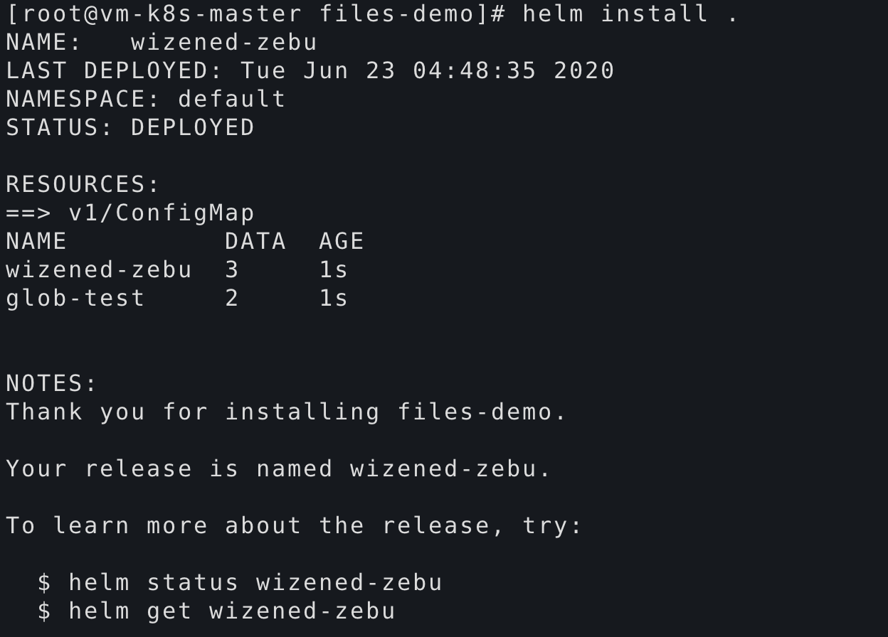

# helm模板开发-NOTES.txt文件和子chart(六)

<!--more-->
## NOTES.txt
在执行`helm install`或`helm upgrade`，Helm可以为用户打印一些有用的信息。NOTES.txt可以使用对象,函数等来高度自定义说明信息。

编写NOTES.txt
```
Thank you for installing {{ .Chart.Name }}.

Your release is named {{ .Release.Name }}.

To learn more about the release, try:

  $ helm status {{ .Release.Name }}
  $ helm get {{ .Release.Name }}
```

安装后提示如下信息：



## 子chart
首先创建一个demo1，然后在创建一个subchart
```
helm create demo1
cd demo1/charts
helm create subchart
```

修改子chart中的values.yaml和configmap.yaml
```
#values.yaml
dessert: sub

#configmap.yaml
apiVersion: v1
kind: ConfigMap
metadata:
  name: {{ .Release.Name }}-sub-cm
data:
  dessert: {{ .Values.dessert }}
```
修改父chart中的values.yaml和configmap.yaml
```
#values.yaml
dessert: parent

#configmap.yaml
apiVersion: v1
kind: ConfigMap
metadata:
  name: {{ .Release.Name }}-parent-cm
data:
  dessert: {{ .Values.dessert }}
```
渲染后的结果：
```
---
# Source: demo1/charts/subchart/templates/configmap.yaml
apiVersion: v1
kind: ConfigMap
metadata:
  name: dining-lion-sub-cm
data:
  dessert: sub
---
# Source: demo1/templates/configmap.yaml
apiVersion: v1
kind: ConfigMap
metadata:
  name: dining-lion-parent-cm
data:
  dessert: parent
```
父chart和子chart的values设置互不影响，我们在父chart的values.yaml中添加一些值可以覆盖子chart的值
```
dessert: parent
subchart:
  dessert: parent1
```
再次渲染后，可以发现子chart的值被覆盖了
```
---
# Source: demo1/charts/subchart/templates/configmap.yaml
apiVersion: v1
kind: ConfigMap
metadata:
  name: alliterating-olm-sub-cm
data:
  dessert: parent1
```

####全局值
Values数据类型具有一个名为Values.global的保留部分，可以在其中设置全局值。
我们修改父chart中的values.yaml
```
global:
  g: "my is global"
```

```
#父chart configmap.yaml
apiVersion: v1
kind: ConfigMap
metadata:
  name: {{ .Release.Name }}-parent-cm
data:
  dessert: {{ .Values.global.g }}


#子chart configmap.yaml
apiVersion: v1
kind: ConfigMap
metadata:
  name: {{ .Release.Name}}-sub-cm
data:
  dessert: {{ .Values.global.g }}
```

渲染后的结果：
```
---
# Source: demo1/charts/subchart/templates/configmap.yaml
apiVersion: v1
kind: ConfigMap
metadata:
  name: reeling-seagull-sub-cm
data:
  dessert: my is global
---
# Source: demo1/templates/configmap.yaml
apiVersion: v1
kind: ConfigMap
metadata:
  name: reeling-seagull-parent-cm
data:
  dessert: my is global
```


---

> 作者: [SoulChild](https://www.soulchild.cn)  
> URL: https://www.soulchild.cn/1836/  

