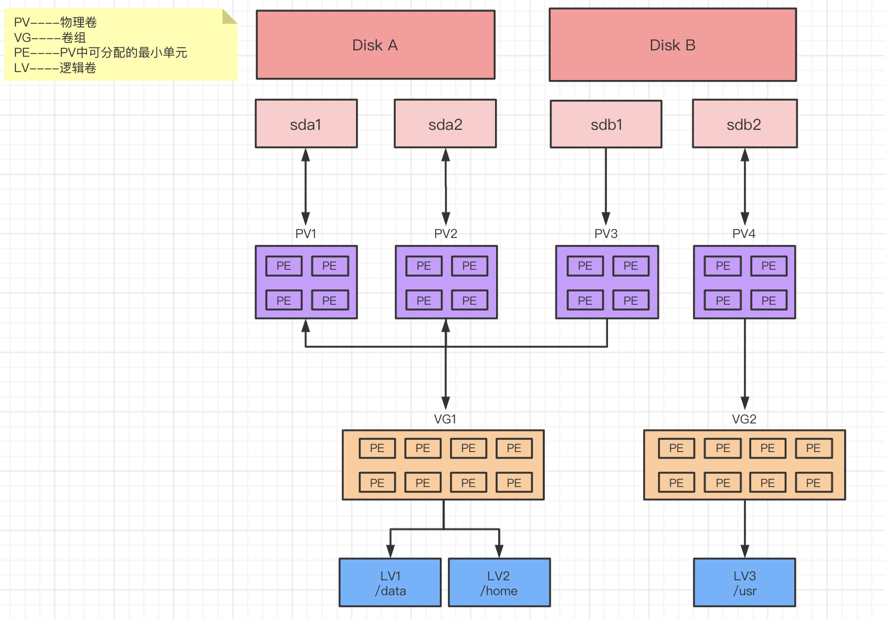

# 使用LVM挂载分区

<!--more-->


PV：物理卷
PE：LVM的最小资源单位，每个PE的大小可以更改，默认4M
VG：卷组，在PV的基础上建立
LV：逻辑卷，在VG的基础上建立，理解为分区，可以改动大小

## 创建使用pv、vg、lv
### 1.创建普通分区，我这里已经有一个sdb2分区了


### 2.创建pv
```
pvcreate /dev/sdb2
```

### 3.创建vg 
```
# 可以指定多个分区，我这里只有一个
vgcreate data /dev/sdb2

#将vg设置为活动状态
vgchange -ay data
```

### 4.创建lv
```
使用-l 100%VG这个参数以卷组的大小百分比来扩展逻辑卷
lvcreate -l 100%VG -n datalv data
```

### 5.格式化文件系统
```
mkfs.xfs /dev/mapper/data-datalv
```
>centos6使用：mkfs.ext4 /dev/mapper/data-datalv

### 6.挂载
```
# 创建挂载点
mkdir /data
mount /dev/mapper/data-datalv /data
```

### 7.设置开机自动挂载
```
vim /etc/fstab
/dev/mapper/data-datalv /data                   xfs     defaults        0 0
```

## 扩容：
### 1.扩展vg
```
直接将/dev/sdc这块硬盘作为PV使用，加入到data这个vg里
vgextend data /dev/sdc
```
>从vg中移除pv：vgreduce data /dev/sdc

### 2.扩展lv
```
# 添加剩余空间的100%大小
lvextend -l +100%FREE /dev/mapper/data-datalv
```

### 3.扩展文件系统
```
xfs_growfs /dev/data/datalv
```
>centos6使用：resize2fs /dev/data/datalv


---

> 作者: [SoulChild](https://www.soulchild.cn)  
> URL: https://www.soulchild.cn/1896/  

