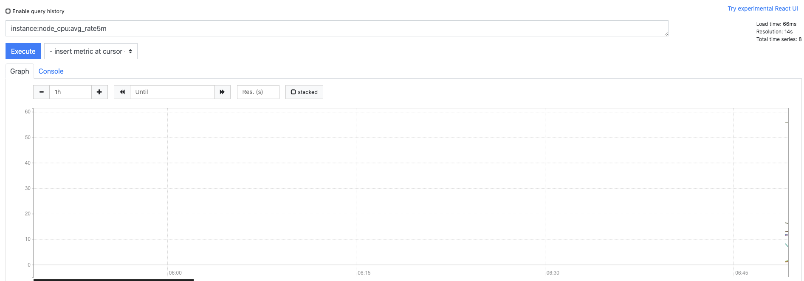

# prometheus-配置文件-rules(三)

<!--more-->
Prometheus支持两种可以配置的规则，记录规则和告警规则,然后定期评估.要创建规则需要通过加载文件的方式,通过glogbal中`rule_files`字段来配置。


检查规则的命令
```bash
promtool check rules /path/to/example.rules.yml
```

## 一、记录规则
记录规则使您可以预先计算经常需要的或计算代价较高的表达式,并将其结果保存为一组新的时间序列。查询预先计算的结果通常比每次都用原始表达式查询要快得多。这对于仪表板特别有用，仪表板每次刷新时都需要重复查询相同的表达式。

规则都存在于规则组,组内的规则会定期运行。
下面是一个配置示例：
```yaml
groups:
  # 指定规则组的名称
  - name: node_rules
    # 运行间隔,默认继承全局配置`evaluate_interval`
    interval: 10s
    rules:
      # 新的时间序列命名称
    - record: job:http_inprogress_requests:sum
      # 原始promql
      expr: sum by (job) (http_inprogress_requests)
    - record: instance:node_cpu:avg_rate5m
      expr: 100 - avg(irate(node_cpu_seconds_total{job=~".*node_exporter",mode="idle"}[5m])) by (instance) * 100
```
** record：新的时间序列名称推荐的命名规范: **
> level:metric:operations
> 第一部分是聚合级别(或者聚合的维度),第二部分是metric指标名称,第三部分是操作

新的指标是可以被复用的：



## 二、告警规则
警报规则在Prometheus中的配置方式与记录规则相同。
### 配置示例:
```yaml
groups:
# 规则组名称
- name: example
  rules:
  # 告警名称
  - alert: load5负载高于5
    # 告警规则
    expr: node_load5 > 5
    # 评估等待时间,可选参数。表示只有当触发条件持续一段时间后才发送告警。在等待期间新产生告警的状态为pending。
    for: 10m
    # 给报警添加标签,可以模板化
    labels:
      severity: critical
    # 告警描述信息,可以模版化
    annotations:
      summary: load5负载高于5
```

### 模版化
标签和注释值可以使用控制台模板进行模板化。`$labels`变量保存一个警告实例的标签键/值对。配置的外部标签可以通过`$externalLabels`变量访问。`$value`变量保存告警实例的评估值。

示例:
```
groups:
- name: example
  rules:
  ＃对任何超过5分钟无法访问的实例发出告警
  - alert: 实例无法访问
    expr: up == 0
    for: 5m
    labels:
      severity: critical
    annotations:
      summary: "实例 {{ $labels.instance }} 无法访问"
      description: "job{{ $labels.job }}的{{ $labels.instance }}实例已经关闭5分钟以上"
```


---

> 作者: [SoulChild](https://www.soulchild.cn)  
> URL: https://www.soulchild.cn/1971/  

