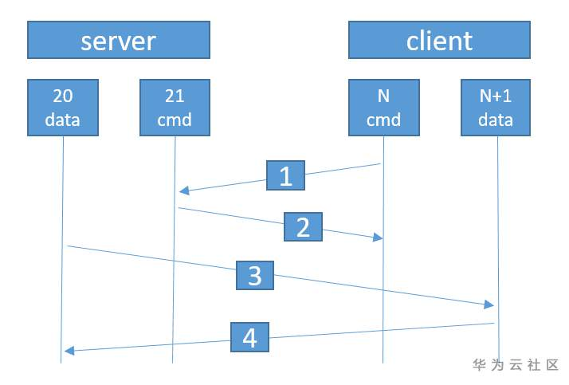

# ftp主动模式和被动模式的区别

<!--more-->
原文:https://www.huaweicloud.com/zhishi/2006281029.html
## 1、主动模式

客户端从一个任意的非特权端口N（N>1023）连接到FTP服务器的21端口。然后客户端开始监听N+1（如下图的1027端口），并发送FTP命令“port N+1”到FTP服务器。接着服务器会从它自己的数据端口（20）连接到客户端指定的数据端口（N+1）。

用更通俗的语言来理解这个交互过程：

1）  客户端用一个大于1024的端口N与FTP服务器的21端口建立一个控制通道，发送一条命令告诉FTP服务端（即通常说的PORT命令），我的数据通道的通信地址是IP1（本机网卡IP），数据通道的端口N+1，服务端收到请求后回复ACK确认。

2）  服务端确认后，用源端口20主动与客户端IP1:N+1建立连接，进行数据通信。

## 2、被动模式

当开启一个FTP连接时，客户端打开两个任意的非特权本地端口N>1024和N+1（分别如下图的1026端口和1027端口）。第一个端口连接服务器的21端口，客户端提交PASV命令给服务端，这样做的结果是服务器会开启一个任意的非特权端口（P>1024），并发送PORT P（如下图2024）命令给客户端。然后客户端发起从本地端口N+1到服务器的端口P的连接用来传送数据。

用更通俗的语言来理解这个交互过程：

1）  客户端使用源端口N与FTP服务端建立一个控制通道，发送一条命令告诉服务端（即通常说的PASV命令），我将使用被动模式与你通信。服务端收请求后，会告知客户端我的IP是IP2（默认为主机网卡IP）和监听端口P，你可以和我的这个IP和端口通信。

2）  客户端收到1）中的信息后，使用源端口N+1，与服务端IP2:P建立连接，进行数据通信。

---

> 作者: [SoulChild](https://www.soulchild.cn)  
> URL: https://www.soulchild.cn/2160/  

