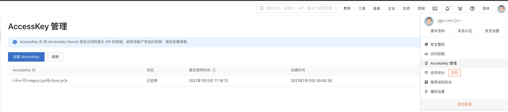

# Traefik配置Let's Encrypt自动生成证书[alidns](三)

<!--more-->
## 一、准备工作
1. 这里使用的alidns，创建AccessKey


2. 创建secret
`kubectl create secret generic traefik-alidns-secret --from-literal=ALICLOUD_ACCESS_KEY=<AK> --from-literal=ALICLOUD_SECRET_KEY=<SK> --from-literal=ALICLOUD_REGION_ID=cn-shanghai -n traefik-v2`


## 二、修改traefik配置(conf.yaml)
```
# 我这里使用的是固定节点
nodeSelector:
    kubernetes.io/hostname: test-k8s-node1

# 持久化acme.json
deployment:
  additionalVolumes:
    - name: acme
      hostPath:
        path: /etc/acme/

additionalVolumeMounts:
  - name: acme
    mountPath: /etc/acme/

additionalArguments:
  # 这个是用于测试的时候使用的地址，当测试证书没问题以后，需要注释下面这个配置。
  # 如果证书由CN=Fake LE Intermediate X1颁发，表示符合预期。可以用过curl -s -vv1看到。
  # - "--certificatesResolvers.ali.acme.caServer=https://acme-staging-v02.api.letsencrypt.org/directory"
  # 指定dns的provider,其他provider: https://doc.traefik.io/traefik/https/acme/#providers
  - "--certificatesResolvers.ali.acme.dnsChallenge.provider=alidns"
  # 用于注册的电子邮件地址
  - "--certificatesResolvers.ali.acme.email=742899387@qq.com"
  # 设置ACME证书的保存位置
  - "--certificatesResolvers.ali.acme.storage=/etc/acme/acme.json"

# 使用步骤一创建的secret
envFrom:
 - secretRef:
     name: traefik-alidns-secret

securityContext:
  capabilities:
    drop: []
  readOnlyRootFilesystem: false
  runAsGroup: 0
  runAsNonRoot: false
  runAsUser: 0
```

更新traefik
`helm upgrade -n traefik-v2 traefik ./traefik -f conf.yaml`

## 三、测试
nginx应用
```
apiVersion: apps/v1
kind: Deployment
metadata:
  name: nginx-test
  namespace: kube-ops
spec:
  selector:
    matchLabels:
      app: nginx
      test: "true"
  template:
    metadata:
      labels:
        app: nginx
        test: "true"
    spec:
      containers:
        - name: nginx-test
          ports:
            - name: http
              containerPort: 80
          image: nginx:1.17.10
---
apiVersion: v1
kind: Service
metadata:
  name: nginx-test
  namespace: kube-ops
spec:
  selector:
    app: nginx
    test: "true"
  type: ClusterIP
  ports:
    - name: web
      port: 80
      targetPort: http
```
ingressroute配置
```
---
apiVersion: traefik.containo.us/v1alpha1
kind: IngressRoute
metadata:
  name: nginx-test
  namespace: kube-ops
spec:
  entryPoints:
    - websecure
  routes:
  - match: Host(`test.soulchild.site`)
    kind: Rule
    services:
    - name: nginx-test
      port: 80
  tls:
    certResolver: ali
    domains:
    - main: "*.soulchild.site"
```

由于域名没有备案，不能访问，我这里直接解析到traefik pod ip，访问测试


---

> 作者: [SoulChild](https://www.soulchild.cn)  
> URL: https://www.soulchild.cn/2198/  

