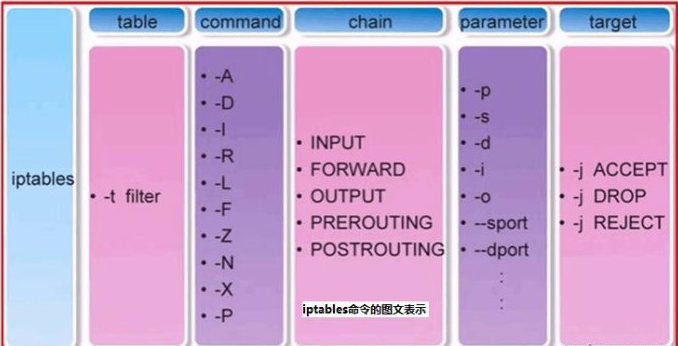

# iptables命令介绍(二)

<!--more-->
iptables man手册: https://linux.die.net/man/8/iptables
iptables中文文档: https://www.frozentux.net/iptables-tutorial/cn/iptables-tutorial-cn-1.1.19.html
备用链接: https://soulchild.cn/iptables

### 一、iptables命令行语法格式
格式: iptables [-t table] command [match] [target]
- `-t table`: 指定表名，不指定默认是filter表
- `COMMAND`: 告诉iptables我们要做什么，比如添加规则、删除规则、替换规则、修改规则、插入规则等等
- `match`: 要对哪些数据包做操作，可以指定包的来源IP地址，网络接口，端口，协议类型等等来选择数据包
- `target`: 指定要执行的操作,比如DROP、ACCEPT、SNT、DNAT。(可在中文文档6.5部分查阅)


下图引自: https://www.cnblogs.com/kevingrace/p/6265113.html



### 二、iptables的COMMAND（https://soulchild.cn/iptables/#COMMANDS）
- `-A chain`: 在指定的链中追加规则(尾部)
- `-I chain [rulenum]`: 在指定的链中插入规则(默认在首部，可以指定规则编号)
- `-D chain [rulenum]`: 删除指定链中的规则(默认删除最后一个)
- `-R chain [rulenum]`: 替换指定链中的规则
- `-F`: 清除指定的链中的规则(如果未指定链,则清除表中的所有链的规则)
- `-N`: 自定义新链
- `-X`: 删除自定义链(必须是空链)
- `-L`: 列出所选链中的所有规则
   - -n以数字显示端口信息
   - -v|-vv显示规则的详细信息(包括每个规则匹配到的数据包数量)
   - --line 显示规则编号
- `Z`: 将指定表中的所有链的字节和数据包计数器清零
- `-P`: 修改指定链中的默认规则，所有规则不能匹配的时候会使用默认规则


### 三、matches(匹配条件https://soulchild.cn/iptables/#MATCHES)
介绍一些常用的
`-p, --protocol`: 匹配协议，不同协议有不同的匹配参数.不指定协议默认为所有协议
- tcp和udp协议
  - `--tcp-flags`: 此选项是tcp协议的。 该选项有两个列表类型的参数。
    - 第一个列表指定我们要检查的标志位。
    - 第二个列表指定 在第一个列表中出现过的且必须被设为1的标志位,第一个列表中其他的标志位必须置0
    - 比如: `-p tcp --tcp-flags SYN,ACK,FIN SYN,ACK`,这里匹配的是SYN和ACK为1，FIN为0的数据包
  - `-m multiport`: 让下面的选项支持匹配多个端口，写法22,53,80,110。并且支持`--ports`参数，`--ports`代表了源和目的端口
  - `--sport, --source-port`: 源端口
  - `--dport, --destination-port`: tcp包的目的端口
  

`-s, --src, --source`: 匹配源地址
`-d, --dst, --destination`: 匹配目标地址
`-i, --in-interface`: 匹配从网络接口进来的数据包，只能用于INPUT，FORWARD和 PREROUTING这三个链
`-o, --out-interface`: 匹配从网络接口出去的数据包
`-f, --fragment`: 用来匹配一个被分片的包的第二片或及以后的部分。
`-m --state`: 指定要匹配包的的状态，有4种状态可用：INVALID，ESTABLISHED，NEW和RELATED。 
- `INVALID`: 意味着这个包没有已知的流或连接与之关联，也可能是它包含的数据或包头有问题。
- `ESTABLISHED`: 意思是包是完全有效的，而且属于一个已建立的连接，这个连接的两端都已经有数据发送。
- `NEW`: 表示包将要或已经开始建立一个新的连接
- `RELATED`: 说明包正在建立一个新的连接，这个连接是和一个已建立的连接相关的。比如FTP-data和FTP-control就是`RELATED`关系

### 四、target( 执行的动作https://soulchild.cn/iptables/#TARGETS )
target决定符合条件的包到何处去，语法是`--jump target`或`-j target`。

---

我们在filter表中建一个名为tcp_packets的链：`iptables -N tcp_packets`

然后再把它作为jump的target：`iptables -A INPUT -p tcp -j tcp_packets`

这样我们就会从INPUT链跳入tcp_packets链，开始在tcp_packets中的旅行。如果到达了tcp_packets链后,未被链中的任何规则匹配，则会退到INPUT链的下一条规则继续它的旅行。如果在子链(tcp_packets)中被ACCEPT了，也就相当于在父链中被ACCEPT了，那么它不会再经过父链中的其他规则。但要注意这个包能被其他表的链匹配，过程可以参考表的优先级。

---

target指定我们要对包做的操作，比如DROP和ACCEPT等等，下面介绍一些常用的。
`-j ACCEPT`: 放行
`-j DROP`: 丢弃
`-j REJECT`: 与`DROP`的区别是，REJECT就向客户端响应一个错误信息，可以通过`--reject-with`选项来控制(默认`port-unreachable`),可用选项如下
- `icmp-net-unreachable`: 网络不可达
- `icmp-host-unreachable`: 主机不可达
- `icmp-port-unreachable`: 端口不可达
- `icmp-proto-unreachable`: 协议不可达
- `icmp-net-prohibited`: 目的网络被强制禁止
- `icmp-host-prohibited`: 目的主机被强制禁止

`-j LOG`: LOG只会记录包的相关信息.可以在/var/log/messages中查看。(详细介绍https://soulchild.cn/iptables/#LOGTARGET)
`-j ULOG`: 支持将LOG写到数据库中
`-j DNAT`: 目的网络地址转换。通常用于外部访问内部。
- 例如: `iptables -t nat -A PREROUTING -d 15.45.23.67 -p tcp --dport 80 -j DNAT --to-destination 192.168.1.1-192.168.1.10`。
- 需要注意：数据包发向内部主机后，会向源地址响应，但是客户端请求的是iptables主机，这样的话tcp无法握手成功。需要将内部主机的网关指向iptables主机。或者在加一条SNAT规则将源地址改为本地IP(`iptables -t nat -A POSTROUTING -p tcp --dport 80 -j SNAT --to-source 192.168.1.150`)

`-j SNAT`: 源网络地址转换。通常用于内部访问外部
- 例如: `iptables -t nat -A POSTROUTING -p tcp --dport 80 -j SNAT --to-source 192.168.10.150`

`-j MASQUERADE`: 和SNAT的作用是一样的，区别就是它不需要指定--to-source。而是自动获取网卡的IP地址,如果条件允许建议使用SNAT
`-j REDIRECT`: 将数据包的端口重定向到本机另一个端口(适用于本地端口的转发(效率高),DNAT适合外部主机的转发)。
- 例如: `iptables -t nat -A PREROUTING -p tcp --dport 80 -j REDIRECT --to-ports 8080`

`-j RETURN`: 它使包返回上一层，顺序是：子链——>父链——>默认策略。具体地说，就是若包在子链中遇到了`RETURN`，则返回父链的下一条规则继续进行条件的比较，若是在父链（或称主链，比如INPUT）中遇到了RETURN，就要应用默认的策略（一般是ACCEPT或DROP）。

`-j NOTRACK`: 对指定的包不做状态追踪
- 例如: `iptables -t raw -I PREROUTING -p tcp --dport 22 -j NOTRACK`
`iptables -t raw -I OUTPUT -p tcp --dport 22 -j NOTRACK`

### 五、常用的例子
- #### 放行80端口
`iptables -I INPUT -p tcp --dport 80 -j ACCEPT`

- ### 将filter表的INPUT、OUTPUT链默认规则改为DROP
```
iptables -P INPUT DROP
iptables -P OUTPUT DROP
```

- #### 开放本地回环地址
`iptables -I INPUT -i lo -j ACCEPT`

- #### DNS服务器配置
```
#开放UDP 53端口(接收外部DNS服务器响应 和 接收其他服务器的DNS请求)
iptables -A INPUT -p udp -m multiport --port 53 -j ACCEPT
#开放TCP 53端口(用于区域文件传输使用,对于主DNS可以只开放dport 53)
iptables -A INPUT -p tcp -m multiport --port 53 -j ACCEPT
```

- #### 允许内部ping外部，禁止外部ping内部
  - 类型参考https://soulchild.cn/iptables/#TABLE.ICMPTYPES
  - `0`: icmp应答包
  - `8`: icmp请求包

```
# 允许本地接收icmp应答包
iptables -A INPUT -p icmp --icmp-type 0 -j ACCEPT
# 拒绝本地接收icmp请求包
iptables -A INPUT -p icmp --icmp-type 8 -j DROP

如果OUTPUT链默认策略是DROP，还需要允许本地发送icmp请求包
iptables -A OUTPUT -p icmp --icmp-type 8 -j ACCEPT
```


---

> 作者: [SoulChild](https://www.soulchild.cn)  
> URL: https://www.soulchild.cn/2328/  

