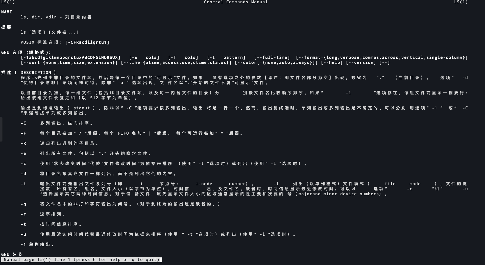

# linux-中文man手册

<!--more-->
项目地址: https://github.com/man-pages-zh/manpages-zh

使用方法(centos/redhat):
```
yum install man-pages-zh-CN
export LANG=zh_CN.utf-8
```
命令行输入`man 命令`,查看帮助
`man ls`



---

> 作者: [SoulChild](https://www.soulchild.cn)  
> URL: https://www.soulchild.cn/2352/  

