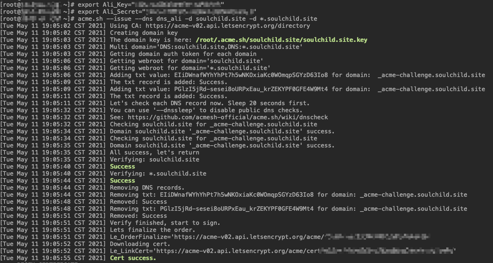

# 使用acme.sh申请免费自动续期的证书

<!--more-->
## 原文: 官方中文文档
https://github.com/acmesh-official/acme.sh/wiki/%E8%AF%B4%E6%98%8E

## 主要步骤:
- 安装 `acme.sh`
- 生成证书
- copy 证书到 nginx 或者其他服务
- 更新证书
- 更新 `acme.sh`

### 1. 安装`acme.sh`
`curl  https://get.acme.sh | sh`

> 普通用户和 root 用户都可以安装使用. 安装过程进行了以下几步:

> 把`acme.sh`安装到你的 home 目录下:
> ~/.acme.sh/
> 并创建 一个 bash 的 alias, 方便你的使用: alias acme.sh=~/.acme.sh/acme.sh

> 自动为你创建 cronjob, 每天 0:00 点自动检测所有的证书, 如果快过期了, 需要更新, 则会自动更新证书.
> 更高级的安装选项请参考: https://github.com/Neilpang/acme.sh/wiki/How-to-install

> 安装过程不会污染已有的系统任何功能和文件, 所有的修改都限制在安装目录中: ~/.acme.sh/

### 2. 生成证书
`acme.sh`实现了acme协议支持的[所有验证协议](https://github.com/acmesh-official/acme.sh/wiki/How-to-issue-a-cert). 一般有两种方式验证: http和dns验证(支持申请泛解析证书).

如果你可以调用域名提供商提供的api，你可以配置自动解析(否则需要手动添加txt记录)，国内的支持阿里云、dnspod.cn、华为云等。我这里使用的是自动alidns验证，更多其他提供商以及使用方法可以查看下面的链接
https://github.com/acmesh-official/acme.sh/wiki/dnsapi

#### 2.1 配置阿里DNS的key和secret
```
export Ali_Key="xxxxxxxxxxxxxxx"
export Ali_Secret="xxxxxxxxxxxxxxx"
```
#### 2.2 申请颁发证书并使用阿里api校验dns(此过程会添加txt记录，完成后会自动删除)
```
acme.sh --issue --dns dns_ali -d soulchild.site -d *.soulchild.site
```
> 也可以更换CA颁发机构: https://github.com/acmesh-official/acme.sh/wiki/Server




### 3.修改nginx配置文件
```nginx
   listen 443;
   server_name  soulchild.site www.soulchild.site;
   ssl on;
   ssl_certificate ssl/soulchild.site.crt;
   ssl_certificate_key ssl/soulchild.site.key;
   ssl_session_timeout 5m;
   ssl_protocols TLSv1.3 TLSv1.1 TLSv1.2;
   ssl_ciphers ECDHE-RSA-AES128-GCM-SHA256:ECDHE:ECDH:AES:HIGH:!NULL:!aNULL:!MD5:!ADH:!RC4;
   ssl_prefer_server_ciphers on;
```
> 将上面的证书(ssl_certificate)和私钥(ssl_certificate_key)修改为你的路径

### 4.copy证书并使nginx生效
步骤2成功执行后会将证书存储到`~/.acme.sh/`目录下，但请不要直接使用这些文件，这是`acme.sh`内部使用的,下面是正确使用步骤。

```bash
acme.sh --install-cert -d soulchild.site \
--key-file       /etc/nginx/ssl/soulchild.site.key  \
--fullchain-file /etc/nginx/ssl/soulchild.site.crt \
--reloadcmd     "systemctl reload nginx"
```
> `--install-cert`: 这个参数代表cpoy
> `-d`: 你的域名
> `--key-file`: copy你的私钥文件,需要和nginx指定的一致
> `--fullchain-file`: copy你的证书链文件(此文件包含自己和中间ca机构的证书),需要和nginx指定的一致
> `--reloadcmd`: 指定重新加载证书的命令

### 4.访问校验


### 5.后期维护命令
`acme.sh --list`: 列出所有证书
`acme.sh --renew -d soulchild.site -d *.soulchild.site --force`: 手动强制更新证书
`acme.sh --renew-all`: 手动更新所有证书
`acme.sh --revoke`: 撤销证书
`acme.sh --remove -d soulchild.site`: 删除证书
`acme.sh --cron`: 通过cronjob更新所有证书。
`acme.sh --upgrade`: 升级acme.sh
`acme.sh --uninstall`: 卸载acme.sh


### 6.配置当执行cronjob时，发送钉钉通知
```
export DINGTALK_WEBHOOK='https://oapi.dingtalk.com/robot/send?access_token=xxx'
export DINGTALK_KEYWORD=acme
acme.sh --set-notify --notify-hook dingtalk
```
> 其他参数和通知方式可查看官方文档https://github.com/acmesh-official/acme.sh/wiki/notify


---

> 作者: [SoulChild](https://www.soulchild.cn)  
> URL: https://www.soulchild.cn/2367/  

