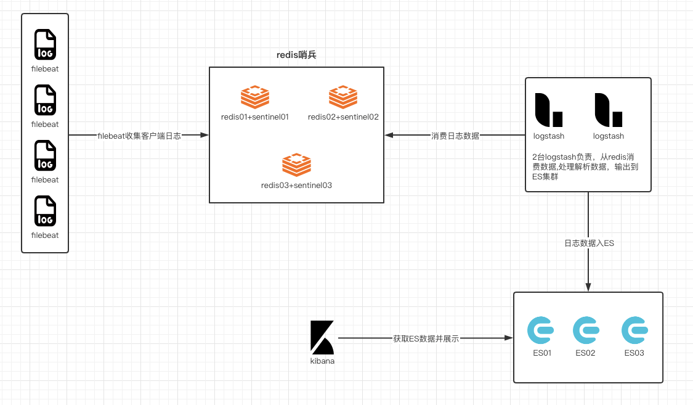

# ELK平台建设

<!--more-->
## 机器规划：
|主机     |IP	|服务	|备注|
|---
|ops-elk-es01	|172.17.10.161	|redis+sentinel、logstash、es、kibana|redis vip:172.17.10.164
ops-elk-es02	|172.17.10.162	|redis+sentinel、logstash、es、kibana|n |
ops-elk-es03	|172.17.10.163	|redis+sentinel、logstash、es| n|


## 架构图:



## 一、安装配置ES集群

### 1.下载二进制包
```bash
wget -O /server/packages/elasticsearch-7.8.1-linux-x86_64.tar.gz https://artifacts.elastic.co/downloads/elasticsearch/elasticsearch-7.8.1-linux-x86_64.tar.gz
```

### 2.解压安装
```bash
tar xf elasticsearch-7.8.1-linux-x86_64.tar.gz -C /usr/local/
```

### 3.优化
vim /etc/sysctl.conf
```bash
fs.file-max=655360
vm.max_map_count = 262144
```

重新加载配置
`sysctl -p`

vim /etc/security/limits.conf
```bash
*        soft    nproc           20480
*        hard    nproc           20480
*        soft    nofile          65536
*        hard    nofile          65536
*        soft    memlock         unlimited
*        hard    memlock         unlimited
```

vim /etc/security/limits.d/20-nproc.conf
```bash
*          soft    nproc     40960
root       soft    nproc     unlimited
```

### 4.修改es配置
vim /usr/local/elasticsearch-7.8.1/config/elasticsearch.yml
```bash
cluster.name: elk-cluster
node.name: node-1
path.data: /data/es/
path.logs: /usr/local/elasticsearch-7.8.1/logs
bootstrap.memory_lock: true
network.host: 0.0.0.0
http.port: 9200
discovery.zen.minimum_master_nodes: 2
cluster.initial_master_nodes: ["172.17.10.161:9300"]
discovery.zen.ping.unicast.hosts: ["172.17.10.161:9300","172.17.10.162:9300","172.17.10.163:9300"]
xpack.security.enabled: true
xpack.security.transport.ssl.enabled: true
xpack.security.transport.ssl.verification_mode: certificate # 证书认证级别
xpack.security.transport.ssl.keystore.path: elastic-certificates.p12
xpack.security.transport.ssl.truststore.path: elastic-certificates.p12
```

### 5.创建用户、es数据目录
```bash
useradd elasticsearch
chown -R elasticsearch.elasticsearch /usr/local/elasticsearch-7.8.1
mkdir /data/es -p
chown -R elasticsearch.elasticsearch /data/es
```

### 6.生成证书
```bash
cd /usr/local/elasticsearch-7.8.1
bin/elasticsearch-certutil ca
bin/elasticsearch-certutil cert --ca elastic-stack-ca.p12
# 修改权限
chown elasticsearch.elasticsearch elastic-*.p12
# 拷贝到配置文件目录
mv elastic-*.p12 config/
```

### 7.配置连接es的各个账户密码
```bash
bin/elasticsearch-setup-passwords interactive
```
> 我设置的是loados-ops

### 8.启动脚本
vim /etc/init.d/es

```bash
#!/bin/bash
#chkconfig: 35 90 90 
ES_BIN=/usr/local/elasticsearch-7.8.1/bin/

function pid_is_exist(){
  ps -ef | grep [e]lasticsearch | grep -v x-pack-ml > /dev/null 2>&1
  return $?
}

function start(){
  w=`whoami`
  [[ $w == "elasticsearch" ]] && $ES_BIN/elasticsearch -d || su - elasticsearch -c "$ES_BIN/elasticsearch -d"
}

function stop(){
  pid_is_exist 
  if [[ $? != 0 ]]
  then
     echo "服务未启动"
     exit
  fi
  ps -ef | grep [e]lasticsearch | grep -v x-pack-ml | awk '{print $2}' | xargs kill
  pid_is_exist
  [[ $? == 0 ]] && echo 停止成功 || read -p 停止失败是否,强制停止: isforce
  [[ $isforce == "y" ]] && ps -ef | grep [e]lasticsearch | grep -v x-pack-ml | awk '{print $2}' | xargs kill -9 
}


case $1 in 
  start)
    start
  ;;

  stop)
    stop
  ;;

  restart)
    stop
    start
  ;;
  
  *)
    echo Usage: $0 "start|stop|restart"
  ;;

esac
```

添加服务开机启动
```bash
chkconfig --add es
```

### 9.启动服务
```bash
service es start
```

### 10.安装其他节点
- 修改第四步中的配置信息
- 第六步不需要重新生成，把之前生成的证书拷贝到新节点即可
- 第七步无需执行
- 其他步骤相同

## 二、安装配置redis哨兵模式
### 1.安装redis
```bash
yum install -y gcc-c++
cd /server/packages
wget http://download.redis.io/releases/redis-5.0.5.tar.gz
tar xf redis-5.0.5.tar.gz
cd redis-5.0.5
make
make install
```

### 2.整合redis
```bash
mkdir /usr/local/redis/{etc,bin,log} -p
cp redis.conf sentinel.conf /usr/local/redis/etc/
cd src
cp mkreleasehdr.sh redis-benchmark redis-check-aof redis-check-rdb redis-cli redis-sentinel redis-server redis-trib.rb /usr/local/redis/bin/
```
> 整合后可以复用，分发到其他节点

### 3.配置环境变量
```bash
echo 'export PATH=$PATH:/usr/local/redis/bin' >> /etc/profile
source /etc/profile
```

### 4.调优
```bash
echo -e 'vm.overcommit_memory=1\nnet.core.somaxconn=2048' >> /etc/sysctl.conf

# 重新加载配置
sysctl -p
```

### 5.修改配置文件
vim /usr/local/redis/etc/redis.conf
```bash
bind 0.0.0.0
protected-mode yes
port 6379
tcp-backlog 2048
timeout 0
tcp-keepalive 300
daemonize yes
supervised systemd
pidfile "/var/run/redis_6379.pid"
loglevel notice
logfile "/usr/local/redis/log/access.log"
databases 16
always-show-logo yes
save 900 1
save 300 10
save 60 10000
stop-writes-on-bgsave-error yes
rdbcompression yes
rdbchecksum yes
dbfilename "dump.rdb"
dir "/usr/local/redis"
replica-serve-stale-data yes
replica-read-only yes
repl-diskless-sync no
repl-diskless-sync-delay 5
repl-disable-tcp-nodelay no
replica-priority 100
lazyfree-lazy-eviction no
lazyfree-lazy-expire no
lazyfree-lazy-server-del no
replica-lazy-flush no
appendonly no
appendfilename "appendonly.aof"
appendfsync everysec
no-appendfsync-on-rewrite no
auto-aof-rewrite-percentage 100
auto-aof-rewrite-min-size 64mb
aof-load-truncated yes
aof-use-rdb-preamble yes
lua-time-limit 5000
slowlog-log-slower-than 10000
slowlog-max-len 128
latency-monitor-threshold 0
notify-keyspace-events ""
hash-max-ziplist-entries 512
hash-max-ziplist-value 64
list-max-ziplist-size -2
list-compress-depth 0
set-max-intset-entries 512
zset-max-ziplist-entries 128
zset-max-ziplist-value 64
hll-sparse-max-bytes 3000
stream-node-max-bytes 4096
stream-node-max-entries 100
activerehashing yes
client-output-buffer-limit normal 0 0 0
client-output-buffer-limit replica 256mb 64mb 60
client-output-buffer-limit pubsub 32mb 8mb 60
hz 10
dynamic-hz yes
aof-rewrite-incremental-fsync yes
rdb-save-incremental-fsync yes
maxclients 4064
```
> 如果是从节点，需要指向主节点，添加如下配置项
> slaveof 172.17.10.161 6379

### 6.配置sentinel
vim /usr/local/redis/etc/sentinel.conf
```bash
daemonize yes
port  26379
logfile  /var/log/redis/redis-sentinel.log
pidfile  /var/run/redis-sentinel.pid
sentinel monitor elk 172.17.10.161 6379 2
sentinel down-after-milliseconds elk 3000  
sentinel failover-timeout elk 20000
sentinel parallel-syncs elk 1
sentinel client-reconfig-script elk /server/scripts/redis_sentinel.sh
```
> 三个节点同样的配置

### 7.创建启动用户
```bash
useradd -r redis && chown -R redis.redis /usr/local/redis/
```

### 8.配置systemd脚本

#### redis-server
vim /etc/systemd/system/redis.service
```bash
[Unit]
Description=Redis persistent key-value database
After=network.target
After=network-online.target
Wants=network-online.target

[Service]
ExecStart=/usr/local/redis/bin/redis-server /usr/local/redis/etc/redis.conf --supervised systemd
Type=notify
User=redis
Group=redis

[Install]
WantedBy=multi-user.target
```

#### redis-sentinel
vim /etc/systemd/system/redis-sentinel.service
```bash
[Unit]
Description=Redis Sentinel
After=network.target
After=network-online.target
Wants=network-online.target

[Service]
ExecStart=/usr/local/redis/bin/redis-sentinel /usr/local/redis/etc/sentinel.conf --supervised systemd
Type=notify
#User=redis
#Group=redis

[Install]
WantedBy=multi-user.target
```

### 9.配置VIP漂移脚本
每个sentinel节点都需要添加如下脚本

vim /server/scripts/redis_sentinel.sh
```bash
#!/bin/bash
MASTER_IP=${6}
VIP='172.17.10.164'
NETMASK='24'
INTERFACE='eth0'
MY_IP=`ip a s dev ${INTERFACE} | awk 'NR==3{split($2,ip,"/");print ip[1]}'`
if [ ${MASTER_IP} = ${MY_IP} ]; then
        /sbin/ip addr add ${VIP}/${NETMASK} dev ${INTERFACE}
        /sbin/arping -q -c 3 -A ${VIP} -I ${INTERFACE}
        exit 0
else
        /sbin/ip addr del ${VIP}/${NETMASK} dev ${INTERFACE}
        exit 0
fi
exit 1
```


### 10.启动服务
```bash
systemctl start redis
systemctl enable redis
systemctl start redis-sentinel
systemctl enable redis-sentinel
```

## 三、filebeat
### 1.安装filebeat
yum install -y https://artifacts.elastic.co/downloads/beats/filebeat/filebeat-7.8.1-x86_64.rpm

### 2.filebeat配置
java
```yaml
filebeat.inputs:
- type: log
  enable: true
  paths: ["/data/log/szjj-server/*.log"]
  exclude_files: ["/data/log/szjj-server/blade-log.log"]
  fields_under_root: true
  fields:
    log_type: "blade_java"
    project: "szjj_base_platform"
    env: "test"
  scan_frequency: 5s
  multiline.pattern: ^\d{4}-\d{1,2}-\d{1,2}|^\d{2}:\d{2}:\d{2}\.\d+
  multiline.negate: true
  multiline.match: after
  multiline.max_lines: 1000

processors:
- add_host_metadata:
    netinfo.enabled: true
- drop_fields:
    fields:
    - input
    - agent
    - ecs
    - beat
    - prospector
    - name
    - host.architecture
    - host.os
    - host.id
    - host.containerized
    - host.mac
    - host.name

output.redis:
  hosts: ["172.17.10.164"]
  datatype: "list"
  db: 0
  key: "%{[project]}_%{[env]}"
```

nginx
```yaml
filebeat.inputs:
- type: log
  paths:
  - /usr/local/nginx/logs/*_access.log
  fields_under_root: true
  fields:
    log_type: nginx_access
    env: prod
  json:
    keys_under_root: true
    overwrite_keys: true
- type: log
  paths:
  - /usr/local/nginx/logs/*_error.log
  fields_under_root: true
  fields:
    log_type: nginx_error
    env: prod

processors:
- add_host_metadata:
    netinfo.enabled: true
- drop_fields:
    fields:
    - input
    - agent
    - ecs
    - beat
    - prospector
    - name
    - host.architecture
    - host.os
    - host.id
    - host.containerized
    - host.mac
    - host.name

output.redis:
  hosts: ["172.17.10.164"]
  datatype: "list"
  db: 0
  key: "nginx_prod"
```


## 四、logstash配置
### 1.input部分配置
```bash
input {
  redis {
    data_type => "list"
    db => 0
    host => "172.17.10.164"
    key => "szjj_base_platform_test"
  }
 
  redis {
    data_type => "list"
    db => 0
    host => "172.17.10.164"
    key => "szjj_base_platform_prod"
  }
 
  redis {
    data_type => "list"
    db => 0
    host => "172.17.10.164"
    key => "bpms_test"
  }
 
  redis {
    data_type => "list"
    db => 0
    host => "172.17.10.164"
    key => "bpms_prod"
  }
 
 
  redis {
    data_type => "list"
    db => 0
    host => "172.17.10.164"
    key => "nginx_test"
  }
 
  redis {
    data_type => "list"
    db => 0
    host => "172.17.10.164"
    key => "nginx_prod"
  }
}
```

### 2.filter部分配置
```bash
filter {
  mutate {
    add_field => {
      "handler" => "${HOSTNAME:logstash-01}"
    }
  }
 
  if [log_type] == "blade_java" {
    mutate {
      copy => { "[log][file][path]" => "tmp" }
      copy => { "message" => "originnal" }
    }
 
    grok {
      keep_empty_captures => true
      pattern_definitions => {
        "MYJAVADATE" => "\d{4}-\d{2}-\d{2} \d{2}:\d{2}:\d{2}\.\d{3}"
      }
      overwrite => [ "message" ]
      match=>{
        "message" => [
          "%{MYJAVADATE:date}[ ]+%{LOGLEVEL:level}[ ]+%{POSINT:pid}[ ]+---[ ]+(?<logger>.*?)[ ]+:[ ]+(?<message>.*[\n]+=+.*$)",
          "%{MYJAVADATE:date}[ ]+%{LOGLEVEL:level}[ ]+%{POSINT:pid}[ ]+---[ ]+(?<logger>.*?)[ ]+:[ ]+%{DATA:message}\n(?<exception>.*$)",
          "%{MYJAVADATE:date}[ ]+%{LOGLEVEL:level}[ ]+%{POSINT:pid}[ ]+---[ ]+(?<logger>.*?)[ ]+:[ ]+%{DATA:message}$"
        ]
      }
    }
 
    date {
      match => ["date", "yyyy-MM-dd HH:mm:ss.SSS"]
    }
     
    mutate {
      gsub => [ "tmp", ".log", "" ]
      split => { "tmp" => "/" }
      add_field => {
        "app" => "%{[tmp][-1]}"
      }
      remove_field => ["tmp"]
    }
 
  } else if [log_type] == "springboot_java" {
 
    grok {
      keep_empty_captures => true
      match => { "message" => "^(?<date>\d{4}-\d{2}-\d{2} \d{2}:\d{2}:\d{2}\.\d{3})" }
    }
 
    date {
      match => ["date", "yyyy-MM-dd HH:mm:ss.SSS"]
    }
 
    mutate {
      copy => { "message" => "originnal" }
    }
 
  }
}
```

### 3.output部分配置
```bash
output{
    if [log_type] == "blade_java" or [log_type] == "springboot_java" {
        elasticsearch {
          hosts => ["172.17.10.161:9200", "172.17.10.162:9200", "172.17.10.163:9200"]
          index => "%{project}-%{env}-%{app}-%{+yyyy.MM.dd}"
          user => "log_agent"
          password => "loados-log"
        }
    }
 
    if [log_type] in ["nginx_access", "nginx_error"] {
        elasticsearch {
          hosts => ["172.17.10.161:9200", "172.17.10.162:9200", "172.17.10.163:9200"]
          index => "%{log_type}-%{env}-%{+yyyy.MM.dd}"
          user => "log_agent"
          password => "loados-log"
        }
    } 
}
```


---

> 作者: [SoulChild](https://www.soulchild.cn)  
> URL: https://www.soulchild.cn/2474/  

