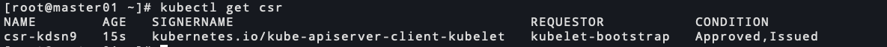

# kubernetes 1.20.7 二进制安装-kubelet安装(十)

<!--more-->
### 一、安装kubelet
```bash
# master节点执行
# 远程创建目录，创建manifests的目的是预留一个静态pod目录，目前暂时还用不到。
for i in {201..203};do ssh 172.17.20.$i mkdir /etc/kubernetes/{manifests,pki} /etc/kubernetes/pki/ca -p ;done
for i in {210..212};do ssh 172.17.20.$i mkdir /etc/kubernetes/{manifests,pki} /etc/kubernetes/pki/ca -p ;done

# 复制CA根证书
for i in {210..212};do scp /etc/kubernetes/pki/ca/ca.pem 172.17.20.$i:/etc/kubernetes/pki/ca/ ;done

# 安装kubelet
for i in {201..203};do scp /server/packages/kubernetes/server/bin/kubelet root@172.17.20.$i:/usr/local/bin/kubelet ;done
for i in {210..212};do scp /server/packages/kubernetes/server/bin/kubelet root@172.17.20.$i:/usr/local/bin/kubelet ;done
```

### 二、生成kubeconfig文件
#### master节点执行
```bash
# 设置集群信息
kubectl config set-cluster kubernetes --kubeconfig=kubelet-bootstrap.conf --server=https://172.17.20.200:6443 --certificate-authority=/etc/kubernetes/pki/ca/ca.pem --embed-certs=true

# 设置用户信息，之前用的是证书，现在这里用的是token(这个token我们后面只赋予他创建csr请求的权限)，kubelet的证书我们交给apiserver来管理
kubectl config set-credentials kubelet-bootstrap --kubeconfig=kubelet-bootstrap.conf --token=`sed 's#,.*##' /etc/kubernetes/token.csv`

# 设置上下文信息
kubectl config set-context kubernetes --kubeconfig=kubelet-bootstrap.conf --cluster=kubernetes --user=kubelet-bootstrap

# 设置默认上下文
kubectl config use-context kubernetes --kubeconfig=kubelet-bootstrap.conf

# 分发到node节点
# 我这里master节点也作为node节点使用
for i in {202..203};do scp /etc/kubernetes/kubelet-bootstrap.conf 172.17.20.$i:/etc/kubernetes/ ;done

for i in {210..212};do scp /etc/kubernetes/kubelet-bootstrap.conf 172.17.20.$i:/etc/kubernetes/ ;done
```

### 三、创建ClusterRoleBinding
#### 1.我们的token属于`system::bootstrappers`组,但是现在没有创建CSR的权限，所以现在需要和ClusterRole(system:node-bootstrapper)绑定，这个ClusterRole是包含`certificatesigningrequests`权限的。下面在master节点执行
```bash
cat <<EOF | kubectl apply -f -
apiVersion: rbac.authorization.k8s.io/v1
kind: ClusterRoleBinding
metadata:
  name: create-csrs-for-bootstrapping
subjects:
- kind: Group
  name: system:bootstrappers
  apiGroup: rbac.authorization.k8s.io
roleRef:
  kind: ClusterRole
  name: system:node-bootstrapper
  apiGroup: rbac.authorization.k8s.io
EOF
```

#### 2.当apiserver访问kubelet时(logs、exec等操作),kubelet也需要对客户端进行认证,k8s中内置了一个`system:kubelet-api-admin`的角色，我们将它和apiserver证书中的CN字段绑定，即和`kubernetes`用户进行绑定,这样apiserver对kubelet就有了访问权限，下面同样在master节点执行
```bash
cat <<EOF | kubectl apply -f -
apiVersion: rbac.authorization.k8s.io/v1
kind: ClusterRoleBinding
metadata:
  name: kube-apiserver-kubelet-apis-admin
roleRef:
  apiGroup: rbac.authorization.k8s.io
  kind: ClusterRole
  name: system:kubelet-api-admin
subjects:
- apiGroup: rbac.authorization.k8s.io
  kind: User
  name: kubernetes
EOF
```


### 四、配置kubelet参数
关于配置: https://kubernetes.io/zh/docs/tasks/administer-cluster/kubelet-config-file/

KubeletConfiguration: https://v1-20.docs.kubernetes.io/docs/reference/config-api/kubelet-config.v1beta1/#kubelet-config-k8s-io-v1beta1-KubeletConfiguration

```bash
cat > /etc/kubernetes/kubelet.yaml <<EOF
apiVersion: kubelet.config.k8s.io/v1beta1
kind: KubeletConfiguration
enableServer: true
staticPodPath: /etc/kubernetes/manifests
syncFrequency: 1m
fileCheckFrequency: 20s
address: 0.0.0.0
port: 10250
readOnlyPort: 0
rotateCertificates: true
serverTLSBootstrap: true
authentication:
  anonymous:
    enabled: false
  webhook:
    cacheTTL: 0s
    enabled: true
  x509:
    clientCAFile: /etc/kubernetes/pki/ca/ca.pem
authorization:
  mode: Webhook
healthzPort: 10248
healthzBindAddress: 0.0.0.0
clusterDomain: cluster.local
clusterDNS: 
  # 配置这个为预留，后期部署core-dns将使用这个地址
  - 10.1.0.10
nodeStatusUpdateFrequency: 10s
nodeStatusReportFrequency: 1m
imageMinimumGCAge: 2m
imageGCHighThresholdPercent: 80
imageGCLowThresholdPercent: 75
volumeStatsAggPeriod: 1m
cgroupDriver: systemd
runtimeRequestTimeout: 2m
maxPods: 200
kubeAPIQPS: 5
kubeAPIBurst: 10
serializeImagePulls: false
evictionHard:
  memory.available: "100Mi"
  nodefs.available: "10%"
  nodefs.inodesFree: "5%"
  imagefs.available: "15%"
containerLogMaxSize: 10Mi
containerLogMaxFiles: 8
EOF


# 分发到其他节点
for i in {202..203};do scp /etc/kubernetes/kubelet.yaml 172.17.20.$i:/etc/kubernetes/ ;done

for i in {210..212};do scp /etc/kubernetes/kubelet.yaml 172.17.20.$i:/etc/kubernetes/ ;done
```
参数说明:
`enableServer`: 启动kubelet的http rest server，这个server提供了获取本地节点运行的pod列表、状态以及其他监控相关的rest接口，默认true。
`staticPodPath`: 静态pod目录
`syncFrequency`: 同步运行中容器的配置的频率,默认1m
`fileCheckFrequency`: 检查静态Pod的时间间隔,默认20s
`address`: 监听地址，默认0.0.0.0
`port`: 监听端口，默认10250
`readOnlyPort`: 一个提供只读服务的端口，0为禁用。
`rotateCertificates`: 启用客户端证书轮换。 Kubelet将从certificates.k8s.io API请求新证书。
`serverTLSBootstrap`: 启用服务器证书引导。 从certificates.k8s.io API请求证书，需要批准者批准证书签名请求。这必须启用`RotateKubeletServerCertificate`特性，默认是启用的。
`authentication`: kubelet对客户端的认证方式
  - `anonymous`: 匿名认证
  - `webhook`: webhook认证方式
    - `cacheTTL `: 认证结果缓存
  - `x509`: x509证书认证
    - `clientCAFile`: 请求kubelet服务端的客户端，这里指定给客户端证书签发的CA机构

`authorization`: kubelet对客户端的授权方式
  - `mode`: 应用于kubelet服务器请求的授权模式。有效值是AlwaysAllow和Webhook。Webhook模式使用SubjectAccessReview API来确定授权。

`healthzPort`: healthz接口的监听端口
`healthzBindAddress`: healthz接口的监听地址
`clusterDomain`: 此集群的DNS域
`clusterDNS`: 一个DNS列表，kubelet将配置所有容器使用此DNS解析，而不是主机的DNS服务器。
`nodeStatusUpdateFrequency `: kubelet将节点状态信息上报到apiserver的频率，默认：10s
`nodeStatusReportFrequency`: kubelet节点状态不变时将节点状态上报到apiserver的频率。默认：1m
`imageMinimumGCAge`: 镜像垃圾回收时，清理多久没有被使用的镜像，默认2m。即2分钟内没有被使用过的镜像会被清理。
`imageGCHighThresholdPercent`: 设置镜像垃圾回收的阈值(磁盘空间百分比)，默认85。高于此值会触发垃圾回收。
`imageGCLowThresholdPercent`: 设置停止镜像垃圾回收的阈值(磁盘空间百分比)，默认80。低于此值会停止垃圾回收。
`volumeStatsAggPeriod`: 计算和缓存所有Pod的卷磁盘使用情况的频率，默认1m
`cgroupDriver`: kubelet用来操纵cgroups的驱动程序（cgroupfs或systemd）
`runtimeRequestTimeout`: 所有runtime请求的超时时间，除了长时间运行的请求如pull、logs、exec 和 attach。默认2m
`maxPods`: 控制kubelet可以运行的pod数量。默认110
`kubeAPIQPS`: 与apiserver通信的qps,默认5
`kubeAPIBurst`: 与apiserver通信时的并发数,默认10
`serializeImagePulls`: 默认true，一个一个按顺序拉镜像，docker大于1.9，并且不是使用aufs存储驱动的建议改成false
`evictionHard`: 设置硬驱逐pod的阈值.https://kubernetes.io/zh/docs/tasks/administer-cluster/out-of-resource/ 默认如下:
  - memory.available: "100Mi" # 可用内存不足100Mi会采用硬驱逐pod
  - nodefs.available: "10%"  # nodefs空间不足10%会采用硬驱逐pod
  - nodefs.inodesFree: "5%"  # inodes不足5%会采用硬驱逐pod
  - imagefs.available: "15%" # imagefs空间不足15%会采用硬驱逐pod

`containerLogMaxSize`: 容器日志轮换大小，满足指定大小会轮换，默认10Mi
`containerLogMaxFiles`: 容器日志轮换保留的最大个数，默认5个


### 五、创建systemd脚本文件
#### 所有node节点执行,注意需要修改--hostname-override=参数的值
```bash
cat > /etc/systemd/system/kubelet.service <<EOF
[Unit]
Description=Kubernetes Kubelet
Documentation=https://github.com/GoogleCloudPlatform/kubernetes
After=docker.service
Requires=docker.service

[Service]
ExecStart=/usr/local/bin/kubelet \\
  --bootstrap-kubeconfig=/etc/kubernetes/kubelet-bootstrap.conf \\
  --cert-dir=/etc/kubernetes/pki/ \\
  --config=/etc/kubernetes/kubelet.yaml \\
  --container-runtime=docker \\
  --network-plugin=cni \\
  --cni-bin-dir=/opt/cni/bin/ \\
  --hostname-override=172.17.20.201 \\
  --kubeconfig=/etc/kubernetes/kubelet.conf \\
  --pod-infra-container-image=registry.aliyuncs.com/google_containers/pause:3.2 \\
  --alsologtostderr=true \\
  --logtostderr=false \\
  --log-file=/var/log/kubelet.log \\
  --log-file-max-size=100 \\
  --v=2
Restart=on-failure
RestartSec=5

[Install]
WantedBy=multi-user.target
EOF
```
参数说明:
`--bootstrap-kubeconfig`: 用于bootstrap引导启动的kubeconfig文件
`--cert-dir`: 证书申请被批准后，用于保存证书和私钥的路径
`--container-runtime`: 容器运行时(CRI)，docker或remote
`--network-plugin`: 网络插件名称
`--cni-bin-dir`: CNI插件的bin目录
`--cni-conf-dir`: CNI配置文件目录
`--container-runtime-endpoint`: 当`container-runtime`使用remote时,指定它的通信端点，默认`unix:///var/run/dockershim.sock`
`--docker-endpoint`: 当`container-runtime`使用docker时,指定它的通信端点,默认`unix:///var/run/dockershim.sock`
`--hostname-override`: 用来配置该节点在集群中显示的主机名，kubelet设置了-–hostname-override参数后，kube-proxy也需要设置，否则会出现找不到Node的情况
`--kubeconfig`: 指定kubeconfig文件。启动流程说明: https://kubernetes.io/zh/docs/reference/command-line-tools-reference/kubelet-tls-bootstrapping/#bootstrap-initialization
`--logtostderr`: 日志输出到stderr而不是文件。默认true
`--pod-infra-container-image`: 指定pause镜像


### 六、证书自动批准和续期
默认情况下,kubelet向apiserver发送证书请求后,需要我们手动批准`kubectl certificate approve xxx`.真正负责签发证书的是`kube-controller-manager`,他需要如下参数: `cluster-signing-cert-file`,`cluster-signing-key-file`,这个我们在前面已经配置过了。

要允许kubelet请求并接收证书(访问kube-apiserver的客户端证书),可以创建一个ClusterRoleBinding将启动引导节点所在的组`system:bootstrappers`绑定到集群角色(ClusterRole)`system:certificates.k8s.io:certificatesigningrequests:nodeclient`上:
```bash
# master节点执行
cat <<EOF | kubectl apply -f -
# 自动批准"system:bootstrappers"组的所有CSR
apiVersion: rbac.authorization.k8s.io/v1
kind: ClusterRoleBinding
metadata:
  name: auto-approve-csrs-for-group
subjects:
- kind: Group
  name: system:bootstrappers
  apiGroup: rbac.authorization.k8s.io
roleRef:
  kind: ClusterRole
  name: system:certificates.k8s.io:certificatesigningrequests:nodeclient
  apiGroup: rbac.authorization.k8s.io
EOF
```


要允许kubelet对客户端证书执行续期操作(对访问kube-apiserver的客户端证书续期)，可以创建一个ClusterRoleBinding将正常工作的节点所在的组`system:nodes`绑定到绑定到集群角色(ClusterRole)`system:certificates.k8s.io:certificatesigningrequests:selfnodeclient`上:
```bash
# master节点执行
cat <<EOF | kubectl apply -f -
# 自动批准"system:nodes"组的CSR续约请求
apiVersion: rbac.authorization.k8s.io/v1
kind: ClusterRoleBinding
metadata:
  name: auto-approve-renewals-for-nodes
subjects:
- kind: Group
  name: system:nodes
  apiGroup: rbac.authorization.k8s.io
roleRef:
  kind: ClusterRole
  name: system:certificates.k8s.io:certificatesigningrequests:selfnodeclient
  apiGroup: rbac.authorization.k8s.io
EOF
```

到此为止，kubelet可以在首次启动时申请一个访问apiserver的客户端证书，并将它拿到手。但是kubelet本身也需要一个服务端证书,这需要我们手动来批准,1.20之前的版本应该可以自动批准(我按照1.19的文档试了一下没有成功)。官方关于kubelet服务端证书的说明:https://v1-20.docs.kubernetes.io/zh/docs/reference/command-line-tools-reference/kubelet-tls-bootstrapping/#certificate-rotation


### 七、启动服务
```bash
# 所有node节点执行
systemctl start kubelet
systemctl enable kubelet
```

### 八、批准kubelet服务端证书
#### 查看客户端csr,可以看到已经自动批准了


#### 等待一会，可以看到服务端证书的csr


#### 这需要我们手动批准，其他节点请自行操作


### 九、查看node状态


---

> 作者: [SoulChild](https://www.soulchild.cn)  
> URL: https://www.soulchild.cn/2493/  

