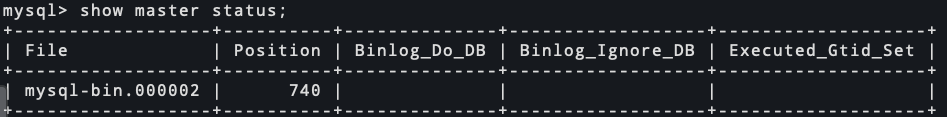

# mysql MHA部署配置

<!--more-->
### 一、机器规划
|主机|IP|角色
|-
|mysql01|172.17.20.240|master
|mysql02|172.17.20.241|slave
|mysql03|172.17.20.242|slave
|manage|172.17.20.150|manage
|vip|172.17.20.243|vip|

### 二、安装mysql
可参考https://soulchild.cn/266.html


### 三、mysql配置文件
**mysql01**
```bash
[mysqld]
basedir=/usr/local/mysql
datadir=/data/mysql
socket=/tmp/mysql.sock
server_id=100
read-only=1
port=3306
log-bin=mysql-bin
relay-log = mysql-relay-bin
replicate-wild-ignore-table=mysql.%
replicate-wild-ignore-table=test.%
replicate-wild-ignore-table=information_schema.%

[mysqld_safe]
log-error=/var/log/mysql.log
```

**mysql02**
```bash
[mysqld]
basedir=/usr/local/mysql
datadir=/data/mysql
socket=/tmp/mysql.sock
server_id=101
read-only=1
port=3306
log-bin=mysql-bin
relay-log = mysql-relay-bin
replicate-wild-ignore-table=mysql.%
replicate-wild-ignore-table=test.%
replicate-wild-ignore-table=information_schema.%

[mysqld_safe]
log-error=/var/log/mysql.log
```

**mysql03**
```bash
[mysqld]
basedir=/usr/local/mysql
datadir=/data/mysql
socket=/tmp/mysql.sock
server_id=102
read-only=1
port=3306
log-bin=mysql-bin
relay-log = mysql-relay-bin
replicate-wild-ignore-table=mysql.%
replicate-wild-ignore-table=test.%
replicate-wild-ignore-table=information_schema.%

[mysqld_safe]
log-error=/var/log/mysql.log
```

### 四、创建mysql账号
所有节点执行
```bash
# 主从复制账号
grant replication slave on *.* to 'repl_user'@'172.17.%.%' identified by 'soulchild_repl';
# 管理员账号
grant all on *.* to 'root'@'172.17.%.%' identified by 'soulchild';
```

### 五、开启主从同步
1.查看master bin-log位置


2.修改slave为从节点
```bash
# mysql02
mysql> change master to master_host='172.17.20.240',master_user='repl_user',master_password='soulchild_repl',master_log_file='mysql-bin.000002',master_log_pos=740;

mysql> start slave;


# mysql03
mysql> change master to master_host='172.17.20.240',master_user='repl_user',master_password='soulchild_repl',master_log_file='mysql-bin.000002',master_log_pos=740;

mysql> start slave;
```

### 六、下载安装MHA工具
下载地址: 
https://github.com/yoshinorim/mha4mysql-manager/releases
https://github.com/yoshinorim/mha4mysql-node/releases
https://code.google.com/archive/p/mysql-master-ha/downloads

```bash
# 所有mysql节点安装node包
yum install -y mha4mysql-node-0.58-0.el7.centos.noarch.rpm

# manager节点
yum install -y mha4mysql-node-0.58-0.el7.centos.noarch.rpm mha4mysql-manager-0.58-0.el7.centos.noarch.rpm
```

### 七、配置所有节点SSH免密登录
略

### 八、配置mha-manager
以下操作在manager节点执行

1.创建相关文件目录
```bash
mkdir /etc/mha/
touch /etc/mha/app1.conf
```

2.编写配置文件
```bash
vim /etc/mha/app1.conf

[server default]
# mysql管理员用户名密码
user=root
password=soulchild
# ssh的用户
ssh_user=root
# 主从复制的用户名密码
repl_user=repl_user
repl_password=soulchild_repl
# mysql二进制日志路径,也可以单独写在单独server部分中
master_binlog_dir=/data/mysql/
# 执行pingSQL语句的频率
ping_interval=1
# mha-manager的日志路径
manager_log=/var/log/mha/app1/manager.log
manager_workdir=/var/log/mha/app1

[server1]
# mysql主机ip
hostname=172.17.20.240
port=3306
# 优先将此服务器设置为主
candidate_master=1
# 默认情况下，如果slave落后于master超过100MB的中继日志,MHA不会选择这台从作为新的master,设置check_repl_delay=0会忽略这个机制
check_repl_delay=0

[server2]
hostname=172.17.20.241
port=3306
master_binlog_dir=/data/mysql

[server3]
hostname=172.17.20.242
port=3306
candidate_master=1
```

### 九、检查配置
1.检查ssh免密配置,在manager节点
```bash
masterha_check_ssh --conf=/etc/mha/app1.conf
```


2.检查主从状态
```bash
masterha_check_repl --conf=/etc/mha/app1.conf
```


这里报错找不到mysqlbinlog，解决方法如下,再次执行检查，看到MySQL Replication Health is OK.就代表没问题了
```bash
ln -s /usr/local/mysql/bin/mysqlbinlog /usr/bin/
ln -s /usr/local/mysql/bin/mysql /usr/bin/
```
### 十、启动mha-manager
```bash
nohup masterha_manager --conf=/etc/mha/app1.conf --ignore_last_failover &> /var/log/mha/app1/app1_start.log &
```

>默认情况下两次宕机时间不足8小时(--last_failover_minute=480)，是不会执行failover的，使用--ignore_last_failover参数会忽略这个机制。
> 如果不设置--ignore_last_failover参数，则需要手动删除[manager_workdir]/xxx.failover.xxx文件

检查运行状态
`masterha_check_status --conf /etc/mha/app1.conf`


> 停止mha: `masterha_stop --conf /etc/mha/app1.conf`

### 十一、故障模拟
1.停止master
```bash
systemctl stop mysqld
```

2.查看当前master是否切换


3.将旧master作为slave加入到集群
```bash
# 查看manager日志,可以看到如下内容,将xxx改为repl_user的密码，在旧master节点上执行
CHANGE MASTER TO MASTER_HOST='172.17.20.242', MASTER_PORT=3306, MASTER_LOG_FILE='mysql-bin.000001', MASTER_LOG_POS=740, MASTER_USER='repl_user', MASTER_PASSWORD='xxx';

# 启动slave
start slave;
```

4.再次启动mha-manager
```bash
nohup masterha_manager --conf=/etc/mha/app1.conf --ignore_last_failover &> /var/log/mha/app1/app1_start.log &
```

### 十二、配置vip漂移脚本
1.创建目录
```bash
mkdir /etc/mha/scripts/
```

2.编写脚本 `vim /etc/mha/scripts/master_ip_failover`
需要修改`$vip`,`$key`,`$ssh_start_vip`, `$ssh_stop_vip`
```bash
#!/usr/bin/env perl
use strict;
use warnings FATAL => 'all';

use Getopt::Long;
use MHA::DBHelper;

my (
  $command,        $ssh_user,         $orig_master_host,
  $orig_master_ip, $orig_master_port, $new_master_host,
  $new_master_ip,  $new_master_port,  $new_master_user,
  $new_master_password
);
my $vip = '172.17.20.243/24';
my $key = "1";
my $ssh_start_vip = "/sbin/ifconfig eth0:$key $vip";
my $ssh_stop_vip = "/sbin/ifconfig eth0:$key down";

GetOptions(
  'command=s'             => \$command,
  'ssh_user=s'            => \$ssh_user,
  'orig_master_host=s'    => \$orig_master_host,
  'orig_master_ip=s'      => \$orig_master_ip,
  'orig_master_port=i'    => \$orig_master_port,
  'new_master_host=s'     => \$new_master_host,
  'new_master_ip=s'       => \$new_master_ip,
  'new_master_port=i'     => \$new_master_port,
  'new_master_user=s'     => \$new_master_user,
  'new_master_password=s' => \$new_master_password,
);

exit &main();

sub main {
  if ( $command eq "stop" || $command eq "stopssh" ) {

    # $orig_master_host, $orig_master_ip, $orig_master_port are passed.
    # If you manage master ip address at global catalog database,
    # invalidate orig_master_ip here.
    my $exit_code = 1;
    eval {

      # updating global catalog, etc
      $exit_code = 0;
    };
    if ($@) {
      warn "Got Error: $@\n";
      exit $exit_code;
    }
    exit $exit_code;
  }
    elsif ( $command eq "start" ) {

        # all arguments are passed.
        # If you manage master ip address at global catalog database,
        # activate new_master_ip here.
        # You can also grant write access (create user, set read_only=0, etc) here.
        my $exit_code = 10;
        eval {
            print "Enabling the VIP - $vip on the new master - $new_master_host \n";
            &start_vip();
            &stop_vip();
            $exit_code = 0;
        };
        if ($@) {
            warn $@;
            exit $exit_code;
        }
        exit $exit_code;
    }
    elsif ( $command eq "status" ) {
        print "Checking the Status of the script.. OK \n";
        `ssh $ssh_user\@$orig_master_host \" $ssh_start_vip \"`;
        exit 0;
    }
    else {
        &usage();
        exit 1;
    }
}


sub start_vip() {
    `ssh $ssh_user\@$new_master_host \" $ssh_start_vip \"`;
}
# A simple system call that disable the VIP on the old_master 
sub stop_vip() {
   `ssh $ssh_user\@$orig_master_host \" $ssh_stop_vip \"`;
}


sub usage {
  print
"Usage: master_ip_failover --command=start|stop|stopssh|status --orig_master_host=host --orig_master_ip=ip --orig_master_port=port --new_master_host=host --new_master_ip=ip --new_master_port=port\n";
}
```
3.给脚本添加执行权限
`chmod +x /etc/mha/scripts/master_ip_failover`

4.修改配置文件,在`[server default]`部分添加脚本参数
vim /etc/mha/app1.conf
```bash
[server default]
# mysql管理员用户名密码
user=root
password=soulchild
# ssh的用户
ssh_user=root
# 主从复制的用户名密码
repl_user=repl_user
repl_password=soulchild_repl
# mysql二进制日志路径,也可以单独写在单独server部分中
master_binlog_dir=/data/mysql/
# 执行pingSQL语句的频率
ping_interval=1
# mha-manager的日志路径
manager_log=/var/log/mha/app1/manager.log
manager_workdir=/var/log/mha/app1
# vip漂移脚本
master_ip_failover_script=/etc/mha/scripts/master_ip_failover


[server1]
# mysql主机ip
hostname=172.17.20.240
port=3306
# 优先将此服务器设置为主
candidate_master=1
# 默认情况下，如果slave落后于master超过100MB的中继日志,MHA不会选择这台从作为新的master,设置check_repl_delay=0会忽略这个机制
check_repl_delay=0

[server2]
hostname=172.17.20.241
port=3306
master_binlog_dir=/data/mysql

[server3]
hostname=172.17.20.242
port=3306
candidate_master=1
```

5.第一次手动配置vip
```bash
# 在当前master节点中添加
ifconfig eth0:1 172.17.20.243/24
```

6.重新启动mha-manager
```bash
masterha_stop --conf=/etc/mha/app1.conf
nohup masterha_manager --conf=/etc/mha/app1.conf --ignore_last_failover &> /var/log/mha/app1/app1_start.log &
```

7.测试
略，重复上面的故障测试步骤，检查vip是否已漂移

### 十三、故障转移告警通知
1.修改配置文件,在[server default]部分添加参数
```bash
report_script=/etc/mha/scripts/send_dingtalk
```

2.编写脚本
vim /etc/mha/scripts/send_dingtalk

```python
#!/usr/bin/python3
# -*- coding: utf-8 -*-
import requests
import json
import sys
import os

headers = {'Content-Type': 'application/json;charset=utf-8'}
api_url = "https://oapi.dingtalk.com/robot/send?access_token=xxx"

def msg(subject, content):
    json_text = {
        "msgtype": "text",
        "text": {
            "content": subject + '\n' + content
        },
    }

    print(requests.post(api_url, json.dumps(json_text), headers=headers).content)


if __name__ == '__main__':
    orig_master_host = sys.argv[1]
    new_master_host = sys.argv[2]
    new_slave_hosts = sys.argv[3]
    subject = sys.argv[4]
    body = sys.argv[5]
    msg("MHA切换告警\n", "旧master: " + orig_master_host + "\n" + "新master: " + new_master_host + "\n" + "新slave: " + new_slave_hosts + "\n" + "subject: " + subject + "\n" +  "body:" + body)
```

3.重启mha-manager
```bash
masterha_stop --conf=/etc/mha/app1.conf
nohup masterha_manager --conf=/etc/mha/app1.conf --ignore_last_failover &> /var/log/mha/app1/app1_start.log &
```

4.测试
请查看`十一、故障模拟`


---

> 作者: [SoulChild](https://www.soulchild.cn)  
> URL: https://www.soulchild.cn/2568/  

