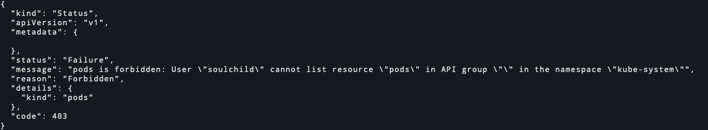

# k8s rbac创建一个User并赋予他指定的权限

<!--more-->
### 前言
创建一个soulchild用户，让他可以访问default命名空间的pod和日志.创建用户证书使用的是cfssl工具

### 一、为用户生成证书
1.创建cfssl api请求内容
```bash
cat > soulchild.json <<EOF
{
    "CN": "soulchild",
    "key": {
        "algo": "rsa",
        "size": 2048
    },
    "names": [
        {
            "O": "ops"
        }
    ]
}
EOF
```
> CN:代表用户名
> O: 代表组名

2.生成证书
```bash
cfssl gencert -ca /etc/kubernetes/pki/ca/ca.pem -ca-key /etc/kubernetes/pki/ca/ca-key.pem -config /etc/kubernetes/pki/ca/ca-config.json -profile kubernetes soulchild.json | cfssljson -bare soulchild
```
> cfssl的配置可查看https://soulchild.cn/2462.html

3.生成证书后使用curl访问测试
```bash
curl -k https://master:6443/api/v1/namespaces/kube-system/pods --cert ./soulchild.pem  --key  ./soulchild-key.pem
```


可以看到提示soulchild用户不能在kube-system命名空间列出核心api组中的pods资源,因为我们没有配置权限,但是他已经可以识别到soulchild用户了,这是我们预期的结果。下面我们去配置权限

### 二、创建Role(角色)
创建一个在kube-system命名空间下只能执行list、get、watch操作的角色。
```yaml
apiVersion: rbac.authorization.k8s.io/v1
kind: Role
metadata:
  name: readonly-pod
  namespace: kube-system
rules:
- apiGroups: [""]
  resources: ["pods", "pods/log"]
  resourceNames: []
  verbs:
  - list
  - get 
  - watch
```
> apiGroups: 要控制哪些api组的权限，""代表核心api组
> verbs: 可以执行的操作权限,目前支持的选项包括`["list", "get", "watch", "delete", "patch", "create", "update" ]`
> resources: verbs权限对哪种资源类型生效
> resourceNames: 设置对哪个具体的资源生效,比如可以指定一个pod名称,代表只能查看这一个pod。空数组代表所有。设置这个的前提是必须对这个具体资源的资源类型有权限

### 三、创建RoleBinding
用户和权限都已经有了，现在我们需要将权限和用户关联起来
```yaml
apiVersion: rbac.authorization.k8s.io/v1
kind: RoleBinding
metadata:
  name: readonly-pod-binding
  namespace: kube-system
subjects:
- kind: User
  name: soulchild
roleRef:
  kind: Role
  name: readonly-pod
  apiGroup: rbac.authorization.k8s.io
```
> subjects.kind: 用户类型，可以是User,Group,ServiceAccount
> subjects.name: 用户名称
> roleRef.Role: 引用的资源类型,仅支持Role和ClusterRole选项.因为之前我们创建的是Role,所以这里配置的Role
> roleRef.name: 引用的资源名称,即Role或者ClusterRole的名称
> roleRef.apiGroup: 引用的api组,即Role或者ClusterRole的api组

### 四、测试权限
```bash
# 获取kube-system命名空间下的所有pod名称
curl -k -s https://172.17.20.200:6443/api/v1/namespaces/kube-system/pods/ --cert ./soulchild.pem --key ./soulchild-key.pem | jq -c '.items[]?.metadata.name'
```


### 五、使用kubeconfig访问
```bash
# 设置用户凭证
k config set-credentials soulchild --client-certificate ./soulchild.pem --client-key ./soulchild-key.pem --embed-certs

# 设置上下文
k config set-context soulchild --cluster kubernetes --user soulchild --namespace kube-system

# 访问测试
k get pod --context soulchild
```
> 这里留个备忘: 使用serviceaccount创建用户时，可以使用k config set-credentials soulchild --token=xxxxx添加用户


---

> 作者: [SoulChild](https://www.soulchild.cn)  
> URL: https://www.soulchild.cn/2585/  

