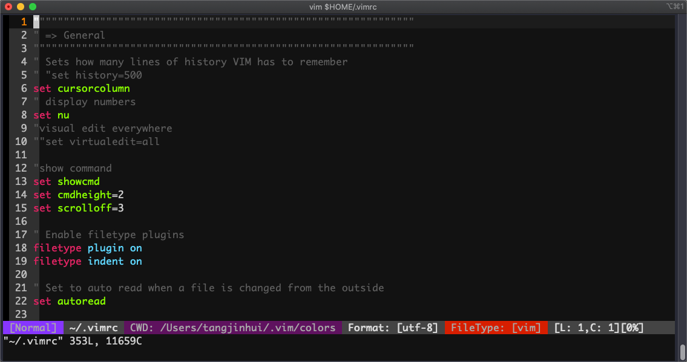

# vim配置方案

<!--more-->
效果


1. 下载配色
```bash
mkdir $HOME/.vim/colors
wget https://raw.githubusercontent.com/tomasr/molokai/master/colors/molokai.vim -O $HOME/.vim/colors/molokai.vim
```

2.修改vimrc
vim $HOME/.vimrc

```bash
"""""""""""""""""""""""""""""""""""""""""""""""""""""""""""""""
" => General
"""""""""""""""""""""""""""""""""""""""""""""""""""""""""""""""
" Sets how many lines of history VIM has to remember
" "set history=500
set cursorcolumn
" display numbers
set nu
"visual edit everywhere
""set virtualedit=all

"show command
set showcmd
set cmdheight=2
set scrolloff=3

" Enable filetype plugins
filetype plugin on
filetype indent on

" Set to auto read when a file is changed from the outside
set autoread

set nocompatible

" Search
set ignorecase    " Ignore case when searching
set smartcase     " When searching try to be smart about cases
set hlsearch      " Highlight search results
set incsearch     " Makes search act like search in modern browsers

" Don't redraw while executing macros (good performance config)
set lazyredraw

" For regular expressions turn magic on
set magic

" Show matching brackets when text indicator is over them
set showmatch
" How many tenths of a second to blink when matching brackets
set mat=2

" No annoying sound on errors
set noerrorbells
"set novisualbell
set t_vb=
set tm=500

" Add a bit extra margin to the left
set foldcolumn=1
set fdm=marker

"""""""""""""""""""""""""""""""""""""""""""""""""""""""""""""""
" => Colors and Fonts
"""""""""""""""""""""""""""""""""""""""""""""""""""""""""""""""
" Enable syntax highlighting
syntax enable

colorscheme molokai
"colorscheme monokai
"colorscheme murphy
"colorscheme solarized
"let g:solarized_termcolors=256
"let g:solarized_contrast="high"    "default value is normal
set t_Co=256      "set vim terminal color
set background=dark
"set guifont=Mono\ 13
set guifont=monaco\ 14


"""""""""""""""""""""""""""""""""""""""""""""""""""""""""""""""
" => Statusline setting
"""""""""""""""""""""""""""""""""""""""""""""""""""""""""""""""
set statusline=%1*\ [%{Disp_Mode()}]\ %*\ %-5.58(%F%m%r%h%w%)\ %2*\ %-5.58(CWD:\ %{getcwd()}%)\ %*\ Format:\ [%{&fenc!=''?&fenc:&enc}]\ %3*\ FileType:\ %y\ %*\ %([L:\ %l,C:\ %c][%p%%]%)%<
hi User1 guibg=slateblue guifg=Gray ctermfg=Gray ctermbg=93
hi User2 guibg=#4876FF guifg=Gray ctermfg=Gray ctermbg=53
hi User3 guibg=Brown guifg=Gray ctermfg=Gray ctermbg=160
hi StatusLine guibg=#cccccc guifg=#222222
set laststatus=2  "2:always display

"""""""""""""""""""""""""""""""""""""""""""""""""""""""""""""""
" => file coding and decoding
"""""""""""""""""""""""""""""""""""""""""""""""""""""""""""""""
" Set utf8 as standard encoding and en_US as the standard language
set termencoding=utf-8
set encoding=utf8
set fileencodings=ucs-bom,utf-8,cp936,gb18030,big5,latin1     "decoding list
set fileencoding=utf-8


"""""""""""""""""""""""""""""""""""""""""""""""""""""""""""""""
" => Files, backups and undo
"""""""""""""""""""""""""""""""""""""""""""""""""""""""""""""""
" Turn backup off, since most stuff is in SVN, git et.c anyway...
set nobackup
set nowb
set noswapfile

"""""""""""""""""""""""""""""""""""""""""""""""""""""""""""""""
" => Text, tab and indent related
"""""""""""""""""""""""""""""""""""""""""""""""""""""""""""""""
" 1 tab == 4 spaces
set shiftwidth=4
set tabstop=4
set softtabstop=4
" Use spaces instead of tabs
set expandtab
" Be smart when using tabs
set smarttab

"toggle paste mode with hitting F2 key
set pastetoggle=<F2>
"set paste    "open paste mode

set ai "Auto indent
set si "Smart indent

"""""""""""""""""""""""""""""""""""""""""""""""""""""""""""""""
" Wrap and breakline setting
"""""""""""""""""""""""""""""""""""""""""""""""""""""""""""""""
" Linebreak on 500 characters
set lbr                 "linebreak
set tw=500              "break at 500 words
set showbreak==>\          "show "=>" before the break line
set wrap "Wrap lines

"configure backspace
set backspace=eol,start,indent
set whichwrap+=<,>,h,l

" Highlight the current line
set cursorline
"highlight CursorLine          guibg=#003853 ctermbg=24  gui=none cterm=none

"set clipboard=unnamed    "yank unnamed register to the system register

" Return to last edit position when opening files (You want this!)  
autocmd! BufReadPost *  
     \ if line("'\"") > 0 && line("'\"") <= line("$") |  
     \   exe "normal! g`\"" |  
     \ endif

"auto load ~/.vimrc
autocmd! BufWritePost $MYVIMRC source $MYVIMRC

"let mapleader = ','
let g:mapleader = ','

""""""""""""""""""""""""""""""""""""""
"save and quit
""""""""""""""""""""""""""""""""""""""
"quit without save
map <leader>q :q!<cr>    
"save and quit
map <leader>w :wq!<cr>    
"save force with :W
"command! W w !sudo tee % > /dev/null

""""""""""""""""""""""""""""""""""""""
"save and quit
""""""""""""""""""""""""""""""""""""""
map <leader>tn :tabnew<cr>
map <leader>tc :tabclose<cr>
map <C-tab> :tabn<cr>
map <C-S-tab> :tabp<cr>

" no highlight
map <leader>/ :nohl<cr>

" Merge selected text into one line
vmap <leader>m J

" change all the tab into space
nmap <leader>rt :retab!<cr>

" update when diff two files
nmap <leader>du :diffupdate<cr>


""""""""""""""""""""""""""""""""""""""
"auto complete (),[],{}and so on
""""""""""""""""""""""""""""""""""""""  
:inoremap ( ()<Left>
:inoremap ) <c-r>=ClosePair(')')<CR>
:inoremap { {}<Left>
autocmd FileType c,cpp :inoremap { {<CR>}<ESC>O
:inoremap } <c-r>=ClosePair('}')<CR>
:inoremap [ []<Left>
:inoremap ] <c-r>=ClosePair(']')<CR>
:inoremap " ""<Left>
"autocmd Filetype c,cpp,python,perl :inoremap ' ''<ESC>i
function! ClosePair(char)
    if getline('.')[col('.') - 1] == a:char
        return "\<Right>"
    else
        return a:char
    endif
endfunction

""""""""""""""""""""""""""""""""""""""
"自动插入文件头
""""""""""""""""""""""""""""""""""""""
autocmd! BufNewFile * silent! 0r ~/.vim/skel/Template.%:e
autocmd! BufNewFile *.cpp,*.[ch],*.sh,*.java,*.v,*.sv,*.vhd,*.py exec ":call SetTitle()"
function! SetTitle()
    "如果文件类型为脚本文件
    if &filetype =~ 'sh\|perl\|python'
        if &filetype == 'sh'
            call setline(1,"#!/bin/bash")
        elseif &filetype == 'perl'
            call setline(1,"#!/usr/bin/perl -w")
        elseif &filetype == 'python'
            call setline(1,"#!/usr/bin/env python")
        endif
        call append(line("."), "")
    elseif &filetype =~ 'verilog\|systemverilog\|c\|cpp'
        call setline(1          , "\//------------------------------------------------------------------------")
        call append(line(".")   , "\// File Name   : ".expand("%"))
        call append(line(".")+1 , "\// Author      : xxxxx (xxxxx@163.com)")
        call append(line(".")+2 , "\// Version     : V0.1 ")
        call append(line(".")+3 , "\//------------------------------------------------------------------------")
        call append(line(".")+4 , "\// Description :" )
        call append(line(".")+5 , "\//     " )
        call append(line(".")+6 , "\//------------------------------------------------------------------------")
        call append(line(".")+7 , "\// Revision History:" )
        call append(line(".")+8 , "\// *Version* | *Modifier* | *Modified Date* | *Description*")
        call append(line(".")+9 , "\//   V0.1    |   Victor   |   ".strftime("%Y-%m-%d")."    | Fisrt Created.")
        call append(line(".")+10, "\//------------------------------------------------------------------------")        
        call append(line(".")+11, "" )
    endif
    if &filetype == 'cpp'
        call append(line(".")+12, "#include<iostream>")
        call append(line(".")+13, "using namespace std;")
        call append(line(".")+14, "")
    endif
    if &filetype == 'c'
        call append(line(".")+12, "#include<stdio.h>")
        call append(line(".")+13, "")
    endif
    if &filetype =~ 'verilog\|systemverilog'
        if expand("%:r") =~ 'tb$'
            call append(line(".")+12, "`timescale 1ns/1ps")
            call append(line(".")+13, "")
            call append(line(".")+14, "module ".expand("%:r")."();")
            call append(line(".")+15, "")
            call append(line(".")+16, "initial begin")
            call append(line(".")+17, "    $fsdbDumpfile(\"wave.fsdb\");")
            call append(line(".")+18, "    $fsdbDumpvars(0);")
            call append(line(".")+19, "\//    $fsdbDumpMDA(0);")
            call append(line(".")+20, "end")
            call append(line(".")+21, "")
            call append(line(".")+22, "endmodule")
        else
            call append(line(".")+12, "module ".expand("%:r")."(")
            call append(line(".")+13, "    input clk   ,")
            call append(line(".")+14, "    input rst_n ,")
            call append(line(".")+15, ");")
            call append(line(".")+16, "")
            call append(line(".")+17, "\//==============================================")
            call append(line(".")+18, "\// Definition of regs and wires")
            call append(line(".")+19, "\//==============================================")
            call append(line(".")+20, "")
            call append(line(".")+21, "\//**********************************************")
            call append(line(".")+22, "\// Function")
            call append(line(".")+23, "\//**********************************************")
            call append(line(".")+24, "")
            call append(line(".")+25, "endmodule")
        endif
    endif
    "新建文件后，自动定位到文件末尾
    exec "normal G"
endfunc

"""""""""""""""""""""""""""""""""""""""""
""实现上面函数中的，Last Modified功能
"""""""""""""""""""""""""""""""""""""""""
"autocmd! BufWrite,BufWritePre,FileWritePre  *.cpp,*.[ch],*.sh,*.java,*.v,*.sv,*.vhd,*.py  ks|call LastModified()|'s  
"function! LastModified()
"       if line("$") > 20
"               let l = 20
"       else
"               let l = line("$")
"       endif
"       exec "1,".l."g/Last Modified: /s/Last Modified: .*/Last Modified:".
"                       \strftime(" %Y-%m-%d %H:%M:%S") . "/e"
"endfunc

" Returns true if paste mode is enabled
function! HasPaste()
    if &paste
        return '[PASTE MODE]  '
    endif
    return ''
endfunction

"""""""""""""""""""""""""""""""""""""""""
" return vim mode
"""""""""""""""""""""""""""""""""""""""""
function! Disp_Mode()
    let mode=mode()
    if mode ==# 'v'
        return 'Visual'
    elseif mode ==# 'V'
        return 'V-Line'
    elseif mode ==# ''
        return 'V-Block'
    elseif mode ==# 's'
        return 'Select'
        elseif mode ==# 'S'
        return 'S-Line'
        elseif mode ==# ''
        return 'S-Block'
        elseif mode =~# '\vi'
        return 'Insert'
        elseif mode =~# '\v(R|Rv)'
        return 'Replace'
        else
        return 'Normal'
        endif
endfunction


"""""""""""""""""""""""""""""""""""""""""
" filetype
"""""""""""""""""""""""""""""""""""""""""
au BufNewFile,BufRead readme,README setf help

"""""""""""""""""""""""""""""""""""""""""
" plugin: supertab
"""""""""""""""""""""""""""""""""""""""""
let g:SuperTabDefaultCompletionType = "context"
let g:SuperTabMappingForward = '<s-space>'
let g:SuperTabMappingBackward = '<s-c-space>'

"""""""""""""""""""""""""""""""""""""""""
" plugin: NERDTree
"""""""""""""""""""""""""""""""""""""""""
"autocmd vimenter * NERDTree
autocmd bufenter * if (winnr("$") == 1 && exists("b:NERDTreeType") && b:NERDTreeType == "primary") | q | endif
map <F3> :NERDTreeToggle<CR>
let NERDTreeShowHidden=0
let NERDTreeWinSize=25
let NERDTreeIgnore=['\~$', '\.swap$', '.pyc$']

"""""""""""""""""""""""""""""""""""""""""
" plugin: UltiSnips
"""""""""""""""""""""""""""""""""""""""""
let g:UltiSnipsExpandTrigger="<tab>"
let g:UltiSnipsJumpForwardTrigger="<tab>"
let g:UltiSnipsJumpBackwardTrigger="<c-b>"

" If you want :UltiSnipsEdit to split your window.
let g:UltiSnipsEditSplit="vertical"
```


---

> 作者: [SoulChild](https://www.soulchild.cn)  
> URL: https://www.soulchild.cn/2639/  

