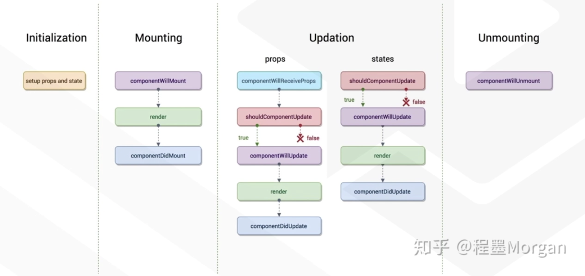

# React入门学习-基础(一)

<!--more-->
### 基本语法
\# 创建元素、标签
React.createElement()
\# 渲染元素到指定的位置
ReactDOM.render()
\# 
React.Component

### 例子中的html
```bash
<!DOCTYPE html>
<html lang="en">
<head>
    <meta charset="UTF-8">
    <meta http-equiv="X-UA-Compatible" content="IE=edge">
    <meta name="viewport" content="width=device-width, initial-scale=1.0">
    <title>Document</title>
    <script src="./node_modules/react/umd/react.development.js"></script>
    <script src="./node_modules/react-dom/umd/react-dom.development.js"></script>
    <script src="https://unpkg.com/babel-standalone@6.26.0/babel.js"></script>
</head>
<body>
    <div id="app"></div>
    <script type="text/babel">
      例子中的代码在这里
    </script>
</body>


</html>
```

### JSX
js中写html，html中写js。

例子
```bash
# 将ele元素渲染到id=app的标签中。这里没有使用React.createElement()，而是使用的es6的语法糖
var name = 'soulchild';
var ele = <h1 className="myclass" >hello {name}</h1>;
ReactDOM.render(ele,document.getElementById('app'));
```

### 组件和props
函数式组件(无状态)
```bash
# 将元素内容定义在函数中，使用return返回。函数名就是组件名。
function Info(props){
  return <div>
    <h1>姓名: {props.name}</h1>
    <p>年龄: {props.age}</p>
    <p>擅长: 梦游</p>
  </div>
}

ReactDOM.render(
  <Info name="SoulChild" age="18" />,
  document.getElementById('app')
)
```

类组件(有状态)
```bash
# 需要继承React.Component，class组件还需要render+return。
# 类组件在调用时会创建一个实例，然后通过调用实例里的render方法来获取元素。
class InfoPlus extends React.Component{
  render(){
    return <div>
      <h1>姓名: {this.props.name}</h1>
      <p>年龄: {this.props.age}</p>
      <p>擅长: 梦游</p>
    </div>
  }
}

ReactDOM.render(
  <InfoPlus name="SoulChild" age="18" />,
  document.getElementById('app')
)
```

### React生命周期


- Initialization-组件初始化阶段
- Mounting-组件加载阶段
- Updation-数据更新阶段
- Unmointing-组件销毁阶段

```bash
class InfoPlus extends React.Component{
  // 定义钩子函数
  constructor(props){
    // 初始化props
    super(props);
    // 初始化state
    this.state= {
      name: 'SoulChild',
      age: '18'
    } 
    console.log('Initialization-数据初始化阶段') 
  }

  componentWillMount(){
    console.log('Mounting(componentWillMount)-组件将要加载')
  }

  componentDidMount(){
    console.log('Mounting(componentDidMount)-组件已加载')
  }

  componentWillReceiveProps(){
      console.log('Updation(componentWillReceiveProps)-不知道')
  }
  
  // 是否允许更新数据
  shouldComponentUpdate(){
    console.log('Updation(shouldComponentUpdate)-要更新数据吗')
    return true; // 允许
  }

  componentWillUpdate(){
    console.log('Updation(componentWillUpdate)-数据将要更新')
  }

  componentDidUpdate(){
    console.log('Updation(componentDidUpdate)-数据已更新')
  }
  
  // 这里使用的箭头函数。使用普通函数获取不到this。
  updateUser = () => {
    this.setState({
      name: 'TC',
      age: '19'
    })
  }

  render(){
    console.log('Mounting or Updation(render)-组件加载或数据更新')
    return <div>
      <h1>姓名: {this.state.name}</h1>
      <p>年龄: {this.state.age}</p>
      <p>擅长: 梦游</p>
      <button onClick={this.updateUser}>更新数据</button>
    </div>
  }
}

ReactDOM.render(
  <InfoPlus />,
  document.getElementById('app')
)
```


### 表单、TODO应用
```bash
      class List extends React.Component{
        constructor(props){
          # 使用state之前必须先走这个
          super(props)
          # 定义两个空值
          this.state = {
            val: '', // 作为临时存储，每次输入内容后都会被替换
            list: [] // 一个列表，存储所有添加进来的内容
          }
        }

        // 将input框输入的内容暂存到state.val中
        handleInput = (event) => {
          this.setState({
            val: event.target.value
          })
        }
        
        // 读取val的内容将其添加到state.list中
        handleAdd = () => {
          const { val, list } = this.state
          list.push(val)
          // 要想改变数据时同步更新到页面中，必须使用setState
          this.setState({
            list: list
          })
        }

        render(){
          const val = this.state.val
          const arr = this.state.list
          let itemList = [] // 存放所有li标签元素

          // 通过循环出state.list中的值,生成li标签,最后push到itemList
          arr.map((item,index)=>{
            let li = <li key={index}>{item}</li>
            itemList.push(li)
          })
          return <div>
            <div>
              <input type="text" value={val} onChange={this.handleInput} />
              <button onClick={this.handleAdd}>添加</button>
            </div>
            <ul>
              {itemList}
            </ul>
          </div>
        }
      }
      ReactDOM.render(<List />, document.getElementById('app'))
```


---

> 作者: [SoulChild](https://www.soulchild.cn)  
> URL: https://www.soulchild.cn/2698/  

