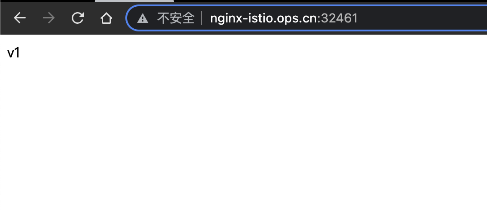

# Istio 配置istio-ingressgateway 单向TLS

<!--more-->
### 一、 部署正常服务
1.初始化
```yaml
# 创建ns
k create ns istio-demo
# 开启自动注入
k label ns istio-demo istio-injection=enabled
```
2.部署nginx
```bash
apiVersion: apps/v1
kind: Deployment
metadata:
  name: nginx-v1
  namespace: istio-demo
spec:
  replicas: 1
  selector:
    matchLabels:
      app: nginx
      version: v1
  template:
    metadata:
      labels:
        app: nginx
        version: v1
    spec:
      initContainers:
      - name: busybox
        image: busybox
        volumeMounts:
        - name: www
          mountPath: /tmp
        command: ["sh", "-c", "echo 'v1' > /tmp/index.html"]
      containers:
      - name: nginx
        image: nginx:1.14-alpine
        imagePullPolicy: IfNotPresent
        ports:
        - name: http
          containerPort: 80
        volumeMounts:
        - name: www
          mountPath: /usr/share/nginx/html/
      volumes:
      - name: www
        emptyDir: {}
---
apiVersion: v1
kind: Service
metadata:
  name: nginx-svc
  namespace: istio-demo
spec:
  type: ClusterIP
  ports:
  - name: http
    port: 80
    targetPort: 80
  selector:
    app: nginx
```

3.暴露服务
```yaml
apiVersion: networking.istio.io/v1alpha3
kind: Gateway
metadata:
  name: nginx-gw
  namespace: istio-demo
spec:
  selector:
    istio: ingressgateway 
  servers:
  - hosts:
    - "nginx-istio.ops.cn"
    port:
      number: 80
      name: http
      protocol: HTTP
---
apiVersion: networking.istio.io/v1alpha3
kind: VirtualService
metadata:
  name: nginx-vs
  namespace: istio-demo
spec:
  exportTo:
  - "*"
  gateways:
  - nginx-gw
  hosts:
  - 'nginx-svc'
  - 'nginx-istio.ops.cn'
  http:
  - route:
    - destination:
        host: nginx-svc
        subset: v1
      weight: 100
    - destination:
        host: nginx-svc
        subset: v2
---
apiVersion: networking.istio.io/v1alpha3
kind: DestinationRule
metadata:
  name: nginx-dr
  namespace: istio-demo
spec:
  host: nginx-svc
  subsets:
  - name: v1
    labels:
      version: v1
  - name: v2
    labels:
      version: v2
```

访问测试:



### 二、修改为https访问
在我们这里例子中只需要修改gw就可以了,首先需要准备证书和私钥,这一步略过了([配置自签证书](https://soulchild.cn/2391.html))

第二步: 创建一个包含证书信息的secret
```
k create -n istio-system secret generic nginx-istio.ops.cn-tls \
--from-file=key=tls/ops.cn_key \
--from-file=cert=tls/ops.cn_crt
```

第三步: 修改Gateway
```yaml
apiVersion: networking.istio.io/v1beta1
kind: Gateway
metadata:
  name: nginx-gw
  namespace: istio-demo
spec:
  selector:
    istio: ingressgateway
  servers:
  - hosts:
    - nginx-istio.ops.cn
    port:
      name: http
      number: 80
      protocol: HTTP
  - hosts:
    - nginx-istio.ops.cn
    port:
      name: https
      number: 8443
      protocol: HTTPS
    tls:
      credentialName: nginx-istio.ops.cn-tls
      mode: SIMPLE
```

第四步: 验证
由于是自签名证书所以是不受信任的


---

> 作者: [SoulChild](https://www.soulchild.cn)  
> URL: https://www.soulchild.cn/2709/  

