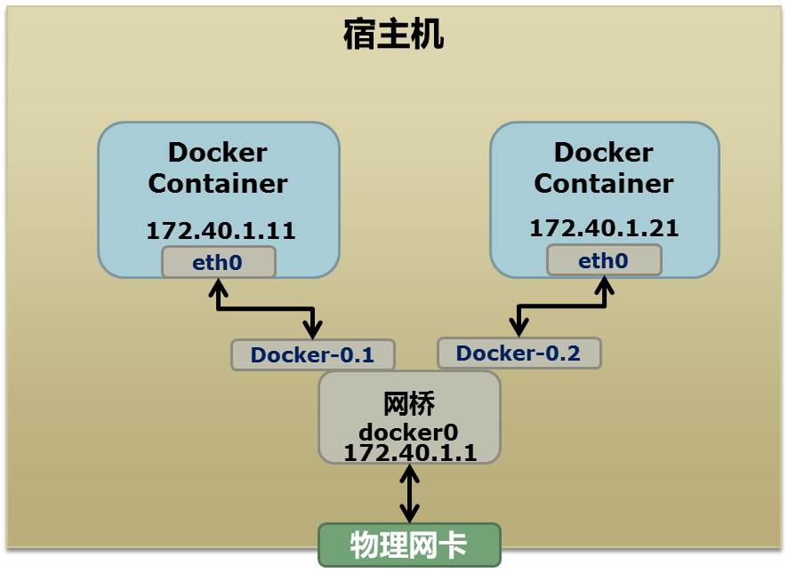

# Linux Network Namespace

<!--more-->
### 作者: 酷壳–CoolShell   原文: https://coolshell.cn/articles/17029.html

Network的Namespace比较啰嗦。在Linux下，我们一般用ip命令创建Network Namespace（Docker的源码中，它没有用ip命令，而是自己实现了ip命令内的一些功能——是用了Raw Socket发些“奇怪”的数据，呵呵）。这里，我还是用ip命令讲解一下。

首先，我们先看个图，下面这个图基本上就是Docker在宿主机上的网络示意图（其中的物理网卡并不准确，因为docker可能会运行在一个VM中，所以，这里所谓的“物理网卡”其实也就是一个有可以路由的IP的网卡）



上图中，Docker使用了一个私有网段，172.40.1.0，docker还可能会使用10.0.0.0和192.168.0.0这两个私有网段，关键看你的路由表中是否配置了，如果没有配置，就会使用，如果你的路由表配置了所有私有网段，那么docker启动时就会出错了。

当你启动一个Docker容器后，你可以使用ip link show或ip addr show来查看当前宿主机的网络情况（我们可以看到有一个docker0，还有一个veth22a38e6的虚拟网卡——给容器用的）：
```bash
hchen@ubuntu:~$ ip link show
1: lo: <LOOPBACK,UP,LOWER_UP> mtu 65536 qdisc noqueue state ... 
    link/loopback 00:00:00:00:00:00 brd 00:00:00:00:00:00
2: eth0: <BROADCAST,MULTICAST,UP,LOWER_UP> mtu 1500 qdisc ...
    link/ether 00:0c:29:b7:67:7d brd ff:ff:ff:ff:ff:ff
3: docker0: <BROADCAST,MULTICAST,UP,LOWER_UP> mtu 1500 ...
    link/ether 56:84:7a:fe:97:99 brd ff:ff:ff:ff:ff:ff
5: veth22a38e6: <BROADCAST,UP,LOWER_UP> mtu 1500 qdisc ...
    link/ether 8e:30:2a:ac:8c:d1 brd ff:ff:ff:ff:ff:ff
```

那么，要做成这个样子应该怎么办呢？我们来看一组命令：

```bash
## 首先，我们先增加一个网桥lxcbr0，模仿docker0
brctl addbr lxcbr0
brctl stp lxcbr0 off
ifconfig lxcbr0 192.168.10.1/24 up #为网桥设置IP地址

## 接下来，我们要创建一个network namespace - ns1

# 增加一个namesapce 命令为 ns1 （使用ip netns add命令）
ip netns add ns1 

# 激活namespace中的loopback，即127.0.0.1（使用ip netns exec ns1来操作ns1中的命令）
ip netns exec ns1   ip link set dev lo up 

## 然后，我们需要增加一对虚拟网卡

# 增加一个pair虚拟网卡，注意其中的veth类型，其中一个网卡要按进容器中
ip link add veth-ns1 type veth peer name lxcbr0.1

# 把 veth-ns1 按到namespace ns1中，这样容器中就会有一个新的网卡了
ip link set veth-ns1 netns ns1

# 把容器里的 veth-ns1改名为 eth0 （容器外会冲突，容器内就不会了）
ip netns exec ns1  ip link set dev veth-ns1 name eth0 

# 为容器中的网卡分配一个IP地址，并激活它
ip netns exec ns1 ifconfig eth0 192.168.10.11/24 up


# 上面我们把veth-ns1这个网卡按到了容器中，然后我们要把lxcbr0.1添加上网桥上
brctl addif lxcbr0 lxcbr0.1

# 为容器增加一个路由规则，让容器可以访问外面的网络
ip netns exec ns1     ip route add default via 192.168.10.1

# 在/etc/netns下创建network namespce名称为ns1的目录，
# 然后为这个namespace设置resolv.conf，这样，容器内就可以访问域名了
mkdir -p /etc/netns/ns1
echo "nameserver 8.8.8.8" > /etc/netns/ns1/resolv.conf
```
- 上面基本上就是docker网络的原理了，只不过，
- Docker的resolv.conf没有用这样的方式，而是用了[上篇中的Mount Namesapce的那种方式](https://coolshell.cn/articles/17010.html)
另外，docker是用进程的PID来做Network Namespace的名称的。

了解了这些后，你甚至可以为正在运行的docker容器增加一个新的网卡：
```bash
ip link add peerA type veth peer name peerB 
brctl addif docker0 peerA 
ip link set peerA up 
ip link set peerB netns ${container-pid} 
ip netns exec ${container-pid} ip link set dev peerB name eth1 
ip netns exec ${container-pid} ip link set eth1 up ; 
ip netns exec ${container-pid} ip addr add ${ROUTEABLE_IP} dev eth1 ;
```

上面的示例是我们为正在运行的docker容器，增加一个eth1的网卡，并给了一个静态的可被外部访问到的IP地址。

这个需要把外部的“物理网卡”配置成混杂模式，这样这个eth1网卡就会向外通过ARP协议发送自己的Mac地址，然后外部的交换机就会把到这个IP地址的包转到“物理网卡”上，因为是混杂模式，所以eth1就能收到相关的数据，一看，是自己的，那么就收到。这样，Docker容器的网络就和外部通了。

当然，无论是Docker的NAT方式，还是混杂模式都会有性能上的问题，NAT不用说了，存在一个转发的开销，混杂模式呢，网卡上收到的负载都会完全交给所有的虚拟网卡上，于是就算一个网卡上没有数据，但也会被其它网卡上的数据所影响。

这两种方式都不够完美，我们知道，真正解决这种网络问题需要使用VLAN技术，于是Google的同学们为Linux内核实现了一个IPVLAN的驱动，这基本上就是为Docker量身定制的。


---

> 作者: [SoulChild](https://www.soulchild.cn)  
> URL: https://www.soulchild.cn/2741/  

