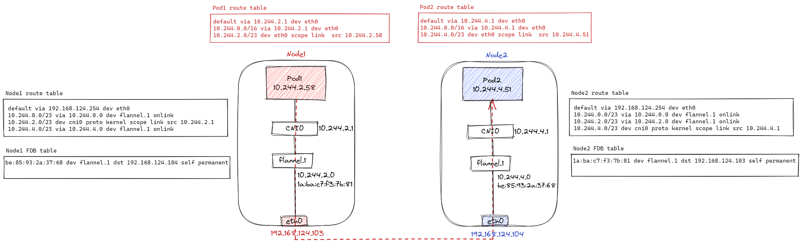

# flannel vxlan模式通信简读

<!--more-->
环境信息

目标：要访问目标IP为10.244.4.51的POD
1. 首先经过路由表匹配规则`10.244.4.0/23 via 10.244.4.0 dev flannel.1 onlink`
2. 确定下一跳为`10.244.4.0`(目标POD所属Node上flannel.1的IP)
3. 通过arp表可以找到目标pod所在节点的flannel.1网卡的MAC地址(对端VTEP设备的MAC)`arp -an | grep 10.244.4.0` => `be:85:93:2a:37:68`
4. 内核封装数据帧，源MAC是当前flannel.1的，目标MAC是对端flannel.1的
5. 紧接着内核会对这个数据帧添加vxlan报头，VNI为1
6. flannel.1将数据帧封装成UDP报文,通过FDB表根据MAC查找目标IP。`bridge fdb show | grep be:85:93:2a:37:68` => `192.168.124.104`
7. UDP报文的源IP是`ip -d link show flannel.1 | grep -o 'vxlan.*eth.'` => `192.168.124.103`，目标IP上面已经获取了，目标端口是8472
8. 在往后就是系统正常的封装了，UDP会被封装在IP报文里，IP报文会被封装在数据帧里，最终通过bit流传送到Node2
9. Node2的收到数据进行解封装，到达8472端口，交由内核中的VXLAN模块处理(此时处理的是vxlan报文)
10. VXLAN模块会比较这个vxlan报头中的VNI和本机的VTEP设备(flannel.1)的VNI是否一致，然后比较内部数据帧中的目的MAC地址与本机的flannel.1是否一致，都没问题后，将vxlan报头和内部数据帧拆掉，将内部数据包通过flannel.1发出
11. 通过路由表得知发往`10.244.4.0/23`网段的数据包要走cni0，cni0将数据包发往最终的pod对应的veth pair设备

---

> 作者: [SoulChild](https://www.soulchild.cn)  
> URL: https://www.soulchild.cn/2908/  

