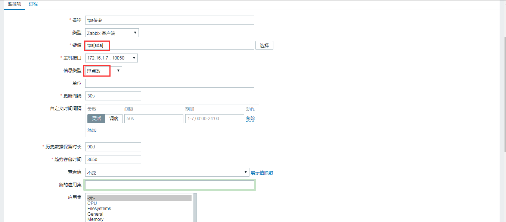

# zabbix传参形式的自定义监控项

<!--more-->
<h3>agent端配置</h3>
[*]用来接收参数,用$可以调用，参数一$1,参数二$2,参数三$3....以此类推

&nbsp;

自定义key：

UserParameter=tps[*],sh /server/scripts/tps.sh $1

&nbsp;

cat /server/scripts/tps.sh
<pre class="pure-highlightjs"><code class="bash">#!/bin/bash
iostat | awk '/^'$1'/{print $2}'</code></pre>
&nbsp;

测试获取sda：

zabbix_get -s 172.16.1.7 -k tps[sda]

0.94

&nbsp;

大概执行过程：

tps[sda]

------&gt;$1=sda

-----&gt;sh /server/scripts/tps.sh sda

-----&gt;iostat | awk '/^sda/{print $2}'

&nbsp;

这样传参的形式可以提高灵活性。

&nbsp;
<h3>web配置</h3>
&nbsp;

&nbsp;

&nbsp;

---

> 作者: [SoulChild](https://www.soulchild.cn)  
> URL: https://www.soulchild.cn/418/  

