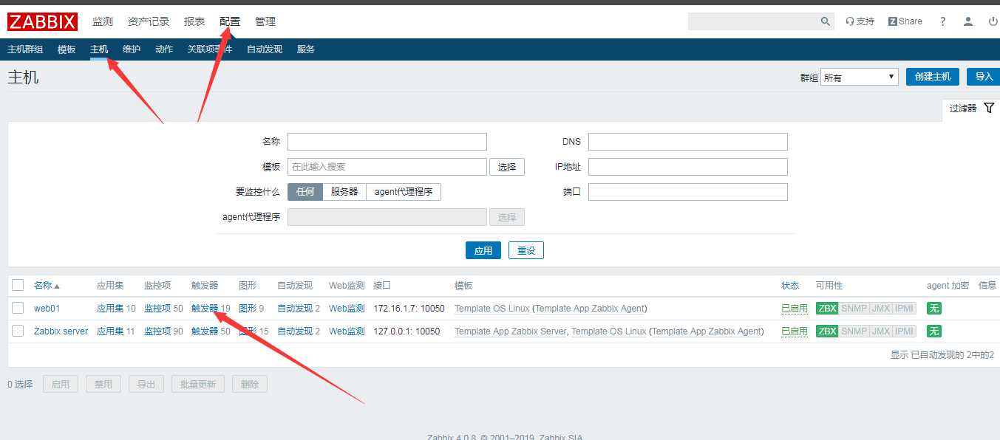

# zabbix触发器和依赖关系简单说明

<!--more-->
<h3><strong>用户登录数量举例：</strong></h3>
&nbsp;

&nbsp;

&nbsp;
<h3><strong>依赖关系：</strong></h3>
&nbsp;

触发器A      监控数据库状态

触发器B      监控web状态码 200

这种情况当数据库出现异常时，两个报警都会触发，造成不必要的报警

此时在触发器B中设置依赖触发器A

就只有在触发器A正常时，触发器B才会报警

当触发器A报警，触发器B则不会报警

---

> 作者: [SoulChild](https://www.soulchild.cn)  
> URL: https://www.soulchild.cn/429/  

