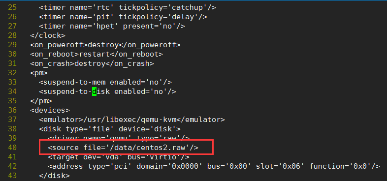

# KVM迁移目录

<!--more-->
虚拟机名称：centos7

磁盘文件路径：/opt/centos2.raw

&nbsp;

1.关机

virsh shutdown centos7

&nbsp;

2.移动磁盘文件到新目录

mv /opt/centos2.raw /data

&nbsp;

3.编辑配置文件

virsh edit centos7

将磁盘文件路径修改为新路径

&nbsp;

4.开机

virsh start centos7

---

> 作者: [SoulChild](https://www.soulchild.cn)  
> URL: https://www.soulchild.cn/543/  

