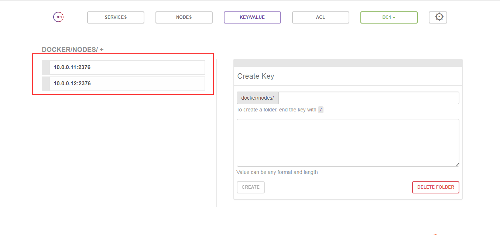

# docker中overlay网络

<!--more-->
环境：三台centos7都有docker

docker01：10.0.0.11

docker02：10.0.0.12

consul：10.0.0.13

&nbsp;

1.部署consul

-h：设置容器主机名
<pre>docker run -d -p 8500:8500 -h consul --name consul --restart=always progrium/consul -server -bootstrap</pre>
&nbsp;

2.修改docker01和docker02配置文件
<pre>[root@docker01 ~]# cat /etc/docker/daemon.json 
{
 "hosts":["tcp://0.0.0.0:2376","unix:///var/run/docker.sock"],
 "cluster-store": "consul://10.0.0.13:8500",
 "cluster-advertise": "10.0.0.11:2376"
}
#############################################################################
[root@docker02 ~]# cat /etc/docker/daemon.json 
{
 "hosts":["tcp://0.0.0.0:2376","unix:///var/run/docker.sock"],
 "cluster-store": "consul://10.0.0.13:8500",
 "cluster-advertise": "10.0.0.12:2376"
}</pre>
3.修改服务启动配置文件

vim /usr/lib/systemd/system/docker.service

将：ExecStart=/usr/bin/dockerd -H fd:// --containerd=/run/containerd/containerd.sock

修改为：ExecStart=/usr/bin/dockerd --containerd=/run/containerd/containerd.sock

修改完后重启docker
<pre>systemctl daemon-reload
systemctl restart docker</pre>
4.查看注册，已经存在两个docker节点了。

http://10.0.0.13:8500/ui/#/dc1/kv/docker/nodes/

&nbsp;

5.创建overlay网络

随便一台docker上执行，其他已注册的节点也会创建overlay网络
<pre>docker network create --driver overlay --subnet 172.16.1.0/24 --gateway 172.16.1.254 overlay_1</pre>
&nbsp;

6.创建容器测试
<pre>docker run -it --network overlay_1 busybox</pre>
两台分别创建，互相可以ping通

&nbsp;

&nbsp;

---

> 作者: [SoulChild](https://www.soulchild.cn)  
> URL: https://www.soulchild.cn/670/  

