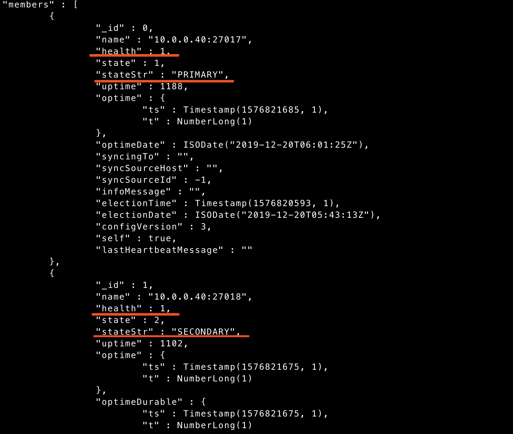
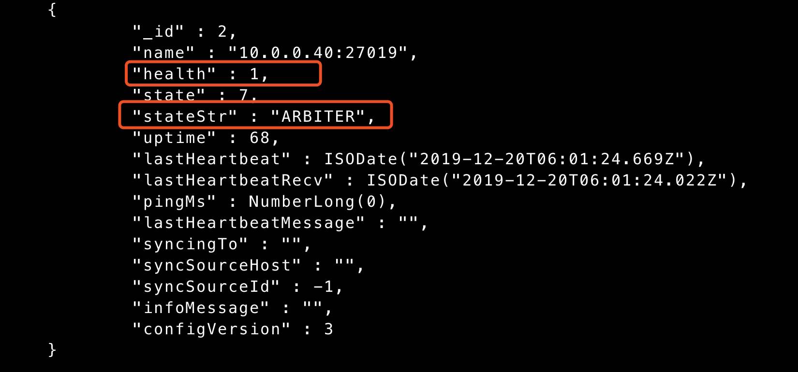

# mongodb复制集

<!--more-->
单机部署4实例：

端口：27017 27018 27019 27020

&nbsp;
<h2>准备实例：</h2>
&nbsp;

创建目录：
<pre class="line-numbers" data-start="1"><code class="language-bash">mkdir -p /application/mongodb/{27017..27020}/conf /application/mongodb/{27017..27020}/data /application/mongodb/{27017..27020}/log</code></pre>
修改配置文件：
<pre class="line-numbers" data-start="1"><code class="language-bash">cat &gt; /application/mongodb/27017/conf/mongo.conf &lt;&lt;EOF
# 系统日志相关
systemLog:
  destination: file
  logAppend: true
  path: /application/mongodb/27017/log/mongod.log

# 数据存储相关
storage:
  dbPath: /application/mongodb/27017/data
  journal:
    enabled: true
  directoryPerDB: true
  wiredTiger:
    engineConfig:
      cacheSizeGB: 1
      directoryForIndexes: true
    collectionConfig:
      blockCompressor: zlib
    indexConfig:
      prefixCompression: true

# 网络相关
net:
  port: 27017
  bindIp: 0.0.0.0

# 进程控制相关
processManagement:
   fork: true

# 安全配置
#security:
#  authorization: enabled

#复制集配置
replication:
  oplogSizeMB: 2048
  replSetName: repl_1
EOF</code></pre>
&nbsp;

创建配置文件：
<pre class="line-numbers" data-start="1"><code class="language-bash">cd /application/mongodb
cp 27017/conf/mongo.conf ./27018/conf/mongo.conf
cp 27017/conf/mongo.conf ./27019/conf/mongo.conf
cp 27017/conf/mongo.conf ./27020/conf/mongo.conf

sed -i 's#27017#27018#' ./27018/conf/mongo.conf
sed -i 's#27017#27019#' ./27019/conf/mongo.conf
sed -i 's#27017#27020#' ./27020/conf/mongo.conf

</code></pre>
&nbsp;

启动多实例：
<pre class="line-numbers" data-start="1"><code class="language-bash">su - mongod
mongod -f /application/mongodb/27017/conf/mongo.conf
mongod -f /application/mongodb/27018/conf/mongo.conf
mongod -f /application/mongodb/27019/conf/mongo.conf
mongod -f /application/mongodb/27020/conf/mongo.conf</code></pre>
&nbsp;
<h2>配置复制集：</h2>
&nbsp;
<h3><strong>一主两从：</strong></h3>
&nbsp;
<pre class="line-numbers" data-start="1"><code class="language-bash">mongo --port 27017 admin

conf = {
                _id: 'repl_1', 
                members: [
                    {_id: 0, host: '10.0.0.40:27017'},
                    {_id: 1, host: '10.0.0.40:27018'},
                    {_id: 2, host: '10.0.0.40:27019'}
                 ]
}

#
rs.initiate(conf)

#查询复制集状态
rs.status()</code></pre>
&nbsp;
<h3><strong>一主一从一arbiter：</strong></h3>
<strong>*Arbiter节点只会参与投票*</strong>
<pre class="line-numbers" data-start="1"><code class="language-bash">#新配置
mongo --port 27017 admin

conf = {
                _id: 'repl_1', 
                members: [
                    {_id: 0, host: '10.0.0.40:27017'},
                    {_id: 1, host: '10.0.0.40:27018'},
                    {_id: 2, host: '10.0.0.40:27019',"arbiterOnly": true}
                 ]
}

#初始化配置
rs.initiate(conf)

#查询复制集状态
rs.status()</code></pre>

&nbsp;

基于一主两从修改：
<pre class="line-numbers" data-start="1"><code class="language-bash"># 删除节点
rs.remove("10.0.0.40:27019")

#添加arbiter节点
rs.addArb("10.0.0.40:27019")

#启动服务
mongod -f /application/mongodb/27019/conf/mongo.conf</code></pre>

&nbsp;

&nbsp;

其他相关命令：

添加删除节点：
<pre class="line-numbers" data-start="1"><code class="language-bash"># 删除一个节点
rs.remove("ip:port")
#添加普通节点
rs.add("ip:port")
#添加Arbiter节点
rs.addArb("ip:port")
#将当前主库降级
rs.stepDown()
</code></pre>
&nbsp;

测试：
<pre class="line-numbers" data-start="1"><code class="language-bash"># 创建一个collection
db.createCollection("user_info")

# 关闭port:27018主库服务
mongod -f /application/mongodb/27018/conf/mongo.conf --shutdown

# 连接27017
mongo 
repl_1:PRIMARY&gt; show dbs
admin   0.000GB
app     0.000GB
config  0.000GB
local   0.000GB
repl_1:PRIMARY&gt; use app
switched to db app
repl_1:PRIMARY&gt; show collections
user_info
repl_1:PRIMARY&gt;</code></pre>
&nbsp;

&nbsp;

---

> 作者: [SoulChild](https://www.soulchild.cn)  
> URL: https://www.soulchild.cn/post/1285/  

