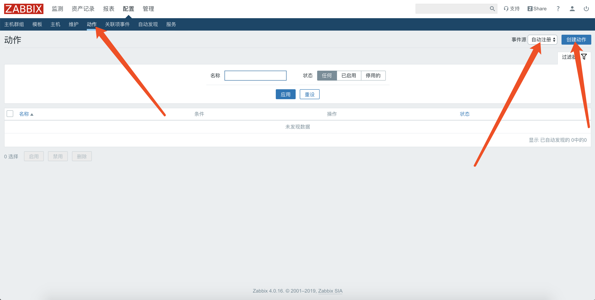
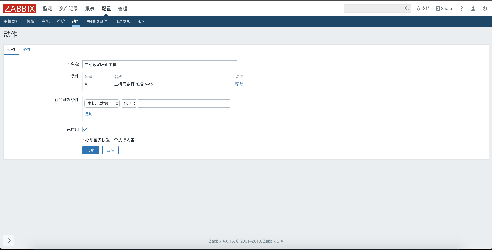
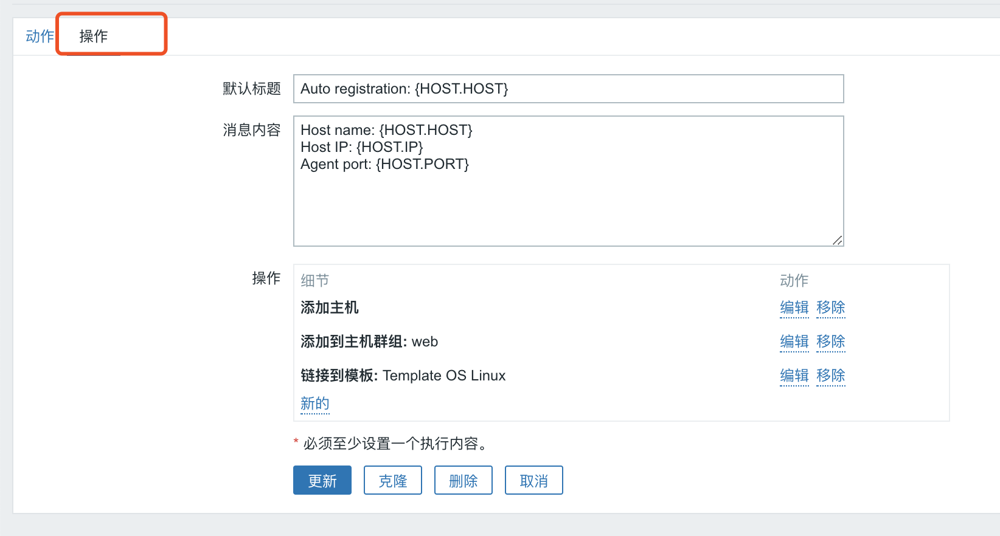

# zabbix通过自动注册创建主机

<!--more-->
安装zabbix-agent

rpm -ivh https://mirrors.tuna.tsinghua.edu.cn/zabbix/zabbix/4.0/rhel/7/x86_64/zabbix-agent-4.0.16-1.el7.x86_64.rpm

&nbsp;

主要修改：

Server：zabbix-server地址

ServerActive：主动模式zabbix-server地址

Hostname：主机名

HostMetadata：元数据

&nbsp;

vim /etc/zabbix/zabbix_agentd.conf
<pre class="line-numbers" data-line="1" data-start="1"><code class="language-bash">Server=192.168.0.200
ServerActive=192.168.0.200
Hostname=web-01
HostMetadata=web</code></pre>
&nbsp;

systemctl restart zabbix-agent

&nbsp;

配置zabbix

1.创建

&nbsp;

&nbsp;

&nbsp;

&nbsp;

配置完后，重启agent即可。

---

> 作者: [SoulChild](https://www.soulchild.cn)  
> URL: https://www.soulchild.cn/post/1408/  

