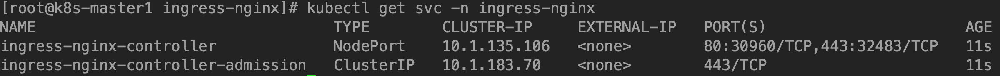
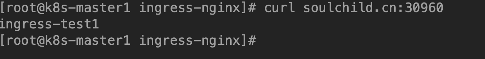
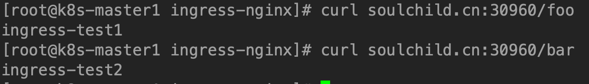
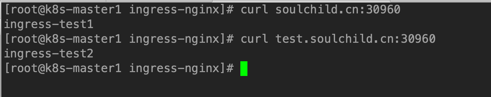

# k8s中ingress-nginx的使用

<!--more-->
1.部署ingress-nginx-controller
<pre class="pure-highlightjs"><code class="null">kubectl apply -f https://raw.githubusercontent.com/kubernetes/ingress-nginx/master/deploy/static/provider/baremetal/deploy.yaml</code></pre>

查看nodeport：

添加域名解析：

192.168.0.3 soulchild.cn  test.soulchild.cn

2. 创建两个测试资源

<pre class="pure-highlightjs"><code class="null">apiVersion: extensions/v1beta1
kind: Deployment
metadata:
  name: nginx-deploy
  labels:
    app: nginx
spec:
  replicas: 3
  template:
    metadata:
      labels:
        app: nginx
    spec:
      containers:
      - name: nginx
        image: nginx:1.14.2
        ports:
        - name: nginx-http
          containerPort: 80
          protocol: TCP
        lifecycle:
          postStart:
            exec:
              command:
              - "/bin/bash"
              - "-c"
              - "echo ingress-test1 &gt; /usr/share/nginx/html/index.html" 
--- 
apiVersion: v1
kind: Service
metadata:
  name: nginx
  labels:
    app: nginx
spec:
  selector:
    app: nginx
  ports: 
  - name: web 
    port: 80 
    targetPort: nginx-http</code></pre>

&nbsp;
<pre class="pure-highlightjs"><code class="null">apiVersion: extensions/v1beta1
kind: Deployment
metadata:
  name: nginx-deploy2
  labels:
    app: nginx2
spec:
  replicas: 3
  template:
    metadata:
      labels:
        app: nginx2
    spec:
      containers:
      - name: nginx2
        image: nginx:1.14.2
        ports:
        - name: nginx-http
          containerPort: 80
          protocol: TCP
        lifecycle:
          postStart:
            exec:
              command:
              - "/bin/bash"
              - "-c"
              - "echo ingress-test2 &gt; /usr/share/nginx/html/index.html"
---
apiVersion: v1
kind: Service
metadata:
  name: nginx2
  labels:
    app: nginx2
spec:
  selector:
    app: nginx2
  ports:
  - name: web
    port: 80
    targetPort: nginx-http</code></pre>
&nbsp;

创建ingress资源

第一种：单服务
<pre class="pure-highlightjs"><code class="null">apiVersion: networking.k8s.io/v1beta1
kind: Ingress
metadata:
  name: test-ingress
spec:
  backend:
    serviceName: nginx
    servicePort: 80</code></pre>
访问：soulchild.cn:30960

&nbsp;

第二种：基于uri

先删除上面的ingress
<pre class="pure-highlightjs"><code class="null">apiVersion: networking.k8s.io/v1beta1
kind: Ingress
metadata:
  name: simple-fanout-example
  annotations:
    nginx.ingress.kubernetes.io/rewrite-target: /
spec:
  rules:
  - host: soulchild.cn
    http:
      paths:
      - path: /foo
        backend:
          serviceName: nginx
          servicePort: nginx-http
      - path: /bar
        backend:
          serviceName: nginx2
          servicePort: nginx-http</code></pre>
&nbsp;

&nbsp;

第三种：基于域名
<pre class="pure-highlightjs"><code class="null">apiVersion: networking.k8s.io/v1beta1
kind: Ingress
metadata:
  name: name-virtual-host-ingress
spec:
  rules:
  - host: soulchild.cn
    http:
      paths:
      - backend:
          serviceName: nginx
          servicePort: nginx-http
  - host: test.soulchild.cn
    http:
      paths:
      - backend:
          serviceName: nginx2
          servicePort: nginx-http</code></pre>
&nbsp;

&nbsp;

和上面的一样，当没有主机匹配时，访问df
<pre class="pure-highlightjs"><code class="null">apiVersion: networking.k8s.io/v1beta1
kind: Ingress
metadata:
  name: name-virtual-host-ingress
spec:
  rules:
  - host: soulchild.cn
    http:
      paths:
      - backend:
          serviceName: nginx
          servicePort: nginx-http
  - host: test.soulchild.cn
    http:
      paths:
      - backend:
          serviceName: nginx2
          servicePort: nginx-http
  - http:
      paths:
      - backend:
          serviceName: df
          servicePort: df-http</code></pre>
&nbsp;

&nbsp;

---

> 作者: [SoulChild](https://www.soulchild.cn)  
> URL: https://www.soulchild.cn/post/1583/  

