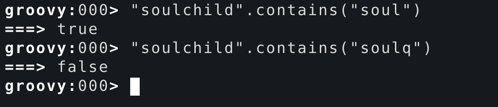
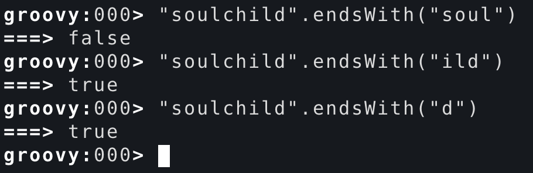
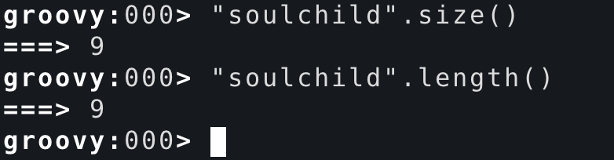
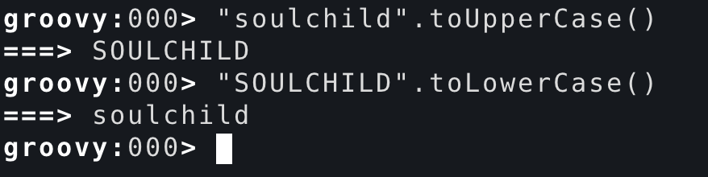
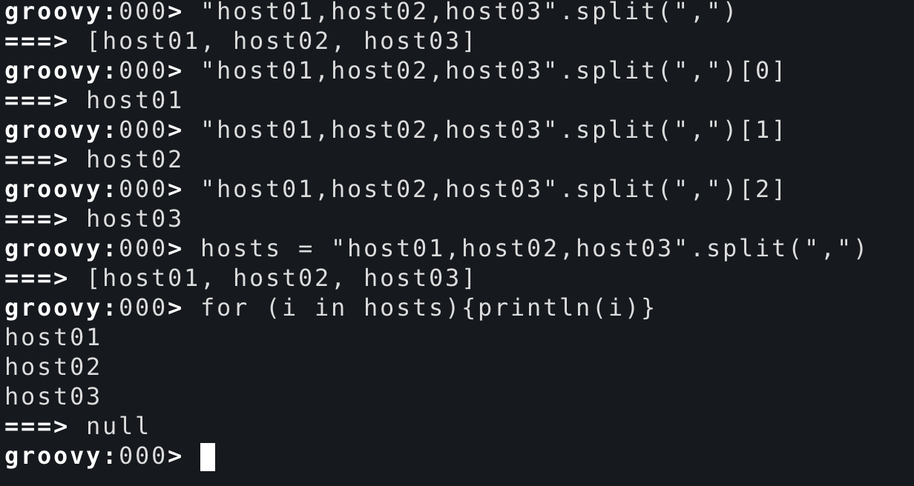
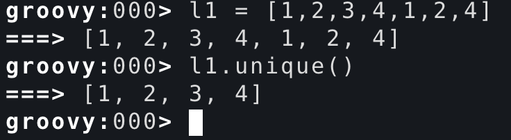
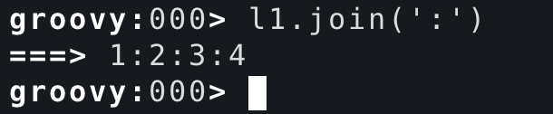
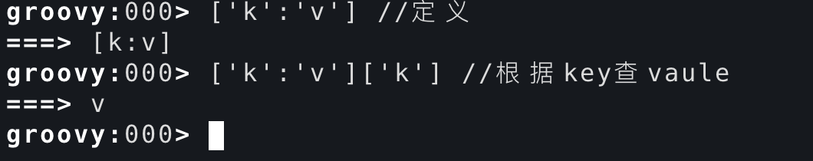
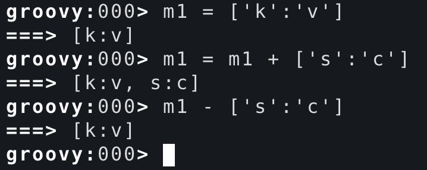

# groovy常用方法

<!--more-->
<h3>字符串：</h3>
&nbsp;

contains：是否包含指定字符串

&nbsp;

endsWith：是否以什么结尾

&nbsp;

size和length：统计字符串长度

&nbsp;

toUpperCase和toLowerCase：大小写转换

&nbsp;
<h3><strong>列表：</strong></h3>
&nbsp;

split：分割文本

&nbsp;

unique：列表去重

&nbsp;

join：将列表中每个元素链接

&nbsp;
<h3>字典：</h3>
&nbsp;

基本操作：

&nbsp;

添加和删除：

&nbsp;

---

> 作者: [SoulChild](https://www.soulchild.cn)  
> URL: https://www.soulchild.cn/post/1619/  

