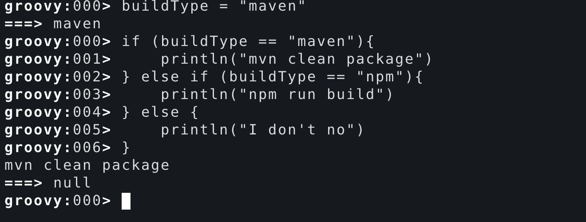
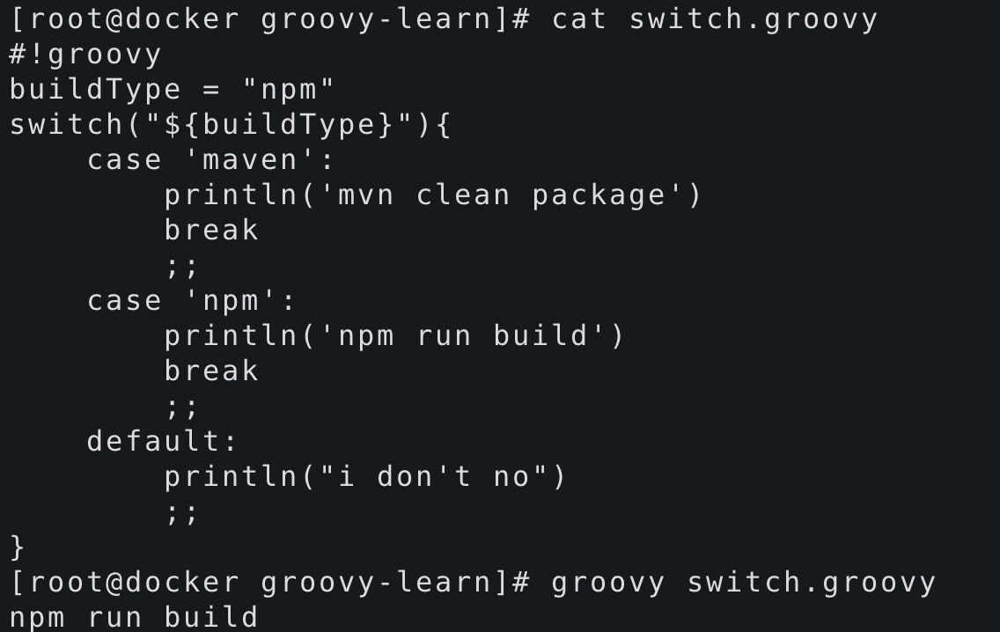
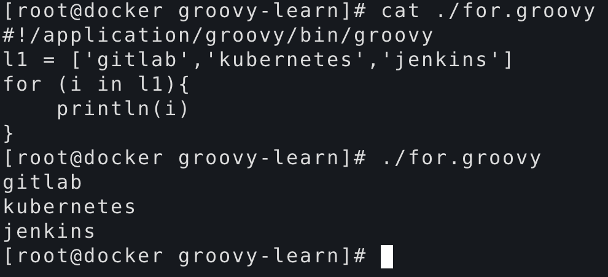
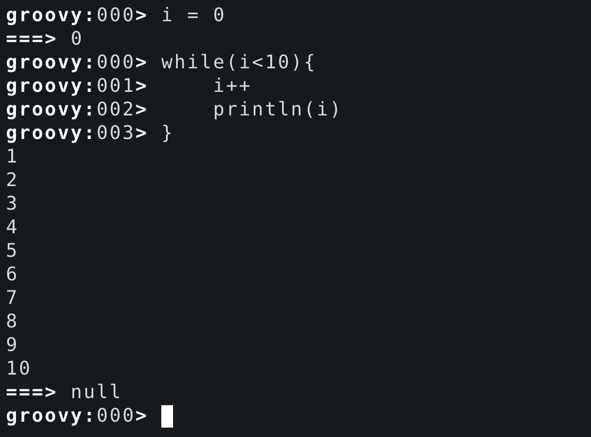

# groovy逻辑和循环语句

<!--more-->
<h3><strong>if判断：</strong></h3>
&nbsp;

&nbsp;
<h3><strong>switch判断：</strong></h3>
&nbsp;

&nbsp;
<h3><strong>for循环：</strong></h3>

&nbsp;
<h3><strong>while循环：</strong></h3>

&nbsp;

---

> 作者: [SoulChild](https://www.soulchild.cn)  
> URL: https://www.soulchild.cn/post/1623/  

