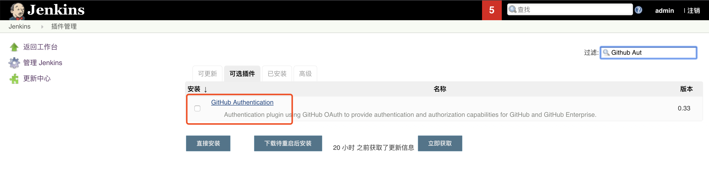
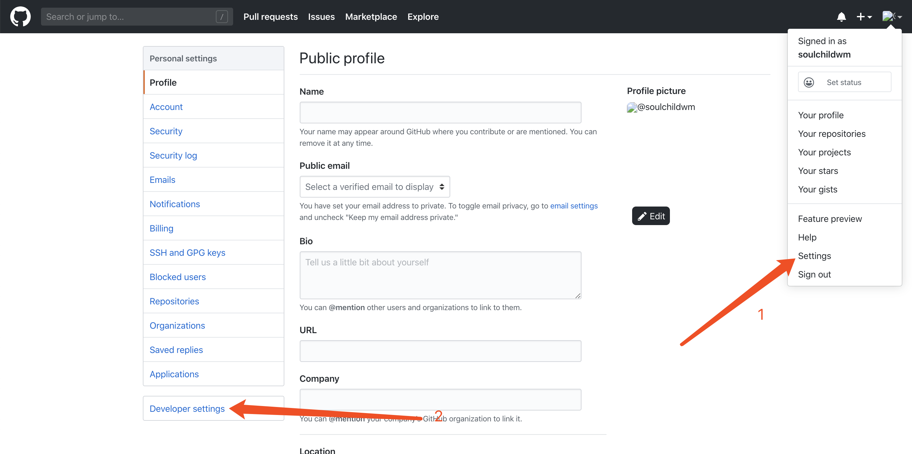
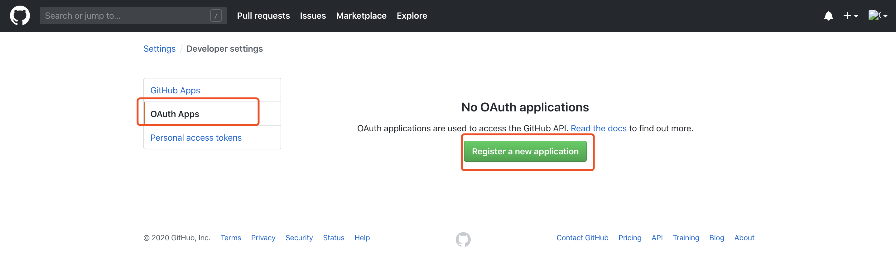
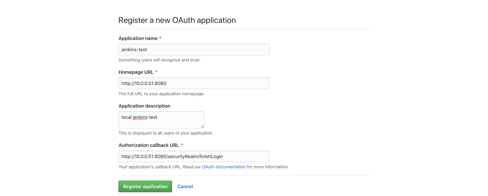
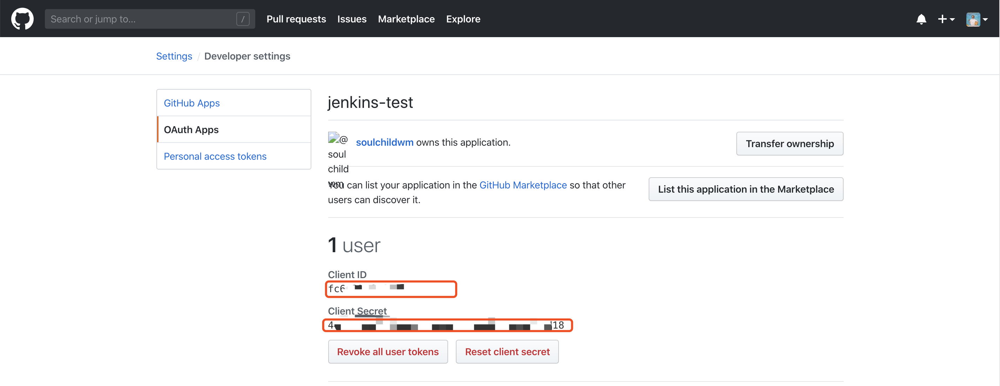
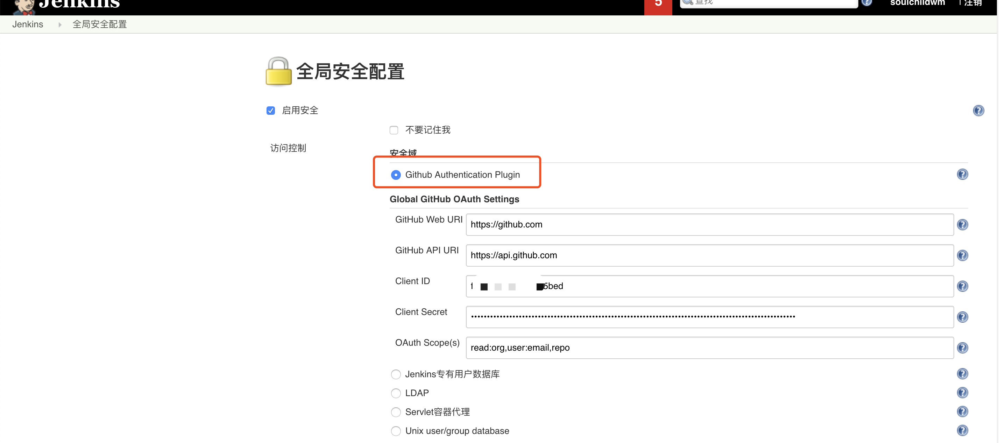
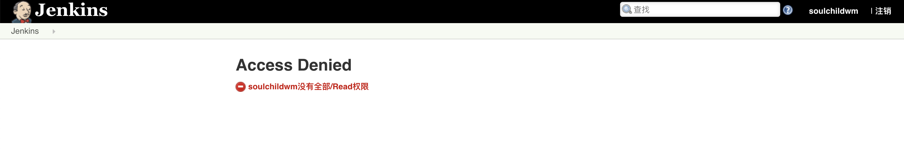
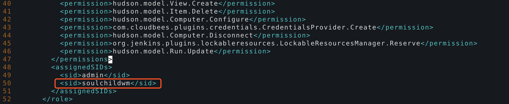

# jenkins集成github登陆

<!--more-->
1.安装插件

&nbsp;

2.配置github

&nbsp;

&nbsp;

添加一个应用

&nbsp;

记录ClientID和Secret

3.配置jenkins

&nbsp;

保存后退出登陆，发现没有权限了，比如这样。。。

&nbsp;

解决方法：

修改jenkins的config.xml文件

在&lt;assignedSIDs&gt;字段中添加&lt;sid&gt;你的用户名&lt;/sid&gt;

&nbsp;

保存后重启即可。

---

> 作者: [SoulChild](https://www.soulchild.cn)  
> URL: https://www.soulchild.cn/post/1633/  

