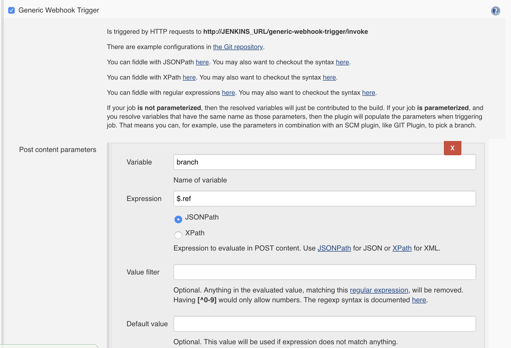

# gitlab提交代码自动触发jenkins pipeline

<!--more-->
1.配置jenkins（需要先安装Generic Webhook Trigger插件）

获取gitlab提交的分支，赋给变量branch

&nbsp;

加一个webhook参数，用于判断触发构建的类型：

&nbsp;

填写token：

&nbsp;

打印相关内容和变量，方便调试：

&nbsp;

2.gitlab配置

URL：http://10.0.0.51:8080/generic-webhook-trigger/invoke?token=demo-maven-service_PUSH&amp;runType=gitlabpush

&nbsp;

修改pipeline动态获取分支名称
<pre class="pure-highlightjs"><code class="null">#!groovy
@Library('jenkins-sharelibrary@master')
def tools = new org.devops.tools()

String srcUrl = "${env.srcUrl}"
String branchName = "${env.branchName}"
String buildType = "${buildType}"
String buildShell = "${buildShell}"

try{
    if ( "${runType}" == "gitlabpush" ){
        branchName = "${branch}"
    }
}catch(Exception e){
    println(branchName)
}

currentBuild.description = "构建分支：${branchName}"

pipeline{
    agent { 
        node { label 'master'} 
    }
    stages{
        stage('GetCode'){
            steps{
                script{
                    tools.myprint("正在拉取代码","green")
                    checkout([$class: 'GitSCM', 
                            branches: [[name: "${branchName}"]], 
                            doGenerateSubmoduleConfigurations: false, 
                            extensions: [], 
                            submoduleCfg: [], 
                            userRemoteConfigs: [[credentialsId: '476e5130-258c-4e7e-a80e-4ea8a303a985', 
                                                url: "${srcUrl}"]]]) 
                }
            }
        }
        stage('Build'){
            steps{
                script{
                    tools.build("${buildType}","${buildShell}")
                }
            }
        }
    }
}</code></pre>
&nbsp;

&nbsp;

&nbsp;

&nbsp;

---

> 作者: [SoulChild](https://www.soulchild.cn)  
> URL: https://www.soulchild.cn/post/1636/  

