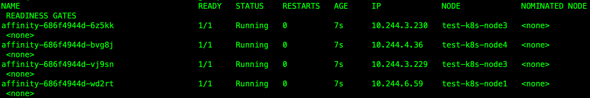

# k8s亲和性调度

<!--more-->
## 亲和性调度可以基于：

node亲和性(nodeAffinity)：选择调度到相同或不同的node节点

pod亲和性(podAffinity)：和某些pod调度到同一节点

pod反亲和性(podAntiAffinity)：和某些pod调度在不同节点


## 亲和性调度可以分成两种策略:

### 硬策略(requiredDuringSchedulingIgnoredDuringExecution):

指定了将 pod 调度到一个节点上必须满足的规则,不满足则会处于pending状态，一直进行重试，直到满足为止。


### 软策略(preferredDuringSchedulingIgnoredDuringExecution):

优先满足指定的规则，如果不满足则会调度到其他节点上。如果有多个软策略还可以设置优先级(weight)


### 1.节点亲和性
使用节点亲和性硬策略将pod调度到 kubernetes.io/hostname 标签不是test-k8s-node2的节点上，软策略将pod尽量调度到test-k8s-node3节点上
```yaml
kind: Deployment
apiVersion: apps/v1
metadata:
  name: affinity
  labels:
    app: nginx
spec:
  replicas: 4
  selector:
    matchLabels:
      app: nginx-affinity
  template:
    metadata:
      labels:
        app: nginx-affinity
    spec:
      containers:
      - name: nginx
        image: nginx:1.14.2
        ports:
        - name: web
          containerPort: 80
      affinity:
        nodeAffinity:
          requiredDuringSchedulingIgnoredDuringExecution:
            nodeSelectorTerms:
            - matchExpressions:
              - key: kubernetes.io/hostname
                operator: NotIn
                values:
                - test-k8s-node2
          preferredDuringSchedulingIgnoredDuringExecution:
            - weight: 1 
              preference: 
                matchExpressions:
                - key: kubernetes.io/hostname
                  operator: In
                  values:
                  - test-k8s-node3
```


> operator可选操作：`In`,`NotIn`,`Exists`,`DoesNotExist`,`Gt`,`Lt`

### 2.pod亲和性
我这里的区域标记是：
```bash
kubectl label nodes test-k8s-node1 zone=1
kubectl label nodes test-k8s-node3 zone=1
kubectl label nodes test-k8s-node2 zone=2
kubectl label nodes test-k8s-node4 zone=2
```

首先找到pod中包含app=nginx节点，查看zone标签的值(topologyKey的作用)，假如zone=2，那么该pod会部署在zone=2的区域中。
```yaml
kind: Deployment
apiVersion: apps/v1
metadata:
  name: affinity
  labels:
    app: nginx
spec:
  replicas: 4
  selector:
    matchLabels:
      app: nginx-affinity
  template:
    metadata:
      labels:
        app: nginx-affinity
    spec:
      containers:
      - name: nginx
        image: nginx:1.14.2
        ports:
        - name: web
          containerPort: 80
      affinity:
        podAffinity:
          requiredDuringSchedulingIgnoredDuringExecution:
          - labelSelector:
              matchExpressions:
              - key: app
                operator: In
                values:
                - nginx
            topologyKey: zone
```
直接部署此文件：

均处于pending状态，


创建一个标签为app=nginx的pod
```yaml
apiVersion: v1
kind: Pod
metadata:
  name: test-nginx-pod
  labels:
    app: nginx
spec:
  containers:
  - name: nginx
    image: nginx:1.14.2
    ports:
    - name: http
      containerPort: 80
```


可以看到这个pod调度到了test-k8s-node1节点上，node1节点的zone值为1，所以刚才的pod会调度到zone=1的节点上


### 3.pod反亲和性

当前app=nginx的pod被调度在node4节点上


创建反亲和性的pod
```yaml
kind: Deployment
apiVersion: apps/v1
metadata:
  name: affinity
  labels:
    app: nginx
spec:
  replicas: 4
  selector:
    matchLabels:
      app: nginx-affinity
  template:
    metadata:
      labels:
        app: nginx-affinity
    spec:
      containers:
      - name: nginx
        image: nginx:1.14.2
        ports:
        - name: web
          containerPort: 80
      affinity:
        podAntiAffinity:
          requiredDuringSchedulingIgnoredDuringExecution:
          - topologyKey: kubernetes.io/hostname
            labelSelector:
              matchExpressions:
              - key: app
                operator: In
                values:
                - nginx
```
可以看到所有pod都不会被调度到node4节点上了


---

> 作者: [SoulChild](https://www.soulchild.cn)  
> URL: https://www.soulchild.cn/post/1651/  

