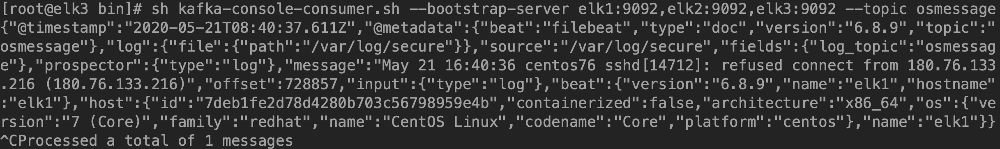

# filebeat6.8.9安装并配置输出日志到kafka

<!--more-->
1.安装部署：
<pre class="pure-highlightjs"><code class="null">wget https://artifacts.elastic.co/downloads/beats/filebeat/filebeat-6.8.9-linux-x86_64.tar.gz
tar xf filebeat-6.8.9-linux-x86_64.tar.gz
mv filebeat-6.8.9-linux-x86_64 /usr/local/filebeat</code></pre>
&nbsp;

2.查看配置文件：

vim /usr/local/filebeat/filebeat.yml
<pre class="pure-highlightjs"><code class="null"># 定义数据来源
filebeat.inputs:
# 日志来源类型log、stdin、redis、等等
- type: log
# 启用
  enabled: true
#指定日志路径，支持模糊匹配，如：/var/log/nginx/nginx*.log
  paths:
   - /var/log/messages
   - /var/log/secure
#行过滤，以DBG开头的行不收集
  #exclude_lines: ['^DBG']
#文件过滤，以gz结尾的文件不收集
  #exclude_files: ['.gz$']
#增加字段
  fields:
# 定义tpoic的名称，方便发送到kafka不同的topic中
    log_topic: osmessages
#名称，从那个节点收集的日志
name: "elk1"

#日志输出到kafka中
output.kafka:
#启用
  enabled: true
#kafka集群地址
  hosts: ["elk1:9092", "elk2:9092", "elk3:9092"]
#kafka的版本
  version: "2.0.0"
  topic: '%{[fields.log_topic]}'
#使用轮询的方式写入到不同的partition。必须是 random, round_robin, hash 三种的一种，默认为 false
 partition.round_robin:
    reachable_only: true
#发送消息给kafka的进程数
  worker: 2
#ACK可靠性级别。0=无响应，1=等待本地提交，-1=等待所有副本提交。默认值为1。
  required_acks: 1
#压缩方式
  compression: gzip
#压缩级别(1-9)，0为禁用
  compression_level: 4
#JSON编码消息的最大允许大小。较大的将被丢弃。默认值为1000000（字节），10M。
  max_message_bytes: 10000000
#设置日志级别，可选error, warning, info, debug
logging.level: debug</code></pre>
3.启动filebeat

&nbsp;
<pre class="pure-highlightjs"><code class="null">cd /usr/local/filebeat/
nohup ./filebeat -e -c filebeat.yml &amp;</code></pre>
4.查看kafka：
<pre class="pure-highlightjs"><code class="null">sh kafka-console-consumer.sh --bootstrap-server elk1:9092,elk2:9092,elk3:9092 --topic osmessage</code></pre>

&nbsp;

&nbsp;

---

> 作者: [SoulChild](https://www.soulchild.cn)  
> URL: https://www.soulchild.cn/post/1679/  

