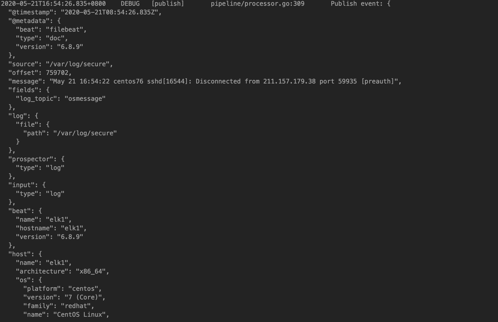
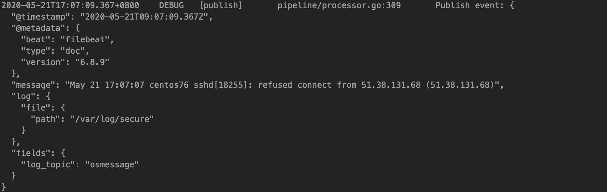

# filebeat字段过滤和加工

<!--more-->
查看过滤之前的字段：

&nbsp;

修改filebeat配置文件，添加如下内容，删除掉不要的字段
<pre class="pure-highlightjs"><code class="null">processors:
 - drop_fields:
     fields:
     - beat
     - host
     - input
     - source
     - offset
     - prospector</code></pre>
&nbsp;

---

> 作者: [SoulChild](https://www.soulchild.cn)  
> URL: https://www.soulchild.cn/post/1686/  

