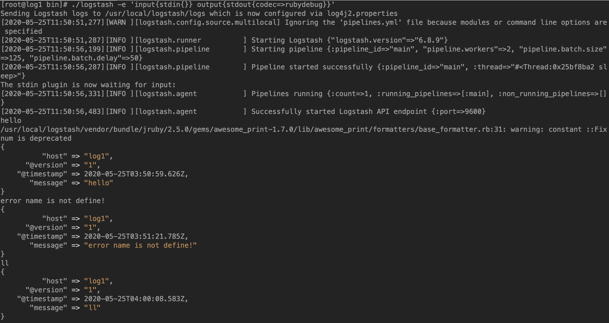
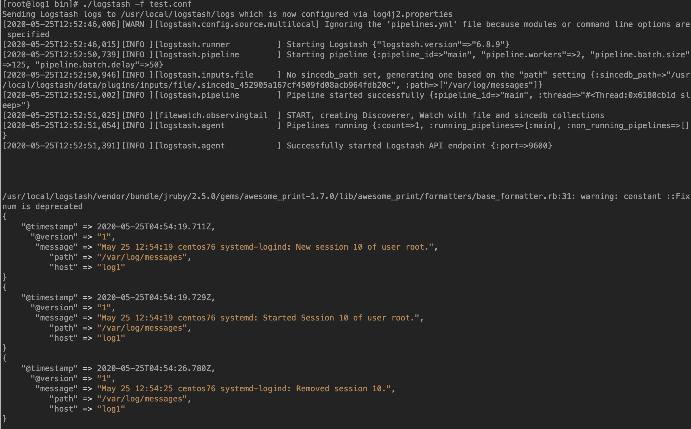
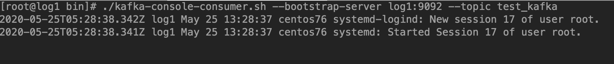

# logstash配置(一)

<!--more-->
1.命令行运行一个简单的输入输出
<pre class="pure-highlightjs"><code class="null">./logstash -e 'input{stdin{}} output{stdout{codec=&gt;rubydebug}}'</code></pre>

将上面的配置写到配置文件中，以配置文件的方式加载

vim test.conf
<pre class="pure-highlightjs"><code class="null">input {
  stdin{}
}

output{
  stdout{codec =&gt; rubydebug}
}
</code></pre>
./logstash -f test.conf

&nbsp;

2.使用文件的方式收集日志
<pre class="pure-highlightjs"><code class="null">input {
  file{
    path =&gt; "/var/log/messages"
  }
}

output{
  stdout{codec =&gt; rubydebug}
}</code></pre>
./logstash -f test.conf

新建一个终端链接查看是否有日志输出

&nbsp;

2.1 将日志输出到kafka中

./logstash -f test.conf
<pre class="pure-highlightjs"><code class="null">input {
  file{
    path =&gt; "/var/log/messages"
  }
}

output{
  kafka{
    bootstrap_servers =&gt; "log1:9092"
    topic_id =&gt; "test_kafka"
  }
}</code></pre>
连接kafka消费端，新建终端看看效果

&nbsp;

后台方式运行logstash
<pre class="pure-highlightjs"><code class="null">nohup ./logstash -f test.conf &amp;&gt; logstash.log &amp;</code></pre>
&nbsp;

&nbsp;

---

> 作者: [SoulChild](https://www.soulchild.cn)  
> URL: https://www.soulchild.cn/post/1695/  

