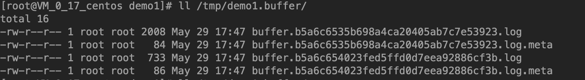

# fluentd缓冲区Buffer（五）

<!--more-->
buffer区块必须位于match区块内，指定如何对事件进行缓冲（避免对输出的目的地造成压力）。Fluentd内置了两种缓冲插件：<a href="https://docs.fluentd.org/v1.0/articles/buf_file">memory</a>、<a href="https://docs.fluentd.org/v1.0/articles/buf_memory">file</a>。

&nbsp;

buffer区块使用@type 参数来指定缓冲区插件的类型，如果省略@type，将使用输出插件指定的默认缓冲区插件，或者使用memory插件。
<pre class="pure-highlightjs"><code class="null">&lt;buffer&gt;
  @type file
&lt;/buffer&gt;</code></pre>
&nbsp;

## 区块键：

为buffer指定一个区块键。有效的值可以是逗号分隔的字符串或空值。

<strong>空白区块键：</strong>

当指定了空的区块键(并且输出插件没有指定默认的区块键) ，输出插件将所有匹配的事件写入一个buffer区块中，直到其大小满为止。
<pre class="pure-highlightjs"><code class="null">&lt;match tag.**&gt;
  # ...
  &lt;buffer&gt;
    # ...
  &lt;/buffer&gt;
&lt;/match&gt;

# No chunk keys: All events will be appended into the same chunk.

11:59:30 web.access {"key1":"yay","key2":100}  --|
                                                 |
12:00:01 web.access {"key1":"foo","key2":200}  --|---&gt; CHUNK_A
                                                 |
12:00:25 ssh.login  {"key1":"yay","key2":100}  --|</code></pre>
&nbsp;

<strong>tag：</strong>

当tag被指定为缓冲区块键时，同一个tag对应一个缓冲区。
<pre class="pure-highlightjs"><code class="null">&lt;source&gt;
  @type tail
  path /var/log/messages
  tag  os.messages
  pos_file /tmp/messages.pos
  &lt;parse&gt;
    @type syslog
  &lt;/parse&gt;
&lt;/source&gt;

&lt;source&gt;
  @type tail
  path /var/log/secure
  tag os.secure
  pos_file /tmp/secure.pos
  &lt;parse&gt;
    @type none
  &lt;/parse&gt;
&lt;/source&gt;

&lt;match os.**&gt;
  @type file
  path  /opt/demo1/demo1-${tag}.log
  &lt;buffer tag&gt;
    @type file
    path /tmp/demo1.buffer
    timekey 60
    timekey_wait 5
  &lt;/buffer&gt;
&lt;/match&gt;</code></pre>
可以看到被分为两个缓冲文件了



&nbsp;

<strong>Time：</strong>

当区块键为time时，会根据timekey的时间来分配不同的缓冲区，在timekey_wait指定的时间刷出缓冲区。

可以看下下面的例子，每60会分配一个新的缓冲区，延迟5秒后刷出
<pre class="pure-highlightjs"><code class="null">&lt;source&gt;
  @type tail
  path /var/log/messages
  tag  os.messages
  pos_file /tmp/messages.pos
  &lt;parse&gt;
    @type syslog
  &lt;/parse&gt;
&lt;/source&gt;

&lt;source&gt;
  @type tail
  path /var/log/secure
  tag os.secure
  pos_file /tmp/secure.pos
  &lt;parse&gt;
    @type none
  &lt;/parse&gt;
&lt;/source&gt;

&lt;match os.**&gt;
  @type file
  path  /opt/demo1
  &lt;buffer time&gt;
    @type file
    timekey 60
    timekey_wait 5
  &lt;/buffer&gt;
&lt;/match&gt;</code></pre>
根据不同时间输出到新的日志文件中


&nbsp;

<strong>其他区块键：</strong>

当指定其他(非time/tag)键时，这些键将作为记录的字段名处理。 输出插件将根据这些字段的值将事件分成块。

可以看下下面这个例子。
<pre class="pure-highlightjs"><code class="null">&lt;source&gt;
  @type tail
  path /var/log/messages
  tag  os.messages
  exclude_path ["/var/log/*.gz", "/var/log/*.zip"]
  refresh_interval 60
  pos_file /tmp/os.pos
  &lt;parse&gt;
    @type syslog
  &lt;/parse&gt;

&lt;/source&gt;


&lt;source&gt;
  @type tail
  path /var/log/secure
  tag os.secure
  pos_file /tmp/secure.pos
  &lt;parse&gt;
    @type none
  &lt;/parse&gt;
&lt;/source&gt;

&lt;filter os.**&gt;
  @type record_transformer
  &lt;record&gt;
    hostname "#{Socket.gethostname}"
  &lt;/record&gt;
&lt;/filter&gt;

&lt;match os.**&gt;
  @type file
  path  /opt/demo1/demo1-${host}.log
  &lt;buffer host&gt;
    @type file
    path /tmp/demo1.buffer
    timekey 60
    timekey_wait 5
  &lt;/buffer&gt;
&lt;/match&gt;</code></pre>
&nbsp;

文件名称中的${host}，被替换为日志记录中的host字段


&nbsp;

#### 可以使用记录访问器语法来使用嵌套字段
 ```<buffer $.nest.field>``` # 访问记录的nest.field字段


#### 组合键
缓冲区块键可以指定2个或更多的键——事件将通过块键值的组合被分割成块
```xml
# <buffer tag,time>

11:58:01 ssh.login  {"key1":"yay","key2":100}  ------> CHUNK_A

11:59:13 web.access {"key1":"yay","key2":100}  --|
                                                 |---> CHUNK_B
11:59:30 web.access {"key1":"yay","key2":100}  --|

12:00:01 web.access {"key1":"foo","key2":200}  ------> CHUNK_C

12:00:25 ssh.login  {"key1":"yay","key2":100}  ------> CHUNK_D
```

#### 空键
当输出插件有默认的块键时，禁用它
```xml
<match tag.**>
  # ...
  <buffer []>
    # ...
  </buffer>
</match>
```

## 占位符
当指定区块键时，可以使用区块键作为变量使用。 这取决于插件是否对配置值应用方法(extract_placeholders)。
```xml
<match log.*>
  @type file
  path  /data/${tag}/access.${key1}.log #=> "/data/log.map/access.yay.log"
  <buffer tag,key1>
    # ...
  </buffer>
</match>
```

##区块键参数time
timekey：必须，没有默认值。输出插件将在指定的时间刷新块，在区块键是time的时候使用
timekey_wait：默认600s，输出插件在`timekey`时间后的`timekey_wait`秒后写入块
timekey_use_utc：默认false，是否使用utc时间
timekey_zone：默认本地时区，可以使用例如`+0800`或`Asia/Shanghai`


## 缓冲参数
- chunk_limit_size: 
默认值内存8MB，文件256MB，每个块的最大大小

- chunk_limit_records: 
每个区块可以存储的最大事件数

- total_limit_size: 
默认值内存512MB，文件64GB，此缓冲插件示例的总大小限制

- queue_limit_length: 
默认0，此缓冲区插件实例的队列长度限制

- chunk_full_threshold: 
默认0.95(95%)，刷新缓冲块的阈值百分比，`chunk_limit_size * chunk_full_threshold`(8M*0.95),也就是缓冲块占用超过95%刷出.

- queued_chunks_limit_size: 
默认值1，限制队列区块的数量。

- compress:
默认：text不压缩，可以使用gzip压缩

## 刷新参数

- flush_at_shutdown:
  默认值:对于持久性缓冲区（例如buf_file）为false，对于非持久性缓冲区（例如buf_memory）为true。是否在关闭时刷新/写入所有缓冲区块的值
- flush_mode：
  + lazy: 根据`timekey`
  + interval: 每隔`flush_interval`刷新一次
  + immediate: 事件进入缓冲块后立即刷空
- flush_interval
默认60s
- flush_thread_count：
默认1，刷新块的线程数，用于并行刷新缓冲块
- flush_thread_interval：
默认1，如果没有缓冲块等待被刷出，线程休眠几秒以进行下一次尝试
- flush_thread_burst_interval：
默认1，输出插件刷新相邻的缓冲块时，启动下一个进程前休眠的秒数
- delayed_commit_timeout：
默认60，输出插件确定异步写入操作失败的超时秒数
- overflow_action：
  当缓冲队列满了，输出插件的行为：
  - 默认：throw_exception
  - throw_exception：排除异常，并打印错误日志
  - block：阻止输入插件将事件发送到该缓冲区
  - drop_oldest_chunk：删除最旧的缓冲块以接受新传入的缓冲块

## 重试参数
- retry_timeout：
默认72h，失败后重试刷新的最大时间
- retry_forever：
默认false，是否永远重试
- retry_max_times：
失败时重试刷新的最大次数
- retry_type：
重试类型
  - 默认: exponential_backoff
  - exponential_backoff: 等待秒数,将根据故障成倍增长，由`retry_exponential_backoff_base`决定
  - periodic: 固定间隔重试`retry_wait`
- retry_wait：
默认1s,在下一次重试刷新之前要等待的秒数
- retry_exponential_backoff_base：
默认2，重试的指数的基数
- retry_randomize：
默认true，如果为true，则输出插件将在随机间隔后重试，可以防止突发
- disable_chunk_backup：
默认false，禁止将不可恢复的数据块存储在备份目录中


---

> 作者: [SoulChild](https://www.soulchild.cn)  
> URL: https://www.soulchild.cn/post/1739/  

