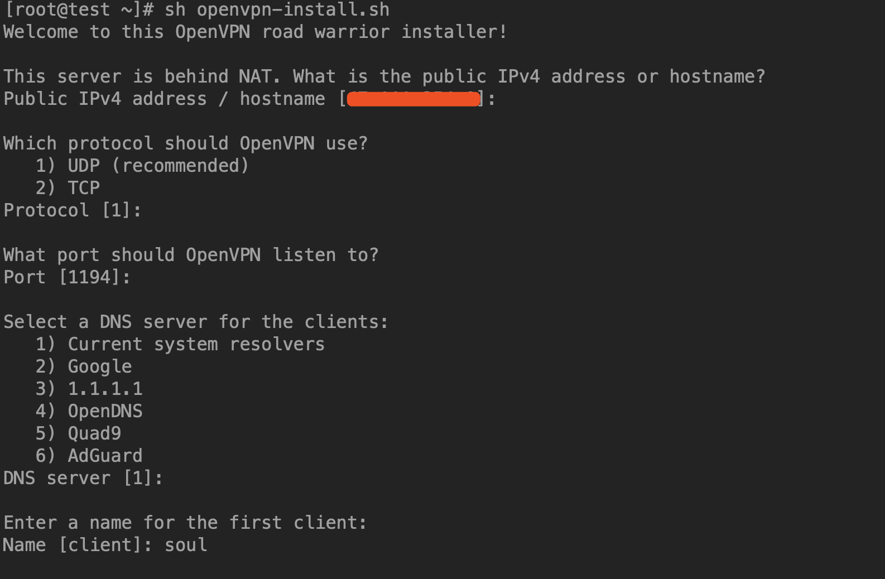

# 一键安装openvpn并配置使用账号密码登陆

<!--more-->
## 脚本github地址：https://github.com/Nyr/openvpn-install

下载脚本：
```bash
wget https://raw.githubusercontent.com/Nyr/openvpn-install/master/openvpn-install.sh

```

安装：
```bash
sh openvpn-install.sh
```
没有特殊需求默认即可


soul用户的客户端配置文件路径：/root/soul.ovpn

将此文件导入到openvpn中，连接即可。


## 配置使用账号密码验证

1.创建脚本:vim /etc/openvpn/checkpsw.sh
```bash
#!/bin/sh
###########################################################
# checkpsw.sh (C) 2004 Mathias Sundman <mathias@openvpn.se>
#
# This script will authenticate OpenVPN users against
# a plain text file. The passfile should simply contain
# one row per user with the username first followed by
# one or more space(s) or tab(s) and then the password.

PASSFILE="/etc/openvpn/psw-file"
LOG_FILE="/etc/openvpn/openvpn-password.log"
TIME_STAMP=`date "+%Y-%m-%d %T"`

###########################################################

if [ ! -r "${PASSFILE}" ]; then
  echo "${TIME_STAMP}: Could not open password file \"${PASSFILE}\" for reading." >> ${LOG_FILE}
  exit 1
fi

CORRECT_PASSWORD=`awk '!/^;/&&!/^#/&&$1=="'${username}'"{print $2;exit}' ${PASSFILE}`

if [ "${CORRECT_PASSWORD}" = "" ]; then 
  echo "${TIME_STAMP}: User does not exist: username=\"${username}\", password=\"${password}\"." >> ${LOG_FILE}
  exit 1
fi

if [ "${password}" = "${CORRECT_PASSWORD}" ]; then 
  echo "${TIME_STAMP}: Successful authentication: username=\"${username}\"." >> ${LOG_FILE}
  exit 0
fi

echo "${TIME_STAMP}: Incorrect password: username=\"${username}\", password=\"${password}\"." >> ${LOG_FILE}
exit 1

```

2.添加权限
```
chmod 755 /etc/openvpn/checkpsw.sh
```

3.添加账号密码
```bash
echo 'username1 password1' >> /etc/openvpn/psw-file
```

4.修改server.conf
```bash
# 追加以下内容
script-security 3
auth-user-pass-verify /etc/openvpn/checkpsw.sh via-env
username-as-common-name
verify-client-cert none
```

5.重启服务
```bash
systemctl restart openvpn-server@server
```

6.修改客户端文件soul.ovpn
```bash
# 追加以下内容,<cert>和<key>部分可以删掉
auth-user-pass
```

客户端填写用户名密码


---

> 作者: [SoulChild](https://www.soulchild.cn)  
> URL: https://www.soulchild.cn/post/1782/  

