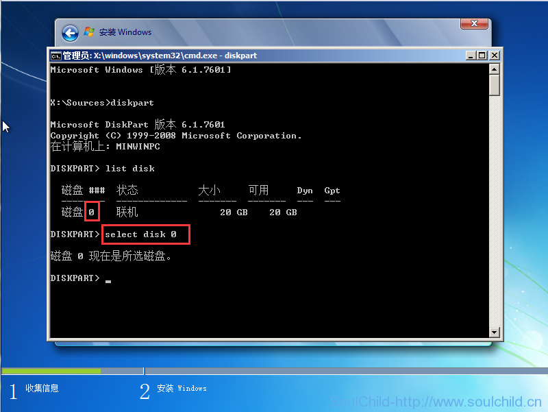

# 使用diskpart命令更改磁盘分区为GPT、MBR教程

<!--more-->
第一步、我们下面这个界面按下Shift+F10，会出现第二步中的命令提示符界面

第二步、输入diskpart命令回车运行工具，然后输入list disk查看磁盘，如下图

第三步、输入seclect disk 0，选中磁盘（注意磁盘编号，不要写错）

第四步、选中磁盘后依次输入下面的命令

1、clean                  //输入此命令前请务必确定硬盘无重要数据，该命令会清除磁盘

2、convert gpt       //将磁盘转换为GPT格式

convert mbr      //将磁盘转换为MBR格式

上面两个根据需要输入一条即可

3、list partition     //查看磁盘分区信息

第五步、创建分区

1、create partition efi size=100     //创建EFI分区，大小为100M

2、create partition msr size=128     //创建MSR分区，默认大小是128M

3、create partition primary size=20000     //创建主分区，size=20000就是分区20G，单位是Mb

4、list partition     //查看磁盘分区信息

至此分区完成，输入两次exit退出即可。

---

> 作者: [SoulChild](https://www.soulchild.cn)  
> URL: https://www.soulchild.cn/post/18/  

