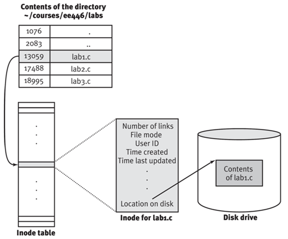
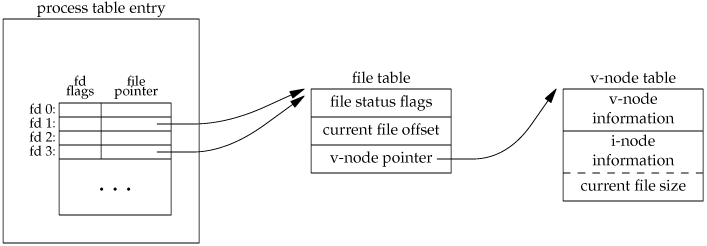

# logrotate机制和原理

<!--more-->
### 原文链接：https://www.lightxue.com/how-logrotate-works

日志实在是太有用了，它记录了程序运行时各种信息。通过日志可以分析用户行为，记录运行轨迹，查找程序问题。可惜磁盘的空间是有限的，就像飞机里的黑匣子，记录的信息再重要也只能记录最后一段时间发生的事。为了节省空间和整理方便，日志文件经常需要按时间或大小等维度分成多份，删除时间久远的日志文件。这就是通常说的日志滚动(log rotation)。

最近整理nginx日志，用了一个类Unix系统上的古老工具——logrotate，发现意外的好用。想了解这个工具的用法推荐看这里。我了解了一下这个工具的运行机制和原理，觉得挺有趣的。


<!--more-->


## 运行机制
logrotate在很多Linux发行版上都是默认安装的。系统会定时运行logrotate，一般是每天一次。系统是这么实现按天执行的。crontab会每天定时执行/etc/cron.daily目录下的脚本，而这个目录下有个文件叫logrotate。在centos上脚本内容是这样的：
```
/usr/sbin/logrotate /etc/logrotate.conf >/dev/null 2>&1
EXITVALUE=$?
if [ $EXITVALUE != 0 ]; then
    /usr/bin/logger -t logrotate "ALERT exited abnormally with [$EXITVALUE]"
fi
exit 0
```
可以看到这个脚本主要做的事就是以/etc/logrotate.conf为配置文件执行了logrotate。就是这样实现了每天执行一次logrotate。

因为我的系统执行/etc/cron.daily目录下的脚本不是我想滚动日志的时间，所以我把/etc/cron.daily/logrotate拷了出来，改了一下logrotate配置文件的路径，然后在crontab里加上一条指定时间执行这个脚本的记录，自定义周期滚动日志就大功告成了。这种自定义的方式有两点要注意：

配置文件里一定要配置rotate 文件数目这个参数。如果不配置默认是0个，也就是只允许存在一份日志，刚切分出来的日志会马上被删除。多么痛的领悟，说多了都是泪。

执行logrotate命令最好加-f参数，不然有时候配置文件修改的内容不生效。

很多程序的会用到logrotate滚动日志，比如nginx。它们安装后，会在/etc/logrotate.d这个目录下增加自己的logrotate的配置文件。logrotate什么时候执行/etc/logrotate.d下的配置呢？看到/etc/logrotate.conf里这行，一切就不言而喻了。

```include /etc/logrotate.d```

## 原理
logrotate是怎么做到滚动日志时不影响程序正常的日志输出呢？logrotate提供了两种解决方案。

### Linux文件操作机制
介绍一下相关的Linux下的文件操作机制。

Linux文件系统里文件和文件名的关系如下图。



目录也是文件，文件里存着文件名和对应的inode编号。通过这个inode编号可以查到文件的元数据和文件内容。文件的元数据有引用计数、操作权限、拥有者ID、创建时间、最后修改时间等等。文件件名并不在元数据里而是在目录文件中。因此文件改名、移动，都不会修改文件，而是修改目录文件。

借《UNIX环境高级编程》里的图说一下进程打开文件的机制。



进程每新打开一个文件，系统会分配一个新的文件描述符给这个文件。文件描述符对应着一个文件表。表里面存着文件的状态信息（O_APPEND/O_CREAT/O_DIRECT...）、当前文件位置和文件的inode信息。系统会为每个进程创建独立的文件描述符和文件表，不同进程是不会共用同一个文件表。正因为如此，不同进程可以同时用不同的状态操作同一个文件的不同位置。文件表中存的是inode信息而不是文件路径，所以文件路径发生改变不会影响文件操作。

## 方案1：create
默认方案没有名字，姑且叫它create吧。因为这个方案会创建一个新的日志文件给程序输出日志，而且第二个方案名copytruncate是个配置项，与create配置项是互斥的。

这个方案的思路是重命名原日志文件，创建新的日志文件。详细步骤如下：

1. 重命名程序当前正在输出日志的程序。因为重命名只会修改目录文件的内容，而进程操作文件靠的是inode编号，所以并不影响程序继续输出日志。

2. 创建新的日志文件，文件名和原来日志文件一样。虽然新的日志文件和原来日志文件的名字一样，但是inode编号不一样，所以程序输出的日志还是往原日志文件输出。

3. 通过某些方式通知程序，重新打开日志文件。程序重新打开日志文件，靠的是文件路径而不是inode编号，所以打开的是新的日志文件。

什么方式通知程序我重新打开日志呢，简单粗暴的方法是杀死进程重新打开。很多场景这种作法会影响在线的服务，于是有些程序提供了重新打开日志的接口，比如可以通过信号通知nginx。各种IPC方式都可以，前提是程序自身要支持这个功能。

有个地方值得一提，一个程序可能输出了多个需要滚动的日志文件。每滚动一个就通知程序重新打开所有日志文件不太划得来。有个sharedscripts的参数，让程序把所有日志都重命名了以后，只通知一次。

## 方案2：copytruncate
如果程序不支持重新打开日志的功能，又不能粗暴地重启程序，怎么滚动日志呢？copytruncate的方案出场了。

这个方案的思路是把正在输出的日志拷(copy)一份出来，再清空(trucate)原来的日志。详细步骤如下：

1. 拷贝程序当前正在输出的日志文件，保存文件名为滚动结果文件名。这期间程序照常输出日志到原来的文件中，原来的文件名也没有变。

2. 清空程序正在输出的日志文件。清空后程序输出的日志还是输出到这个日志文件中，因为清空文件只是把文件的内容删除了，文件的inode编号并没有发生变化，变化的是元信息中文件内容的信息。

结果上看，旧的日志内容存在滚动的文件里，新的日志输出到空的文件里。实现了日志的滚动。

### 这个方案有两个有趣的地方。

文件清空并不影响到输出日志的程序的文件表里的文件位置信息，因为各进程的文件表是独立的。那么文件清空后，程序输出的日志应该接着之前日志的偏移位置输出，这个位置之前会被\0填充才对。但实际上logroate清空日志文件后，程序输出的日志都是从文件开始处开始写的。这是怎么做到的？这个问题让我纠结了很久，直到某天灵光一闪，这不是logrotate做的，而是成熟的写日志的方式，都是用O_APPEND的方式写的。如果程序没有用O_APPEND方式打开日志文件，变会出现copytruncate后日志文件前面会被一堆\0填充的情况。

日志在拷贝完到清空文件这段时间内，程序输出的日志没有备份就清空了，这些日志不是丢了吗？是的，copytruncate有丢失部分日志内容的风险。所以能用create的方案就别用copytruncate。所以很多程序提供了通知我更新打开日志文件的功能来支持create方案，或者自己做了日志滚动，不依赖logrotate。

## 总结
logrotate是个优秀的日志滚动工具，它是用蜂蜜，川贝，桔梗，加上天山雪莲配制而成，不须冷藏，也没有防腐剂，除了毒性猛烈之外，味道还很好吃。实在是居家旅行、杀人灭口必备良药！


---

> 作者: [SoulChild](https://www.soulchild.cn)  
> URL: https://www.soulchild.cn/post/1903/  

