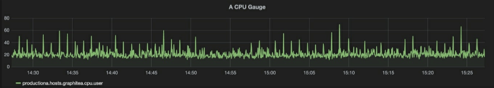
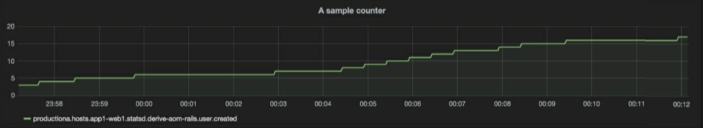
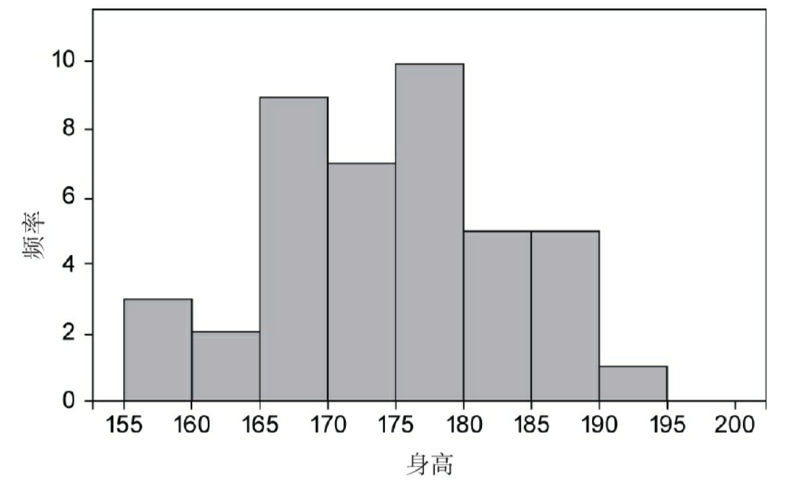

# prometheus-指标类型

<!--more-->
本文内容来自图书prometheus监控实战
### 1.测量型(gauge):
第一种指标类型是测量型（gauge），这种类型是上下增减的数字。常见的监控指标如CPU、内存和磁盘使用率等都属于这个类型。对于业务指标来说，可能是网站上的客户数量。

### 2.计数型(counter):
  第二种类型是计数型（counter），这种类型是随着时间增加而不会减少的数字。虽然它们永远不会减少，但有时可以将其重置为零并再次开始递增。应用程序和基础设施的计数型示例包括系统正常运行时间、设备收发包的字节数或登录次数。业务方的示例可能是一个月内的销售数量或应用程序收到的订单数量。
  
计数型指标的一个优势在于它们可以让你计算变化率。每个观察到的数值都是在一个时刻：t，你可以使用t+1处的值减去t处的值，以获得两个值之间的变化率。通过了解两个值之间的变化率，可以理解许多有用的信息。例如登录次数指标，你可以通过计算变化率来查看每秒的登录次数，这有助于确定网站这段时间的受欢迎程度。

### 3.直方图(histogram):
直方图（histogram）是对观察点进行采样的指标类型，可以展现数据集的频率分布。将数据分组在一起并以这样的方式显示，这个被称为"装箱"（binning）的过程可以直观地查看数值的相对大小。 统计每个观察点并将其放入不同的桶中，这样可以产生多个指标：每个桶一个，加上所有值的总和以 及计数。
通常，频率分布直方图看起来像条形图

上图是身高频率分布的样本直方图。x轴是身高的分布，y轴是对应的频率值，例如可以看到身高 160～165cm对应的值是2。

### 4.摘要型(Summary):
摘要型(Summary)类似于直方图，摘要会采样观察结果（通常是请求持续时间和响应大小之类的东西）。尽管它还提供了观测值的总数和所有观测值的总和，但它可以计算滑动时间窗口内的可配置分位数。

---

> 作者: [SoulChild](https://www.soulchild.cn)  
> URL: https://www.soulchild.cn/post/1958/  

