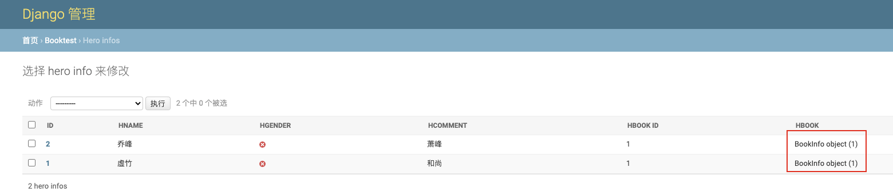

# django-后台字段显示配置

<!--more-->
1. 配置应用下的admin.py
```python
from django.contrib import admin
from booktest.models import BookInfo, HeroInfo


class BookInfoAdmin(admin.ModelAdmin):
    """图书模型管理类"""
    # 自定义显示哪些字段
    list_display = ['id', 'btitle', 'bpub_date']


class HeroInfoAdmin(admin.ModelAdmin):
    """人物模型管理类"""
    # 自定义显示哪些字段
    list_display = ['id', 'hname', 'hgender', 'hcomment', 'hbook_id', 'hbook']


# 注册模型类,只有注册的模型类才会显示在后台管理中
admin.site.register(BookInfo, BookInfoAdmin)
admin.site.register(HeroInfo, HeroInfoAdmin)

```

2.将 xxx object显示为自定义内容

```python
在models.py中修改个模型类添加__str__方法

def __str__(self):
    return self.btitle
```


---

> 作者: [SoulChild](https://www.soulchild.cn)  
> URL: https://www.soulchild.cn/post/2026/  

