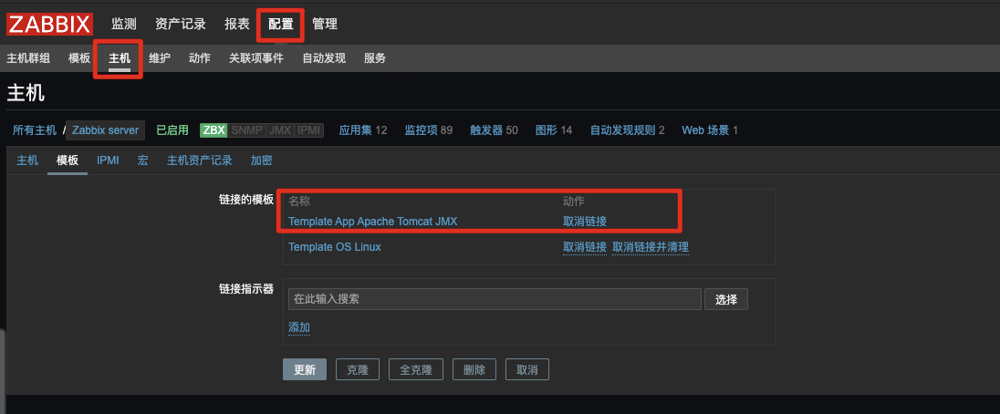

# zabbix使用zabbix-java-gateway监控JVM

<!--more-->
## 一、编译安装zabbix-java-gateway
进入zabbix源码包路径
```bash
cd /server/packages/zabbix-4.0.16
./configure --enable-java --prefix=/application/zabbix-java-gateway
make && make install
```

## 二、启动
`su - zabbix -c /application/zabbix-java-gateway/sbin/zabbix_java/startup.sh`

## 三、zabbix_server的配置文件添加如下两个参数
```bash
# 我的zabbix-server和zabbox-java-gateway装在同一台机器上了，所以用的127.0.0.1
JavaGateway=127.0.0.1
JavaGatewayPort=10052
StartJavaPollers=5
```
重启zabbix-server
`systemctl restart zabbix-server`

如果需要日志调试，可以修改配置文件`/application/zabbix-java-gateway/sbin/zabbix_java/lib/logback.xml`将info改为debug，日志的输出在`/tmp/zabbix_java.log`
```xml
        <root level="info">
                <appender-ref ref="FILE" />
        </root>
```

## 四、tomcat添加jmx配置
1.vim /application/tomcat/bin/catalina.sh
在第二行添加即可，下面的ip端口号需要修改为zabbix可以连接
```bash
CATALINA_OPTS="$CATALINA_OPTS -Dcom.sun.management.jmxremote -Dcom.sun.management.jmxremote.authenticate=false -Dcom.sun.management.jmxremote.ssl=false -Dcom.sun.management.jmxremote.port=12345 -Djava.rmi.server.hostname=127.0.0.1"
```
2.默认情况下除了12345端口外,还会开放另一个RMI随机端口,这个端口也需要对zabbix-java-gateway开放.但是随机端口不好写规则，所以可以通过修改为固定端口来解决

下载一个扩展jar包
```shell
cd /application/tomcat/lib
wget http://archive.apache.org/dist/tomcat/tomcat-8/v8.5.54/bin/extras/catalina-jmx-remote.jar
```

修改tomcat中server.xml,在最后一个`<Listener className=.../>`下面添加即可
```xml
<Listener className="org.apache.catalina.mbeans.JmxRemoteLifecycleListener" rmiServerPortPlatform="12346" rmiRegistryPortPlatform="12345"/>
```


3.重启tomcat
```shell
/application/tomcat/bin/shutdown.sh
/application/tomcat/bin/startup.sh
```

## 五、配置zabbix-web(不用自带模板可跳过3和4步)
1.选择要监控的主机


2.添加jmx的地址配置


3.添加模板


4.检查结果


## 六、推荐模板
https://github.com/rodrigoluissilva/Zabbix-JMX-Tomcat-Extended-Template/tree/master

根据自己的需要选择模板导入即可,下面演示一个
1.导入模板


2.给主机链接模板


3.修改宏,我的端口是8081。`{$HTTP_PORT}`,`{$JMX_PASSWORD}`,`{$JMX_USERNAME}`


4.给模板添加宏变量,在主机中单独设置也可以。我这里是tomcat8,默认连接器是nio模式


---

> 作者: [SoulChild](https://www.soulchild.cn)  
> URL: https://www.soulchild.cn/post/2138/  

