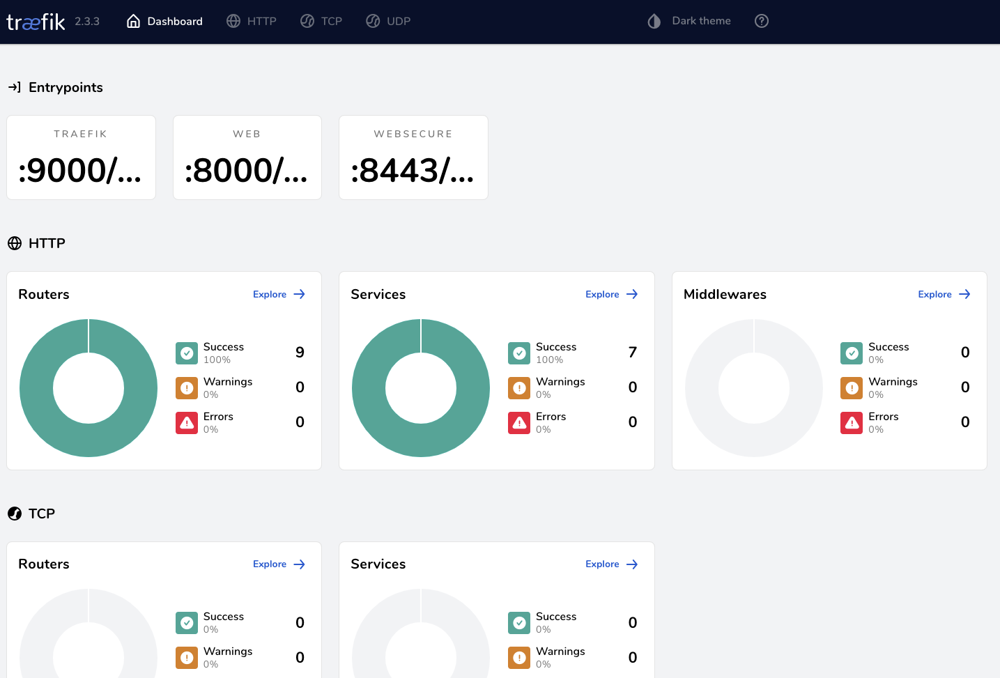
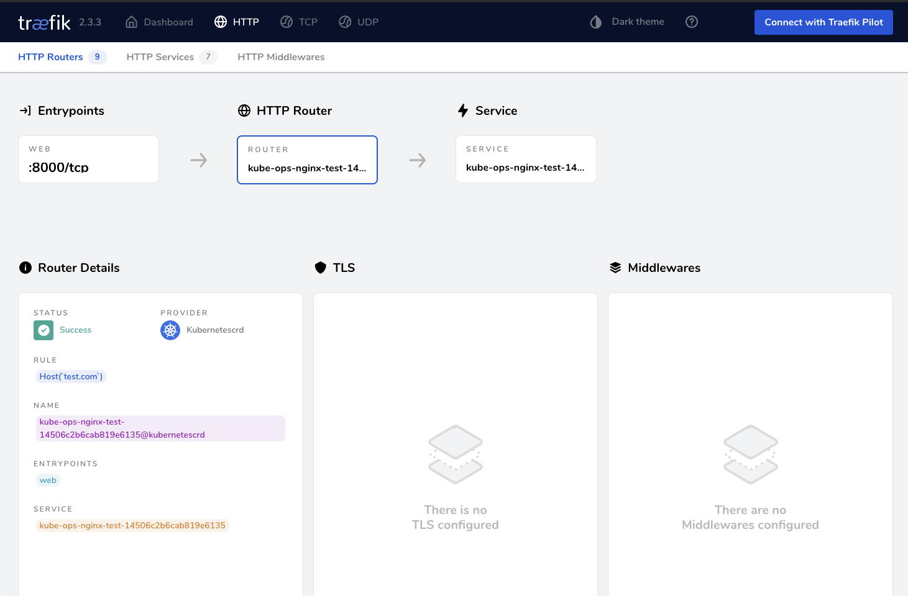
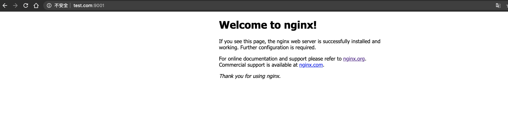
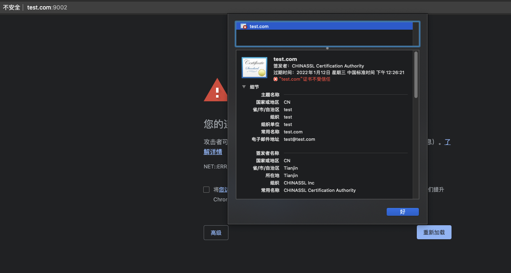

# traefik-IngressRoute配置详解(二)

<!--more-->
IngressRoute是traefik编写的一个自定义资源(CRD),可以更好的配置traefik所需的路由信息
<https://doc.traefik.io/traefik/reference/dynamic-configuration/kubernetes-crd/#resources>

## 一、使用helm安装traefik

1.添加traefik仓库

```bash
helm repo add traefik https://helm.traefik.io/traefik
helm repo update
```

2.安装traefik

```bash
kubectl create ns traefik-v2
helm install --namespace=traefik-v2 traefik traefik/traefik 
```

3.暴露traefik的dashboard
端口说明:
9000是dashboard
8000是http入口
8443是https入口

`kubectl port-forward --address=0.0.0.0 -n traefik-v2 $(kubectl get pods -n traefik-v2 --selector "app.kubernetes.io/name=traefik" --output=name) 9000:9000`

通过master节点`IP:9000/dashboard/`访问traefik仪表盘

> 以上安装方式仅为学习使用.



## 二、traefik IngressRoute资源配置

下面部署一个nginx应用

```yaml
apiVersion: apps/v1
kind: Deployment
metadata:
  name: nginx-test
  namespace: kube-ops
spec:
  selector:
    matchLabels:
      app: nginx
      test: "true"
  template:
    metadata:
      labels:
        app: nginx
        test: "true"
    spec:
      containers:
        - name: nginx-test
          ports:
            - name: http
              containerPort: 80
          image: nginx:1.17.10
---
apiVersion: v1
kind: Service
metadata:
  name: nginx-test
  namespace: kube-ops
spec:
  selector:
    app: nginx
    test: "true"
  type: ClusterIP
  ports:
    - name: web
      port: 80
      targetPort: http
```

让我们通过IngressRoute来配置一个规则

<https://doc.traefik.io/traefik/routing/providers/kubernetes-crd/#kind-ingressroute>

```yaml
apiVersion: traefik.containo.us/v1alpha1
kind: IngressRoute
metadata:
  name: nginx-test
  namespace: kube-ops
spec:
  entryPoints:
    # 监听指定入口点为的流量。这里的web就是traefik静态配置(启动参数)中的 --entryPoints.web.address=:8000,通过仪表盘也可以看到
    - web
  routes:
    - kind: Rule
      match: Host(`test.com`)
      services:
        - name: nginx-test
          port: 80
```

可以看到我门刚才配置的规则已经生效了。



现在将入口点web暴露出来，通过9001端口。
`kubectl port-forward --address=0.0.0.0 -n traefik-v2 $(kubectl get pods -n traefik-v2 --selector "app.kubernetes.io/name=traefik" --output=name) 9001:8000`

在本地做hosts解析
`x.x.x.x    test.com`

现在我们打开test.com:9001可以看到nginx已经正常访问


## 三、https配置

1. 生成证书secret
`kubectl create secret tls nginx-test --cert=tls.crt --key=tls.key`

2. 修改之前的IngressRoute

```yaml
apiVersion: traefik.containo.us/v1alpha1
kind: IngressRoute
metadata:
  name: nginx-test
  namespace: kube-ops
spec:
  entryPoints:
    # 指定入口点为web。这里的web就是traefik静态配置(启动参数)中的 --entryPoints.web.address=:8000,通过仪表盘也可以看到
    - web
  routes:
    - kind: Rule
      match: Host(`test.com`) # 匹配规则,第三部分说明
      services:
        - name: nginx-test
          port: 80
  tls:
    secretName: nginx-test
```

因为不是正常的证书,所以访问过不去


## 四、ingressroute配置详解

```yaml
apiVersion: traefik.containo.us/v1alpha1
kind: IngressRoute
metadata:
  name: foo
  namespace: bar
spec:
  # 入口点列表
  entryPoints:
    - foo
  # 定义路由配置
  routes:
  # kind目前只支持Rule
  - kind: Rule
    # 路由匹配规则
    match: Host(`test.example.com`)
    # 当前规则的优先级,优先级高则优先匹配,可以用来解决路由冲突
    priority: 10
    # 使用中间件
    middlewares:
      # 中间件名称
    - name: middleware1
      # 中间件所在的k8s namespace
      namespace: default
    # 引用service
    services:
    # Service或者TraefikService
    - kind: Service
      name: foo
      namespace: default
      # 转发客户端的header,默认true
      passHostHeader: true
      # service的端口号，也可以写名称
      port: 80
      # 定义traefik如何响应服务端的请求给客户端
      responseForwarding:
        # 当接收到来自后端服务的响应1ms后,将响应发送给客户端,例如防止分块传输(Transfer-Encoding: chunked)频繁发送大量小数据、发送小文件等情况下会用到
        # 如果是流式响应那么这个参数不生效
        flushInterval: 1ms
      # 请求后端服务器使用http或https
      scheme: https
      # 引用ServersTransport资源,仅k8s service支持。 ServersTransport用于全局配置 Traefik 和后端之间的连接
      # ServersTransport配置说明项 https://doc.traefik.io/traefik/routing/overview/#transport-configuration
      # 自定义ServersTransport资源 https://doc.traefik.io/traefik/routing/providers/kubernetes-crd/#kind-serverstransport
      serversTransport: transport
      # 启用粘性会话,将请求转发到同一个pod中
      sticky:
        # 目前仅支持cookie
        # 会在初始响应中添加 Set-Cookie 标头，让客户端知道是哪个服务器处理的第一个响应。在后续请求中，为了保持与同一服务器的会话有效，客户端应该发送带有值集的 cookie。
        cookie:
          name: cookie
          # httpOnly 不允许使用javascript获取cookie
          httpOnly: true
          # secure 仅应通过 HTTPS 连接传输
          secure: true
          # 控制浏览器是否应该将 Cookie 发送到跨站点请求中, 防止csrf攻击。 
          # 可选项 none, lax, strict 或者不写， 如果SameSite=None那么secure必须为true
          sameSite: none
      # 负载均衡策略, 目前只支持轮询
      strategy: RoundRobin
      # 可以定义多个 service 之间的访问权重比例
      weight: 10
  # https相关配置
  tls:
    # 证书 secret
    secretName: supersecret
    # 引用 TLSOption 对象, TLSOption允许用户配置TLS连接的一些参数。
    # https://doc.traefik.io/traefik/https/tls/#tls-options
    options:
      name: opt
      namespace: default
    # 使用指定的证书解析器自动生成证书, https://www.soulchild.cn/post/2198/
    certResolver: foo
    # 指定哪些域名需要启用tls, 如果启用了certResolver，会将所有域名都向Let's Encrypt's申请证书
    domains:
    - main: example.net
      sans:
      - a.example.net
      - b.example.net
      - "*.example.cn"
    # 引用 TLSStore 对象, 我认为这就是高级版的tls secret, 它可以包含多个tls secret,还可以设置默认的tls secret, 也可以使用证书解析器自动申请和续期证书
    store:
      name: public-tls
      namespace: traefik
```

## 五、路由匹配规则

- Headers(\`key\`, \`value\`): 判断请求头是否存在, key 是请求头名称，value是值. 例如`HeadersRegexp("User-Agent", "Chrome|IE")`

- HeadersRegexp(\`key\`, \`regexp\`): 同上,可以使用正则来匹配. 例如`HeadersRegexp("User-Agent", "Chrome|IE")`

- Host(\`example.com\`, ...): 检查Host请求头,判断其值是否为给定之一. 例如 Host(\`example.com\`, \`test.com\`)

- HostHeader(\`example.com\`, ...): 同上,因为历史原因才存在的

- HostRegexp(\`example.com\`, \`{subdomain:[a-z]+}.example.com\`, ...): 同上，可以使用正则.

- Method(\`GET\`, ...): 匹配method (GET, POST, PUT, DELETE, PATCH, HEAD). 例如 Method(\`GET\`, \`POST\`, \`PUT\`)

- Path(\`/path\`, \`/articles/{cat:[a-z]+}/{id:[0-9]+}\`, ...): 匹配确切的请求路径。接受正则表达式

- PathPrefix(\`/products/\`, \`/articles/{cat:[a-z]+}/{id:[0-9]+}\`): 匹配请求前缀路径。接受正则表达式

- Query(\`foo=bar\`, \`bar=baz\`): 匹配查询字符串参数

- ClientIP(\`10.0.0.0/16\`, \`::1\`): 如果客户端IP是给定的IP/CIDR之一，则匹配。它接受IPv4, IPv6和CIDR格式。注意它只匹配客户端IP, 也就是remote ip。

### 正则语法

正则的格式为 `{name: regexp}`, name随便写, regexp是正则

### 运算符

可以使用 `&&`, `||`, `!`, `()` 将多种规则组和使用
例如: (Host(\`example.com\`, \`test.com\`) || PathPrefix(\`/products/\`)) && ClientIP(\`10.0.0.0/16\`)


---

> 作者: [SoulChild](https://www.soulchild.cn)  
> URL: https://www.soulchild.cn/post/2159/  

