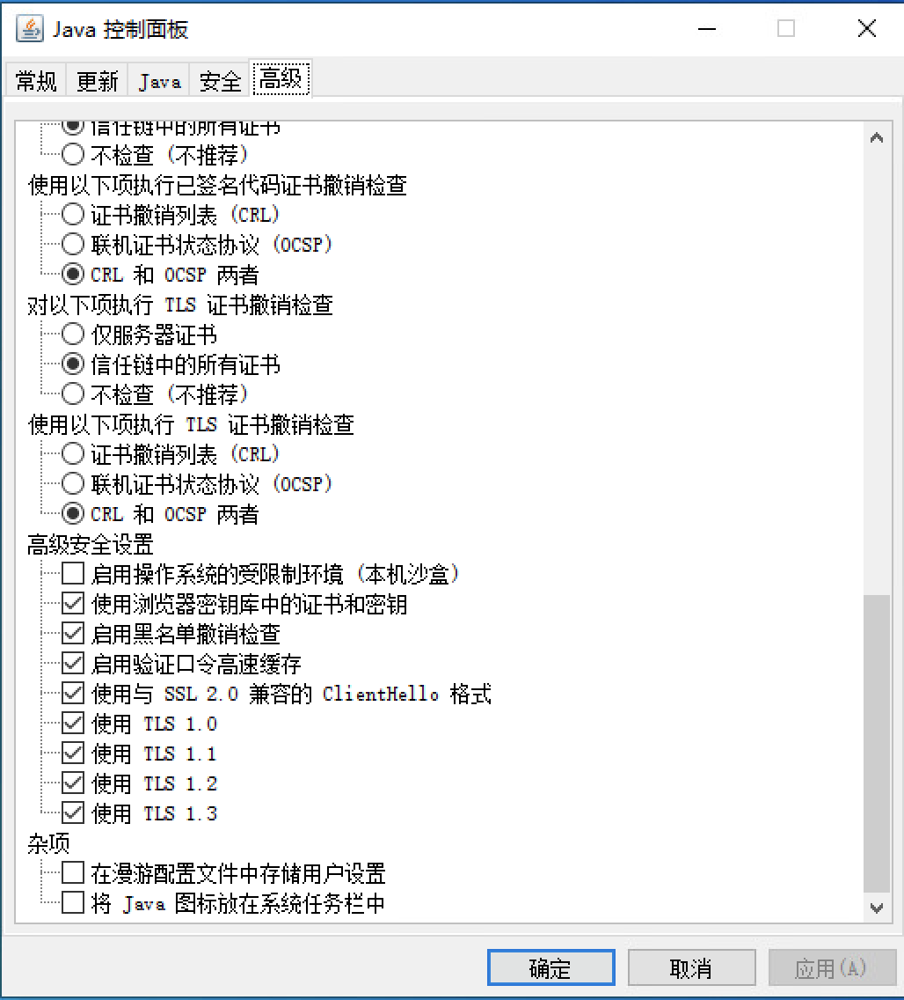

# idrac连接报错-查看器已终止 原因：网络连接终端

<!--more-->
## 方法1(可能无效). 进入win控制面板，进入java控制面板，勾选协议

## 方法2.修改java.security
文件路径：`C:\Program Files\Java\jre1.8.0_271\lib\security\java.security`

注释jdk.tls.disabledAlgorithms

以上为临时解决方案，最好还是升级idrac,一般可以解决

---

> 作者: [SoulChild](https://www.soulchild.cn)  
> URL: https://www.soulchild.cn/post/2218/  

